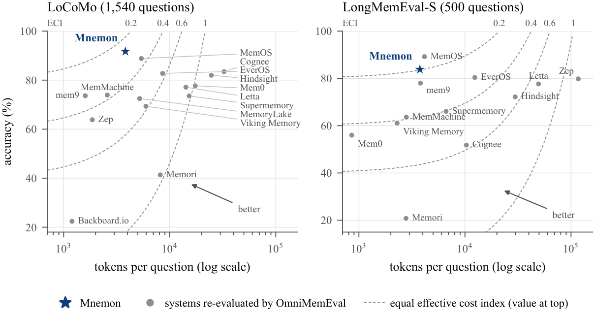
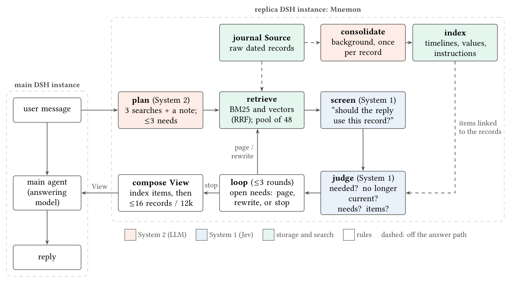
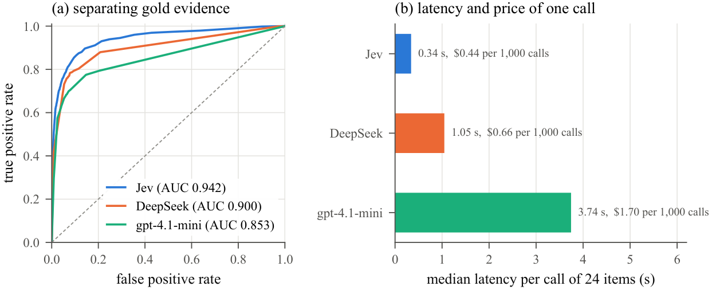

# Mnemon：快慢两套系统的智能体记忆

[English](README.md) · [论文 PDF](docs/paper/main.pdf) · [复现论文数字](#复现论文数字) · [运行系统](#运行系统)

Mnemon 是一个为 LLM 助手设计的长期记忆 Agent。它把对话保存为带日期的原始记录，等问题到来时才开始工作，并按"双系统"理论的方式分工：

- **System 1**：一个快速的决策模型，对检索到的记录回答大量简单的是非判断。
- **System 2**：一个 LLM，负责拟定少量检索、组织最终回答。
- **后台整合**：把每条记录整合一次、建成索引，让涉及整段对话的问题也能找到检索本身找不到的证据。

<p align="center">
  
</p>
<p align="center"><sub>准确率与每题送给作答模型的上下文长度。Mnemon（星号）和 OmniMemEval 重测的 14 个系统都用 gpt-4.1-mini 作答。虚线连接成本效益指数相同的点，越靠左上越好。</sub></p>

## 亮点

- **LoCoMo 准确率第一，上下文不到 4k。** 在 OmniMemEval 的统一协议下（gpt-4.1-mini 作答）：
  - LoCoMo 得 **91.7%**，15 个系统中第一；LongMemEval-S 得 **83.8%**，13 个系统中第二。
  - 每题只给作答模型约 **3.8k token**。它是唯一一个在两个基准上都超过 80%、上下文又不到 4k 的系统。
- **LoCoMo 上成本效益指数最低**：0.259，第二名为 0.337。
- **达到公开最佳成绩的水平。** 用 DeepSeek-V4.1-Flash 作 System 2 时，LongMemEval-S 得 **94.4%**，LoCoMo 得 **92.2%**（修订标签下 95.3%）。
- **千万 token 规模下成本有界。** 从 BEAM 的 100K 档到 10M 档，记录多了 80 倍，每题成本只变为原来的 **1.11** 倍。
- **System 1 判断得更好。** 在同样的 14,359 条记录上区分关键证据：
  - Jev 的 AUC 为 **0.942**，DeepSeek 为 0.900，gpt-4.1-mini 为 0.853。
  - 两个 LLM 的延迟是 Jev 的 3–11 倍。

## 两个核心思想

### 快慢两套系统

记忆在读取阶段的工作，大部分属于 System 1：一个个彼此独立、标准明确的小问题。例如：
- 回复该不该用这条记录？
- 后来的消息是否已经推翻了它？
- 它是否给出了问题所需的第二个日期？

像 [Jev](https://typesafe.ai/blog/introducing-system-one-models-and-jev) 这样的 System One 模型，三分之一秒就能回答几十个这样的问题。

只有一小部分属于 System 2：拟定检索、说清回复需要什么、计算出答案。这些 LLM 做得好，但慢。

正因为判断够快，Mnemon 才能在提问时直接读原始记录，而不必事先改写。两套系统之间的规则只读取 System 1 可靠给出的信息，即排序和"是/否"结果；只有当 System 1 发现某个需求没被满足时，才去调用 System 2。

<p align="center">
  
</p>
<p align="center"><sub>Mnemon 处理一轮用户消息的过程。它作为 <a href="https://github.com/deepseek-ai/deepseek-harness">DeepSeek Harness</a> 的第二个实例，运行在主 Agent 旁边，不改动主 Agent，每轮发布一个 View。</sub></p>

### 与存储结构无关的记忆

在写入时做抽取的系统，必须事先规定什么算事实、什么算实体、什么算偏好，每换一种数据就要重新设计抽取。Mnemon 在写入时不对记录做任何判断，只要求存储能按检索返回带日期的记录。

整合出的索引（话题时间线、取值历史、长期指令）叠在原始记录之上，并链接回记录。它只是记录的一层视图，而不是记录的结构；有没有索引，Mnemon 都能读取原始记录。

因此，只要记录能被检索，就能加上这种记忆。论文评测的是对话记忆，因为这是有公开基准的场景；其他类型的存储还没有测过。

## 结果

所有数字都来自 `docs/paper/data/results.json`，由 `runs/` 中的运行记录计算得出。我们的运行由 gpt-4.1-mini 评分；OmniMemEval 用 gpt-4o-mini 评分，两者约有 1–2 分的差异。

### 统一协议下的比较（gpt-4.1-mini 作答）

表中列出准确率（%）、每题送给作答模型的上下文，以及成本效益指数：
- 定义：ECI = (1 − 准确率) + 上下文 / 全量上下文 token 数。
- 含义：假设每答错一题，就用一次全量上下文作答来补救，ECI 就是每题的期望成本，越低越好。
- 其他系统的数字来自 OmniMemEval。

| 系统 | LoCoMo | 上下文 | ECI | LongMemEval-S | 上下文 | ECI |
|---|---:|---:|---:|---:|---:|---:|
| **Mnemon** | **91.7** | 3.8k | **0.259** | 83.8 | 3.8k | 0.198 |
| MemOS | 88.83 | 5.4k | 0.362 | **89.2** | 4.2k | **0.147** |
| Cognee | 83.48 | 32.5k | 1.670 | 51.8 | 10.3k | 0.580 |
| EverOS | 82.75 | 8.6k | 0.569 | 80.4 | 12.4k | 0.314 |
| Hindsight | 81.99 | 24.7k | 1.322 | 72.2 | 29.8k | 0.561 |
| Mem0 | 77.68 | 17.4k | 1.028 | 56.0 | 0.9k | 0.448 |
| Letta | 77.12 | 14.2k | 0.885 | 77.67 | 49.4k | 0.693 |
| MemMachine | 73.9 | 2.6k | 0.380 | 63.6 | 2.8k | 0.391 |
| mem9 | 73.64 | 1.6k | 0.337 | 78.0 | 3.8k | 0.256 |
| Supermemory | 73.53 | 15.2k | 0.970 | 66.07 | 6.6k | 0.402 |
| MemoryLake | 72.49 | 5.2k | 0.516 | – | – | – |
| Viking Memory | 69.33 | 6.0k | 0.583 | 61.07 | 2.3k | 0.411 |
| Zep | 63.83 | 1.9k | 0.448 | 79.8 | 117.1k | 1.316 |
| Memori | 41.34 | 8.1k | 0.963 | 20.8 | 2.8k | 0.818 |
| Backboard.io | 22.4 | 1.2k | 0.831 | – | – | – |

这里只比较作答阶段的上下文，因为这是所有系统都公开的唯一成本。Mnemon 的其他成本（规划、Jev、整合）单独列在下面，不计入这个指数。

### 与各项目公开的最好成绩对比

各项目公布的最好成绩，作答模型、评委和协议各不相同，所以这张表比较的是宣称，不是系统本身。完整的 18 项及出处见论文表 3。

| 项目 | LoCoMo | LongMemEval-S | 作答模型 / 评委 |
|---|---:|---:|---|
| **Mnemon** | **95.3**† | 94.4 | DeepSeek-V4.1-Flash（带思考）/ DeepSeek |
| Zep / Graphiti | 94.7 | 90.2 | gpt-5.4（中等推理）/ gpt-5.4 |
| EverMemOS | 93.05 | 83.0 | gpt-4.1-mini / 三个评委取平均 |
| Mem0 | 92.5 | 94.4 | GPT-5 / GPT-5 |
| MemU | 92.09 | – | 未说明 |
| Hindsight | 92.0 | **94.6** | 未公开 |
| MemMachine | 91.69 | 93.0 | gpt-4.1-mini；LongMemEval-S 用 gpt-5-mini / gpt-4o-mini |
| MemOS | 88.83 | 89.2 | gpt-4.1-mini / gpt-4o-mini（OmniMemEval） |

† 使用修订后的 LoCoMo 标签（去掉 44 道无法使用的题、改正 25 个答案）；原始标签下为 92.2，其他各项都用原始标签。

### 五个基准与完整成本

表中设置如下：
- 作答模型：gpt-4.1-mini。
- 得分：依次为 gpt-4.1-mini / DeepSeek 评委给出的分数。
- 名次：在 OmniMemEval 重测过的系统中的排名。
- 每题成本：包括作答、规划和 Jev，按标价计算。
- 整合成本：每份记忆一次性的花费。

| 基准 | 题数 | 得分 | 名次 | 上下文 | 每题成本 | 延迟中位数 | 每份记忆的整合成本 |
|---|---:|---:|---:|---:|---:|---:|---:|
| LoCoMo | 1,540 | 91.7 / 91.4 | 1/15 | 3.8k | $0.0033 | 9.6 秒 | $0.013 |
| LongMemEval-S | 500 | 83.8 / 85.4 | 2/13 | 3.8k | $0.0033 | 13.1 秒 | $0.017 |
| HaluMem | 3,467 | 73.3 / 65.8 | 8/13 | 3.4k | $0.0036 | 12.3 秒 | $0.089 |
| BEAM-100K | 400 | 64.5 / 60.5 | 10/12 | 3.8k | $0.0048 | 12.1 秒 | $0.012 |
| BEAM-10M | 200 | 51.2 / 48.8 | 10/12 | 3.8k | $0.0053 | 15.3 秒 | $1.62 |

读取路径上，除了检索索引，没有任何东西随记忆增长：
- 规划只读最近的对话。
- Jev 每轮最多筛选 48 条记录。
- View 有固定预算。

System 1 负责广泛地读，System 2 只读一小部分：
- 每题 Jev 读 3.5 万到 7.3 万 token 的记录，是作答模型所读的 9–19 倍。
- Jev 每 token 的价格约为作答模型的十分之一。

### System 1 与 LLM 判断的对比

<p align="center">
  
</p>

我们让 Jev、DeepSeek 和 gpt-4.1-mini 对同样的 14,359 条记录回答同一个问题。Jev 区分关键证据的效果最好，而且每条记录能回答两个问题，所用时间只相当于 LLM 回答一个问题。

## 复现论文数字

论文里的每个数字都来自 `docs/paper/scripts/collect.py`，它读取运行记录，不需要任何 API key。

```sh
python3 tools/restore_runs.py                     # 把 runs/ 展开到 runs-expanded/ 并逐个校验
# 放入两个公开数据集：
#   runs-expanded/benchmarks/locomo10.json              LoCoMo（github.com/snap-research/locomo）
#   runs-expanded/benchmarks/longmemeval_s_cleaned.json LongMemEval-S（cleaned 版）
MNEMON_RUNS=$PWD/runs-expanded python3 docs/paper/scripts/collect.py   # 重写 docs/paper/data/results.json
git diff --stat docs/paper/data/results.json      # 只有 HaluMem 的条目会变：它的运行记录不在仓库中
TECTONIC=tectonic PYTHON=python3 bash docs/paper/build.sh   # 生成表格、图（matplotlib）和 main.pdf
```

`beam_evidence.py` 还需要 `pyarrow` 和 BEAM 的 `100K.parquet`。

## 运行系统

需要 Node.js 25（实验用的是 v25.1.0）和 pnpm 11。

```sh
pnpm install --frozen-lockfile        # 按锁文件安装，DSH 为 0.1.5-rc.1，与实验一致
pnpm run build && pnpm run build:plugins
pnpm -r --filter 'dsh-mnemon-*' test --passWithNoTests
```

真实运行会调用外部模型。密钥放在环境变量或本地 `.env` 中（该文件已被 git 忽略），不要提交进仓库：

| 变量 | 用途 |
|---|---|
| `TYPESAFE_API_KEY` | Jev（System 1） |
| `DEEPSEEK_API_KEY` | DeepSeek 作答、规划、笔记和整合 |
| `OPENAI_API_KEY` | gpt-4.1-mini 运行与评分 |
| `OPENAI_BASE_URL` | 可选，默认使用 OpenAI API |

两题冒烟运行的命令见[英文 README](README.md#run-the-system)。完整系统还需加上以下参数（`scripts/bench/run.ts` 文件开头说明了所有选项）：
- `--simple`；
- 混合检索：`--embed-url <本地 nomic-embed-text 服务>`；
- 整合：`--consolidate deepseek-flash`。

## 仓库结构

| 路径 | 内容 |
|---|---|
| `docs/paper/` | 论文：LaTeX 源、参考文献、数据、生成的表格和图、`main.pdf` 及其脚本 |
| `docs/reports/` | 论文背后的预注册与研究报告 |
| `docs/pr-assets/` | 只包含报告实际链接的素材 |
| `docs/plans/` | 报告链接的两份设计文档 |
| `runs/` | `collect.py` 读取的运行记录（gzip 压缩），附 `MANIFEST.json` |
| `docs/run-commits.json` | 每个运行目录对应的代码提交和模型 |
| `src/` | 快照提交时的 dsh-mnemon 内核 |
| `plugins/` | 脚本和内核构建需要的 18 个插件 |
| `scripts/` | 评测工具（`scripts/bench`）、副本启动脚本及其依赖 |
| `assets/` | 本 README 中的图，由论文渲染而来 |
| `tools/` | 快照的生成与检查工具 |
| `VERSIONS.md` | DSH、dsh-mnemon、模型和数据集的版本 |
| `PROVENANCE.json` | 源提交号，以及每个文件的 git blob 和 SHA-256 |

## 快照的生成与校验

本仓库是研究分支在 `f97c5679`（2026-09-28）时的冻结快照，不含 git 历史。

已校验的内容：
- 只用 `runs/` 和两个公开数据集重算出的 `results.json`，除 HaluMem 的条目外与提交的版本一致（HaluMem 的运行记录不在仓库中）。
- 按锁文件安装、内核与插件构建、插件的 223 个测试全部通过。
- 两题冒烟运行两题都给出了回答。
- `tools/audit.py` 扫描干净。

以上校验是在 `e5c7954a` 的快照上做的。刷新到 `f97c5679` 时，只改了论文的正文、参考文献、表格脚本、生成的表格和 PDF。运行记录、`collect.py` 和系统代码都没有变，`tools/audit.py` 重新扫描也是干净的。

快照保证什么、不保证什么：
- `PROVENANCE.json` 列出的文件与源提交逐字节一致；`modified` 下的文件只替换了本机路径。
- 论文的运行目录来自 25 个不同的提交（见 `docs/run-commits.json`）。快照是分支的最新提交，不等同于每个历史提交。
- Memory Spaces、Runtime、三层策略这三个插件，只是因为内核界面打包需要才带上，不含它们的测试。

## 引用

```bibtex
@techreport{grivn2026mnemon,
  title  = {Mnemon: Remembering Fast and Slow in {LLM} Agents},
  author = {Grivn},
  year   = {2026},
  note   = {Technical report}
}
```

## 关于名称

它不是 `mnemon` CLI（[mnemon-dev/mnemon](https://github.com/mnemon-dev/mnemon)，那是另一个独立产品），也不是 Mnemon Agency；评测的系统没有用到 `mnemon` 二进制。它也不是 `dsh-mnemon` 的发布版本，而是冻结的研究快照。

## 许可与数据

代码来自 dsh-mnemon，采用 MIT 许可（见 `LICENSE`）。运行记录和报告素材中含有来自 LoCoMo、LongMemEval、BEAM 的文本，再分发前请确认各数据集的许可。HaluMem 的运行记录不在仓库中：它的许可（CC BY-NC-ND 4.0）不允许分享改编内容。
