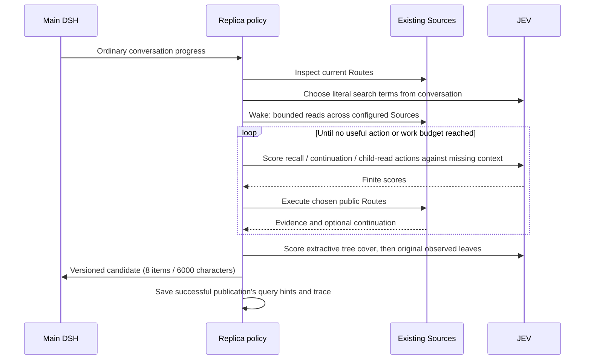

# OptMem-inspired JEV exploration: frozen experiment protocol

Date: 2026-09-23. Baseline commit: `8dbf9b21`. Same local branch and worktree; no push or PR. Existing Source implementations and public read limits are unchanged.

Completed implementation, final comparisons, limitations and retained evidence: [experiment report](../reports/jev-optmem-20260923.md).

## Reference and scope

The reference is [VictorTaelin/OptMem](https://github.com/VictorTaelin/OptMem), rechecked against its current README and memo on this date, plus our earlier [source study](https://github.com/VictorTaelin/OptMem/tree/1fb164cf39028047781f72ac3bb1e5a691c1dcb0). OptMem retains submitted notes, builds a lossy summary tree, presents a budgeted cover, and allows recall/zoom. It is not model training. Earlier documents' references to “OptMem training” were inaccurate.

This independent policy borrows wake/recall/zoom and separating navigation from evidence. It uses an extractive binary tree over observed results; it does not reproduce OptMem's storage, generated summaries, or claim full-corpus coverage. Every published fact must come from a current-run plugin read. Checkpoints retain query hints and audit data; opaque View cursors do not cross runs. No Source changes, management reads, direct-store retrieval, model-generated query strings, or automatic writes are used.

## Predeclared comparisons

1. Repeat all 17 existing heterogeneous turns at 900 records: old two-stage `jev` versus `jev-optmem`. Same corpus per run, same 8-item/6000-character output budget, same main prompt/model, capture disabled, no main tool calls. Both main arms allow up to 30 seconds for the replica. Rotate arm order each input.
2. Repeat all 17 turns at 900 records with deterministic scattered placement and varied distractors. The original layout contains six authored rows near the end of each source and repeated distractors mentioning the scenario names. The scattered layout permutes every row by SHA-256(source type + fixture key), and uses twelve different distractor topics. It is a second synthetic stress condition, not an untouched real-user benchmark.
3. Replay the **same observed candidate pool and conversation** through tree and flat selection to isolate the final tree filter. Compare required-evidence retention and selector usage; do not infer main-answer quality from this selection-only ablation.
4. Offline process/lifecycle checks, and scale probe at 4500 records if available. Offline passes measure mechanics, never semantic model quality.

Old policy: up to four source reads, seven candidates per source. New policy: seven per initial read across configured Sources, up to 24 reads total, two adaptive rounds of up to six actions, 24 cover nodes and 64-leaf inspection budget. Route-owned call/result limits still apply. More search effort is an explicit cost, not a free efficiency improvement.

Record per-turn actual reads, unique sources, selected/injected required groups, fact keyword hits, obsolete evidence, canary answers, workspace/branch leaks, main input tokens including cache, JEV calls/tokens, latency, API failures, partial/unavailable text, and exact raw answers. Existing labels remain evaluation-only; policy code must not inspect fixture IDs, expected answers, or source data files.

Quality criteria: improvement is measured against the simultaneous old arm, not inferred from JEV confidence. Report every failed criterion, per-layout deltas and successful/failed examples. Do not claim generalized superiority, trained optimization, complete memory coverage, or publishability merely from a synthetic win.

## Recorded refinement after the first development run

The v1 original-layout run is retained separately. It found Canvas titles only on the second/final search round, leaving no phase to open their bodies. Version 2 uses remaining slots within the unchanged 24-read budget for one terminal child-read pass. Literal proposal extraction also joins adjacent tokens when ICU splits a Chinese name into single characters. These are general mechanism fixes, not fixture-specific branches. Repeat the original comparison and run scattered-layout stress with the final version; do not merge v1/v2 scores.

## Requested extension: contemporaneous all-candidates comparison

After the initial report, the user requested a comparison with all-candidates. Freeze this extension before running it: reseed fresh 900-record original and scattered corpora; run all 17 inputs with `all-candidates,jev-optmem`, rotating order. Keep the final strategy code unchanged. The control retains every result from nine bounded seven-item reads (up to 63); it does not search the whole corpus or open child bodies. It has no JEV API calls and no 8-item selection cap. The exploration arm retains its 24-read/8-item/6000-character budgets. Both use the same 24,000-character main Replica projection; verify actual complete injection instead of assuming it. Record answer quality, stage coverage, context size, actual read counts, foreground latency, JEV usage including post-answer refresh, API errors and exact failures. This tests the previous all-candidates baseline, not an equal-compute or same-observed-pool oracle.

The user also requested a comprehensive comparison including main DSH response latency. Derive first non-whitespace text, last text and completion from durable DSH inbox/request/compact-stream/turn timestamps. Archive the source events and independently replay timing arithmetic. Separate fresh candidate preparation (including queue/poll/write time), main model time to first text, and remaining generation. Report means, medians and p95; 17 samples make nearest-rank p95 the maximum. These timestamps do not include browser transport or rendering. The existing strategy and running comparison need no modification for this measurement.
