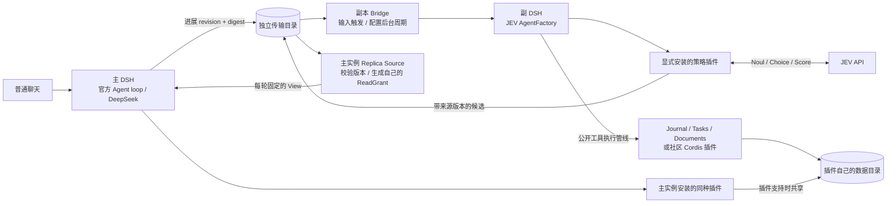
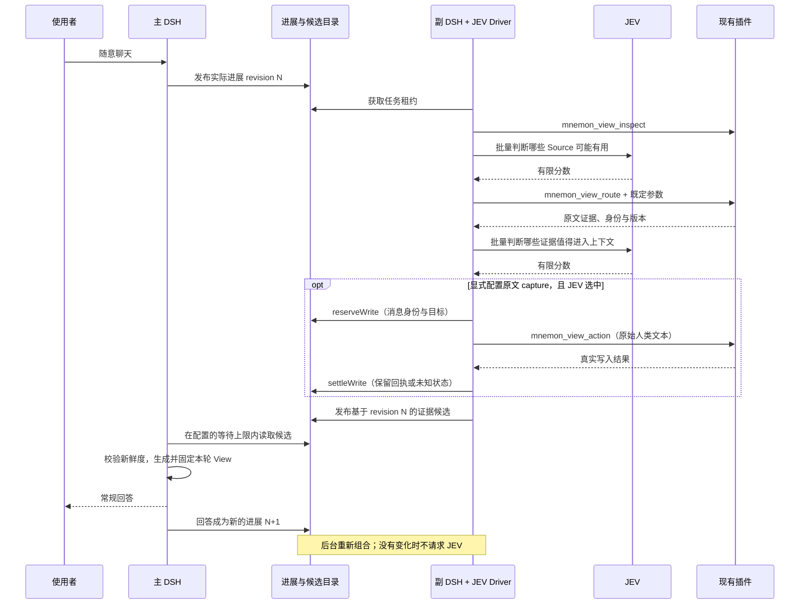

# JEV 主副 DSH 实验实现

本地分支 `codex/jev-replica-agent-loop` 从 draft PR #229 的 `codex/composable-workspace-context` 创建，合入 main `84d469ff`。不发布、不推送。本轮目标是交付可运行与可测的版本；不声称已经验证 JEV 相对其他架构的普遍优势。

主 DSH 保持常规对话 Agent；独立副 DSH 安装另一个 AgentFactory。普通聊天、工具与插件数据仍沿用 DSH 和 Mnemon 已有路径。副本每次被唤醒时使用显式策略，通过 JEV 的有限回答决定读哪些内容，然后把带来源版本的证据候选交给主实例。主实例负责最终 View 的构造和生命周期。

## 插件职责

| 类别 | 插件/机制 | 职责 |
| --- | --- | --- |
| Driver | dsh-mnemon-agent-loop-jev | AgentFactory、队列、取消、持久化、上下文组装、决策预算、DSH 工具执行 |
| Transport / Source | dsh-mnemon-replica | 普通输入进展、后台触发、跨进程候选交付、主实例的快照与 ReadGrant |
| 可选策略 | dsh-mnemon-strategy-jev-context | 有限的 Source 与证据筛选；可选原文追加；所有阈值和选择策略都在此 |
| 现有 Sources | journal / tasks / documents 等 | 自己管理内容、原文读取、版本、写入语义和持久化 |
| 现有 Strategies | workspace / focus 等 | Mnemon View 的确定性构造；按配置选择，Driver 不强制默认策略 |
| Providers | 现有 provider 插件 | 各自后端的存储和检索；本轮无需迁移全部数据 |

保留 `plugins/<package-name>` 的 npm workspace 布局。新增的 Driver 与 Transport 不伪装成 Source/Strategy 的子类别；现有软件包名称和导出路径保持可用。没有把各插件实现集中到一个新内核里。

## 执行和写入

1. 主实例发布实际对话进展。副本轮询本地传输目录；没有新进展时不调用模型。后台周期必须显式配置。
2. 副本通过公开的 `ctx.agents.create/resume` 和新 Factory 驱动，触发 `system-prompt/assemble`、`agent/pre-step`，使现有 Mnemon View 和插件钩子正常工作。
3. 策略调用 `mnemon_view_inspect` 获取本轮可见的结构化 Route/ActionOffer 目录。它不包含 ReadGrant 或额外授权。
4. JEV 对明确问题给出有限回答。程序决定具体工具名与参数，再通过 `ctx.tools.execute` 执行。结果、异常和消耗回到下一步。
5. 显式开启 capture 时，只可追加最新的人类原文。先持久化操作意图，随后记录真实回执。写入和候选发布分别完成；不声称写完就已进入主 View。
6. 副本发布被选证据。主实例核对会话、输入版本/摘要、内容摘要和配置的新鲜度界限，再创建自己的 Source 快照及 ReadGrant。已经执行的 turn 不会被后续候选改写。

## 兼容边界

实现首先针对实际安装的 DSH `0.1.5-rc.1` 公共接口验证。DSH master 的 Agent 事件接口仍在变化；未经验证的版本不能直接视为兼容。副本只安装一个 Factory；LLM 重试、自动命名、压缩、token-meter、goal-round 等依赖原循环语义的插件需要移除或逐项适配。普通工具和 Source 仍遵守自己的依赖与执行权限。

独立实例和目录是运行隔离。需要共享内容时，插件自身必须支持同一存储目录及并发访问；当前 Journal 的 RecordStore 已提供文件锁与原子写入。任意社区插件不自动获得共享存储或远程调用能力。

候选里的内容版本证明副本读到了什么，不证明任意第三方后端此刻仍未变化。可以通过下一次输入或配置的后台周期重新生成。`waitMs` 和允许的版本滞后决定实时性与前台等待之间的取舍。

当前策略实现的是有界的两阶段筛选，不包含 Jev-Mem 的图遍历/结构学习，不包含 OptMem 的分层摘要与展开协议。运行协议允许其他作者实现多步策略和生成器，但此版本不默认启用它们。

## 验证清单

- 自动化：生命周期、回滚、恢复、取消、工具拒绝、预算、陈旧候选、写入意图、不可变 View。
- 两个独立进程：各自 DSH_HOME，实际已有插件读写，共享数据与传输目录，普通聊天触发更新，重启与空闲行为。
- 真实 API：JEV 有限决策和 DeepSeek 主对话；固定数据、普通对话、选择效果、调用/Token/延迟，保留失败案例。
- 回归：仓库的类型、单元、构建、打包、独立插件消费和 headless 检查；原生 Mnemon master `b0661c0b` 编译二进制用于相关验证。
- 交付：可重跑命令、配置、必要截图、实测报告；未完成的验证不会写成已通过。

参考官方 [DSH AgentFactory](https://github.com/deepseek-ai/deepseek-harness/tree/master/packages/core/agent)、[TypeSafe JS SDK](https://github.com/typesafe-ai/typesafe-sdk-js)、[Jev-Mem 论文](https://arxiv.org/html/2609.23986v1)与[作者实现](https://github.com/libingzheren/Jev-Mem)。

## 架构图





## 启动与替换

先完成本仓库的 `pnpm install`、`pnpm build`、`pnpm build:plugins`。API Key 通过进程环境 `TYPESAFE_API_KEY` 与 `DEEPSEEK_API_KEY` 提供，不写入 Profile。以下脚本只写指定的新实验目录：

```sh
# 可选：向全新实验目录写入 13 条合成内容；已有数据会拒绝重播。
node --experimental-transform-types scripts/seed-jev-profile.ts --root /tmp/jev-demo

# 两个实际 DSH CLI/Web Profile；每个 Profile 都通过 dsh plugin add 安装依赖。
node scripts/serve-jev-replica.mjs \
  --root /tmp/jev-demo --mnemon /absolute/path/to/mnemon \
  --main-port 5410 --replica-port 5411
```

在主实例页面添加打印出的 `workspace` 目录后普通聊天即可。副实例页面用于看工具轨迹；它不是一个可以选 LLM 聊天的普通会话。停止监督进程会停止两个子进程，数据保留。再次运行加 `--reuse`，保留手工修改的 Profile 配置。浏览器登录令牌只出现在本地启动日志中。

这两个 Profile 的配置位于 `<root>/<main|replica>/dsh-home/profiles/web/cordis.patch.yml`。要换策略或社区插件，使用对应实例的 `DSH_HOME` 执行 `dsh plugin --profile web add ...`，然后在该 Profile 显式配置 Entry。安装包不会自动将其启用；不存在全局默认的 JEV 策略。

Journal / Tasks 的 RecordStore 除了 `dataDir`，还按完整 `sourceInstanceKey` 分区。官方 Profile 下 `experiment-journal` 会成为 `source:include:experiment-journal`；主副必须保持对应完整标识一致。此约束由插件自己的存储设计决定；Bridge 不复制或重写第三方插件内容。示例启动器将根目录规范化为真实路径，避免 `/tmp` 与 `<tmp>` 在工作区身份上分裂。

当前源码与打包测试针对 Node 25.1.0、DSH 0.1.5-rc.1。脚本直接运行 TypeScript 需要支持 `--experimental-transform-types` 的 Node；发布插件本体使用编译后的 JavaScript。
