# LoCoMo 与 LongMemEval 全量对比：用 DSH 组装的 JEV 记忆实例

日期：2026-09-24 · 分支：`codex/jev-replica-practice`（本地提交，不发布、不推送）· 运行：北京时间 11:27 起，处于 DeepSeek 高峰时段

## 结论

1. **主张一：记忆实例确实是用 DSH 生态组合出来的。**
   - 记忆实例开工以来，DSH 内核只改了 9 行（1 个文件），Host 改了 106 行（5 个文件）。
   - 生态里已有的 Source 插件一行没改：journal、tasks、documents、files、sessions 等全部原样复用。
   - 约 3,000 行产品代码（另有测试约 800 行）全部落在新插件和策略里：副本桥、JEV 控制循环、自然策略。
   - 本次所有对比变体都只改配置，没有为某个变体改代码。
   - 生态里还有 9 个记忆服务提供方，Mem0 也在其中，可以作为异构记忆的一部分接进来。
2. **主张二：引入 JEV 后，性能没有明显损失。LoCoMo 上成立，LongMemEval 上还不能证明。**
   - 参照组是仅主 DSH：主模型用 DSH 的 View 工具自己查记忆。
   - 事先定的可接受损失上限：LoCoMo 3 个百分点，LongMemEval 5 个百分点。
   - **LoCoMo：** JEV 缓存方案 −1.4 [−2.8, 0.0]，JEV 全量方案 −1.6 [−3.0, −0.3]。在修订标签上，两者分别是 −0.9 和 −1.2，区间下限都在上限以内。
   - **LongMemEval：** JEV 全量方案 −2.8 [−7.2, +1.6]，JEV 缓存方案 −4.0 [−8.4, +0.4]。差异不显著，但区间下限超出了 5 个百分点，所以还不能证明没有明显损失。
   - **更正（2026-09-25）：LongMemEval 这两个数不应再引用。** 两个 JEV 方案都受台账缺陷影响（提交 4c171072）：
     - 同一天的记录超过一次 View 能读的数量时，台账无法继续往前翻，7–9% 的副实例台账停在 128 条笔记。
     - 测评框架只给每轮 16 次 JEV 调用，而笔记约 600 条时全量扫描就不够用了。
     - 修复后重跑了全量方案，在前 356 题上比仅主 DSH 高 +8.7 [+3.9, +13.5] 个百分点，校正后 p = 0.0016。这 356 题按数据集顺序排列，题型分布偏（没有知识更新题），只能在同一批题上比较。
     - 缓存方案没有重跑。详见 `docs/reports/cue-recall-20260924.md` §6。
   - **反证：** 只搭副本架构、不用 JEV（BM25 副本），会落后 9.3 个百分点（LoCoMo）和 23.2 个百分点（LongMemEval）。JEV 把这部分损失收回了 8–19 个百分点。
3. **效率：两种 JEV 方案里，主模型每题只读约 650 token。**
   - 作为对比：整段放入 2.2 万（LoCoMo）和 10.5 万（LongMemEval）；仅主 DSH 7.6 万和 5.3 万，而且要请求 4–5 次。
   - LoCoMo 上，JEV 缓存方案每题 $0.00078，约为仅主 DSH 的 1/5；p95 延迟 10 秒对 24 秒。
   - LongMemEval 每题的记忆都是新的：JEV 全量方案 $0.0032，和仅主 DSH 相当；缓存方案没有缓存可用，$0.0061。
4. **整段放入上下文是这两个基准上的准确率上限。**
   - 前提是答题模型为开思考的 DeepSeek，历史不超过约 11 万 token。
   - 成绩：LoCoMo 92.5%（修订后 95.7%），LongMemEval 95.2%。LoCoMo 上它还因为缓存而最便宜。
   - 代价随历史线性增长。历史加长到 8 倍（约 82 万 token）时，准确率从 95% 降到 85%，p50 延迟从 2.7 秒升到 18.7 秒，每题费用从 $0.007 升到 $0.12。
   - 如果主模型是 4o 系列（128k 窗口），历史到 2 倍就放不进去；按 4o 的价格算，整段放入比 JEV 方案贵 6–30 倍。
5. **标签和评审的可靠性：**
   - LoCoMo 有 4.5% 的题标签有问题：修正 25 题，剔除 44 题。修订后各组都涨 2.6–3.2 个百分点，组间差距不变。
   - DeepSeek 两遍判分的一致率：LoCoMo 99.1%（κ 0.96），LongMemEval 99.5%（κ 0.99）。
   - 严格盲审抽 150 题，DeepSeek 判宽 11 次，多是"记忆里没有记载，最接近的是……"这类回答，集中出现在记忆组。
6. **这两个基准只能证明"不吃亏"，证明不了核心价值。** LoCoMo 和 LongMemEval 都是同一种聊天记录，正是 Mem0 这类系统的主场，只能说明我们在传统主场上不掉性能。异构记忆的价值需要换一种测法来证明：题目和答案不变，记忆按内容分布到多种原生插件里（LoCoMo-H / LongMemEval-H，见 §10）。

## 1. 实验设计

### 1.1 数据

| 数据集 | 规模 | 每份记忆 | 题型 |
|---|---|---|---|
| LoCoMo | 10 段对话，272 个会话 | 每段 1.3–2.5 万 token | 1540 题：单跳 841、多跳 282、时间 321、开放域 96。按 Mem0 等工作的惯例，不含对抗类 446 题 |
| LongMemEval_S（清洗版） | 500 题，每题自带一份历史 | 约 48 个会话，约 10.6 万 token | 单会话·用户 70、单会话·助手 56、单会话·偏好 30、跨会话 133、时间推理 133、知识更新 78，其中 30 道拒答题单独统计 |

### 1.2 测法：先写入、再召回、再作答、再判分

1. **写入（相当于 ADD）：** 提问前，每个会话由 DeepSeek 写成带日期的笔记，按不超过 600 字切块，通过 journal Source 的标准 `create` 接口写进去。所有记忆组共用同一份笔记，只在召回和作答上有差别。
2. **建索引：** 副实例在后台预读 6 轮，把笔记读进自己的台账。这一步只读 Source，不调模型。
3. **召回和作答：** 每道题开一个新会话。主模型是 DeepSeek flash，开思考，推理强度 high。
4. **判分：**
   - LoCoMo 用 Mem0 的宽松 CORRECT/WRONG 判定，另算 F1 和 BLEU-1；
   - LongMemEval 用它自带 `evaluate_qa.py` 的分题型判定；
   - 评审是 DeepSeek（不开思考，温度 0），所有答案都判两遍。
5. **隔离：** 问答过程不写回记忆。已核对过：答题后 journal 的记录数不变。

### 1.3 对照组

| 组 | 做法 |
|---|---|
| 整段放入上下文 | 不用记忆系统，完整原始历史直接放进提示；作为上限参照 |
| 仅主 DSH | 主 DSH 自己挂 Source，看 Host 的 View，并用工具查；这是 DSH 自带的做法 |
| 副实例 · BM25 | 副本架构，但判断只用 BM25，不用 JEV；用来看"只有架构、没有 JEV"会怎样 |
| **JEV 全量方案** | 副实例里，JEV 分批并行地逐条处理全部笔记，再对候选做两问判断（需不需要、是否已过时） |
| **JEV 缓存方案** | 副实例里，一个弱 LLM 先读整本台账（作为稳定前缀，能命中缓存），列出候选并给出检索词，再由 JEV 判断 |
| v4t（只在 LoCoMo 上跑，作参照） | JEV 缓存方案的 View，外加主模型也能自己查 |

### 1.4 统计方法

- **准确率区间：** 同时给 Wilson 区间，和按"一段对话"重采样的 bootstrap 区间（10,000 次，固定随机种子）。LoCoMo 同一段对话的题共用一份记忆，不能当作相互独立。
- **两两比较：** 同一批题上做配对差值，区间用对话级 bootstrap，显著性用 McNemar 精确检验，并按 Holm 方法做多重比较校正。
- **非劣效检验：** 可接受的损失上限定为 LoCoMo 3 个百分点、LongMemEval 5 个百分点。定下这个上限时，LoCoMo 结果已全部看过，LongMemEval 的 JEV 缓存方案还没出结果、JEV 全量方案只出了一部分。
- **评审可靠性：** 两遍判分的一致率和 Cohen's κ；另外做了严格盲审（§6）。

### 1.5 运行与数据

- **规模和失败：** LoCoMo 6 组、LongMemEval 5 组，共 11,740 个答案，失败 0 次。
- **运行方式：** 测试框架支持断点续跑，每次调用都记录代码版本、数据集校验和、模型、提示词和并发设置。
- **原始数据：** 在练习工作区的 `runs/bench-full-20260924/` 下，不进 git。包括每题答案、两遍判分、每题交给主模型的上下文（`contexts.jsonl`），以及每题的工作区。
- **进仓库的数据：** 统计结果、逐题结果表、修订标签和盲审记录在 `docs/pr-assets/bench-full-20260924/data/`。
- **实际消耗（到写报告时为止）：**
  - DeepSeek 按低峰价约 $59：回答 $40.5、写笔记 $15.8、判分约 $3。这次在高峰时段跑，实际约 $119。
  - JEV 输入 1.32 亿 token，约 $5.5。

## 2. 主张一：DSH 生态组合带来的好处

### 2.1 改动足迹

起点是记忆实例开工前的最后一个提交（2026-09-23，把 main 合进草稿分支），终点是当前分支。

| 层 | 新增 / 删除行数 | 文件数 | 内容 |
|---|---:|---:|---|
| DSH 内核（src/core） | +9 / −2 | 1 | 路由说明只展示给能调用的 Agent |
| Host（src/host） | +100 / −6 | 5 | 增量投递、路由展示、配置项 |
| 已有插件（各类 Source 等） | **0** | 0 | 原样复用 |
| 新插件：副本桥（replica）、JEV 控制循环（agent-loop-jev） | +1,115（另有测试 +279） | 20 | 通用的"专用实例"基础设施 |
| 新插件：早期 JEV 策略（strategy-jev-context） | +261（另有测试 +62） | 7 | |
| JEV 自然策略插件（strategy-jev-optmem） | +1,602（另有测试 +467） | 17 | 记忆专用策略 |
| 实验框架、测试、文档 | 约 +10,500 | — | 不属于产品代码 |

- **生态先于记忆实例存在：** 这些 Source 插件是 2026-09-09 作为通用 workspace 功能加入的，比记忆实例早两周，所以算复用，不算这次的开发量。
- **比例：** 产品代码约 2,980 行，其中内核和 Host 的改动约占 3.5%。
- **需要如实说明的一点：** 这 109 行内核和 Host 改动，是在记忆实例演进过程中加的，用来支持增量投递和路由展示，不是为了开工就必须改的。

### 2.2 只改配置就能切换的部件

| 变体 | 改动的配置项 |
|---|---|
| 判断：BM25 ↔ JEV | `natural: 'lexical' \| 'jev'` |
| 召回：JEV 全量 ↔ 弱 LLM 预召回 | `recall: 'jev' \| 'llm'`，以及 `termsFrom: 'recall'` |
| 投递：增量 / 追加 / 替换 | `snapshotDelivery: 'delta' \| 'append' \| 'replace'` |
| 主模型是否也能自己查（v4t） | `mainMemory: true` |
| View 预算和召回清单长度 | `maxItems`、`maxCharacters`、`listing` |
| 主模型思考模式 | `thinking` |

### 2.3 来自生态的能力，以及对应的效果

这部分数据来自第二轮报告 `docs/reports/jev-v4-20260923.md`。

| DSH 提供的能力 | 带来的效果 |
|---|---|
| 各 Source 的原生读写，带版本号 | 一周场景（9 种 Source、10 处事实中途变化）：过时回答 0/82，基线 7/82；用到必要事实 96%，基线 76% |
| Host 的增量投递 | 主模型缓存命中率 97%，替换投递只有 78% |
| 独立实例带来的进程隔离 | 4 倍语料实验里，副实例任务失败时，主 Agent 照常用上一份 View 回答 |
| 后台作业 | 预读和日期回填都在主模型之外完成，不占主模型的上下文 |
| 记忆工作放在副实例里做，主模型上下文保持精简 | 长工具任务的验收通过率：记忆方案 96–98%，仅主 DSH 75% |

### 2.4 生态里现成的记忆服务提供方

Memory Spaces 这个 Source 下面有 9 个提供方：Mnemon 原生、Holographic、ByteRover、Mem0、Supermemory、Honcho、Hindsight、RetainDB、OpenViking。
- **本地可跑：** Mnemon 原生（本地 `mnemon.db`，带类型图谱）和 Holographic（本地结构化事实库，带实体图谱）。
- **需要外部服务：** 其余几个需要各自的云服务或自建服务。

所以 Mem0 这类传统记忆系统，在 DSH 里只是可以接进来的一个零件，可以和日志、任务、文档、会话并列，由记忆实例统一组合。这是 §10 异构记忆基准的基础。

## 3. 主张二：引入 JEV 后是否有明显损失

各方案相对仅主 DSH 的配对差值，单位是百分点，方括号是按对话重采样的 95% 区间：

| | LoCoMo 原版（1540 题） | LoCoMo 修订版（1496 题） | LongMemEval（500 题） |
|---|---:|---:|---:|
| JEV 缓存方案 | −1.4 [−2.8, 0.0] | −0.9 [−2.1, +0.3] | −4.0 [−8.4, +0.4] |
| JEV 全量方案 | −1.6 [−3.0, −0.3] | −1.2 [−2.6, +0.1] | −2.8 [−7.2, +1.6] |
| 副实例 · BM25（不用 JEV） | −9.3 [−11.2, −7.2] | −9.3 [−11.2, −7.1] | −23.2 [−28.2, −18.2] |
| 非劣效上限 | 3 | 3 | 5 |
| 结论 | 缓存方案成立；全量方案临界 | 两个方案都成立 | 两个方案都不能证明 |

> **更正（2026-09-25）：** LongMemEval 一列的两个 JEV 方案受台账缺陷影响（见结论第 2 条），作废。修复后的全量方案在前 356 题上相对仅主 DSH 是 +8.7 [+3.9, +13.5]；缓存方案没有重跑。

- **JEV 把副本架构的损失收了回来。** 在副实例里用 JEV 代替 BM25，LoCoMo 高 7.9 个百分点，LongMemEval 高 19.2 个百分点，校正后都显著。
- **JEV 两个方案之间没有显著差异。** LoCoMo 上差 0.3，LongMemEval 上差 1.2。
- **LongMemEval 为什么差 3–4 个百分点，见 §4.4：** 主要是 View 给得太薄，证据没给全。
- **仅主 DSH 本身比整段放入低很多：** LoCoMo 低 5.9，LongMemEval 低 15.6。所以"不比仅主 DSH 差"说明的是：在 DSH 内部，把记忆工作从主模型挪到专用实例，不会带来损失；并不等于追平了整段放入。

## 4. 总体结果


### 4.1 LoCoMo（1540 题，原版标签）

| 组 | 准确率 [95% 区间] | F1 | BLEU-1 | 每题总 token | 主模型读入 | 每题费用 | 延迟 p50 / p95 |
|---|---:|---:|---:|---:|---:|---:|---:|
| 整段放入上下文 | 92.5% [91.1, 93.7] | 0.519 | 0.442 | 2.2 万 | 2.2 万 | $0.00038 | 1.4 / 8.8 秒 |
| v4t（参照） | 88.1% [87.1, 88.9] | 0.286 | 0.212 | 4.6 万 | 2.5 万（1.9 次请求） | $0.00232 | 5.6 / 17.5 秒 |
| 仅主 DSH | 86.6% [85.6, 87.5] | 0.176 | 0.108 | 7.7 万 | 7.6 万（4.8 次请求） | $0.00379 | 7.0 / 24.1 秒 |
| JEV 缓存方案 | 85.3% [83.9, 86.5] | 0.423 | 0.351 | 2.2 万 | 630 | $0.00078 | 5.1 / 10.0 秒 |
| JEV 全量方案 | 85.0% [83.4, 86.5] | 0.413 | 0.342 | 3.2 万 | 650 | $0.00156 | 4.9 / 9.6 秒 |
| 副实例 · BM25 | 77.3% [75.6, 79.5] | 0.326 | 0.256 | 1.8 千 | 1.5 千 | $0.00039 | 2.6 / 6.6 秒 |

费用按 DeepSeek 低峰价（未命中 / 命中 / 输出每百万 token $0.15 / $0.003 / $0.6）和 JEV 输入价（$0.042）计算，不含写笔记（LoCoMo 摊到每题只有 $0.00005）。

F1 和 BLEU-1 偏向简短的回答。仅主 DSH 和 v4t 的回答长，所以这两项偏低；它们和 LLM 评审的准确率不是一回事。

### 4.2 LongMemEval_S（500 题）

| 组 | 准确率 [95% 区间] | 每题总 token | 主模型读入 | 每题费用（回答） | 写笔记摊销 | 延迟 p50 / p95 |
|---|---:|---:|---:|---:|---:|---:|
| 整段放入上下文 | 95.2% [93.2, 97.0] | 10.6 万 | 10.5 万 | $0.0150 | — | 3.0 / 9.0 秒 |
| 仅主 DSH | 79.6% [76.0, 83.0] | 5.4 万 | 5.3 万（4.2 次请求） | $0.0029 | $0.0274 | 6.1 / 14.8 秒 |
| JEV 全量方案 | 76.8% [73.0, 80.4] | 7.0 万（98.5% 是 JEV） | 662 | $0.0032 | $0.0274 | 5.4 / 17.0 秒 |
| JEV 缓存方案 | 75.6% [71.8, 79.2] | 4.8 万（召回 3.6 万，未命中缓存） | 661 | $0.0061 | $0.0274 | 5.5 / 10.2 秒 |
| 副实例 · BM25 | 56.4% [52.2, 60.6] | 1.8 千 | 1.4 千 | $0.0004 | $0.0274 | 2.5 / 5.6 秒 |

### 4.3 按题型



| LoCoMo | 整段放入 | 仅主 DSH | BM25 | JEV 全量 | JEV 缓存 | v4t |
|---|---:|---:|---:|---:|---:|---:|
| 单跳（841） | 96.1 | 90.0 | 84.5 | 88.6 | 88.8 | 90.4 |
| 多跳（282） | 93.6 | 84.8 | 66.3 | 84.4 | 86.5 | 89.7 |
| 时间（321） | 90.7 | 86.6 | 78.8 | 84.7 | 84.1 | 89.1 |
| 开放域（96） | 64.6 | 62.5 | 41.7 | 56.2 | 54.2 | 59.4 |

| LongMemEval | 整段放入 | 仅主 DSH | BM25 | JEV 全量 | JEV 缓存 |
|---|---:|---:|---:|---:|---:|
| 单会话 · 用户（64） | 96.9 | 82.8 | 93.8 | 85.9 | 89.1 |
| 单会话 · 助手（56） | 100.0 | 78.6 | 83.9 | 87.5 | 92.9 |
| 单会话 · 偏好（30） | 96.7 | 53.3 | 40.0 | **80.0** | 73.3 |
| 跨会话（121） | 90.1 | 65.3 | 26.4 | 68.6 | 62.8 |
| 时间推理（127） | 96.1 | 85.8 | 34.6 | 71.7 | 71.7 |
| 知识更新（72） | 97.2 | 94.4 | 79.2 | 73.6 | 72.2 |
| 拒答（30） | 93.3 | 96.7 | 100.0 | 96.7 | 93.3 |

- **JEV 方案占优的题型：** 单会话类题目明显好于仅主 DSH。偏好题 80% 对 53%，助手题 93% 对 79%。
- **JEV 方案落后的题型：** 知识更新题（73% 对 94%）和时间推理题（72% 对 86%）。仅主 DSH 的 Host View 天然按时间展示最新记录，所以在这两类上占优；这也是 LongMemEval 上总分落后的主要来源。

### 4.4 错在哪里：证据没进 View，而不是读错

按证据会话是否出现在交给主模型的内容里分组：

| | 证据全部给到 | 只给到一部分 | 一条都没给到 |
|---|---|---|---|
| LongMemEval · JEV 全量方案 | 294 题，**95.2%** | 148 题，58.8% | 58 题，29.3% |
| LongMemEval · JEV 缓存方案 | 287 题，**95.8%** | 164 题，51.8% | 49 题，36.7% |
| LongMemEval · 仅主 DSH | 413 题，92.5% | 31 题，38.7% | 56 题，7.1% |
| LoCoMo · JEV 缓存方案 | 1263 题，**92.1%** | 145 题，75.2% | 128 题，31.2% |

- **证据给全时，JEV 方案和整段放入一样准。** 差距几乎全部来自召回和选择。
- **View 太薄。** LongMemEval 上 JEV 方案平均只给 1.7 条笔记，而预算允许 16 条、1.2 万字符。跨会话汇总类的题常常只拿到一部分证据。
- **仅主 DSH 的证据覆盖更高（83% 对 JEV 方案约 58%），** 因为它自己会反复去查，代价是 4 次以上请求、5 万多 token。

## 5. LoCoMo 标签修订

**流程：** 整个过程不看任何一组的答案。
1. 1540 题逐题取出问题、标准答案，以及数据集标注的证据对话（前后各多取两轮，带会话日期）。先由模型初筛，标出 175 题可能有问题。
2. 5 个复核代理分工逐题复核，必要时在整段对话里搜索，确认"证据里找不到"是不是只是证据位置标错了。
3. 另外从初筛判"正确"的题里随机抽 60 题一起复核，检查初筛有没有漏判。

**结果：**
- 修正 25 题，剔除 44 题，合计占 4.5%。
- 随机抽的 60 题全部保留。在这个样本量下，初筛的漏检率上限约为 5%。
- 抽查了两条复核结论，都和原文一致。

常见问题：
- **标准答案写成了另一个人的情况：** 问 Tim 学过什么语言，标准答案却是 John 会的西班牙语。
- **相对日期算错：** 5 月 25 日说"上周六"，标准答案写成了"周日"。
- **答案只出现在隐藏的图片元数据里：** 对话正文和图片说明里都没有。
- **问题问错了人：** 所问的事其实是对话另一方做的，而被问的人没有对应答案。

| 组 | 原版 | 修订版 | 变化 |
|---|---:|---:|---:|
| 整段放入上下文 | 92.5 | 95.7 [95.2, 96.2] | +3.2 |
| v4t（参照） | 88.1 | 91.0 [89.7, 92.1] | +2.9 |
| 仅主 DSH | 86.6 | 89.2 [87.7, 90.5] | +2.6 |
| JEV 缓存方案 | 85.3 | 88.2 [87.0, 89.2] | +2.9 |
| JEV 全量方案 | 85.0 | 88.0 [86.2, 89.4] | +3.0 |
| 副实例 · BM25 | 77.3 | 79.9 [78.0, 81.9] | +2.6 |

修订对各组的影响几乎一样，组间差距不变。修订版只作为补充，原版仍是主结果，便于和公开结果对照。所有修订决定、理由和证据引用都在 `data/refine-decisions.jsonl`。

## 6. 评审可靠性

**两遍判分的自洽性：**
- LoCoMo：9,240 个答案判了两遍，一致率 99.06%，κ = 0.961；
- LongMemEval：2,500 个，一致率 99.48%，κ = 0.985。

**严格盲审（LoCoMo）：**
- 只从标签确认无误的题里抽样，6 组各 25 题，其中 60% 取自和标准答案词重合很少的回答（宽松评审最可能出错的地方）。
- 由一个独立的复核代理按严格标准判分，它看不到组名和 DeepSeek 的判分。
- 结果：一致率 92%，DeepSeek 判宽 11 次、判严 1 次。

| 组 | 一致率 | DeepSeek 判宽 | 按 DeepSeek 的准确率 | 按严格标准的准确率 |
|---|---:|---:|---:|---:|
| 整段放入上下文 | 100% | 0 | 98.0% | 98.0% |
| JEV 全量方案 | 100% | 0 | 88.2% | 88.2% |
| v4t | 96% | 1 | 95.7% | 91.5% |
| JEV 缓存方案 | 88% | 3 | 94.3% | 82.8% |
| 副实例 · BM25 | 88% | 3 | 74.1% | 63.1% |
| 仅主 DSH | 80% | 4 | 89.2% | 72.9% |

两列准确率都是这 25 题的抽样估计，已按抽样权重折回全体。

- **判宽集中在一类回答上：** 先说"记忆里没有记载"，再把正确事实作为"最接近的细节"补上；或者在几个答案之间摇摆。LoCoMo 的宽松判分提示会放过这类回答，而它们恰好出现在记忆组"证据没给全"的时候。
- **影响：** 按严格标准，整段放入和各记忆组的真实差距可能比表面数字更大，仅主 DSH 受影响最明显。
- **样本量有限：** 每组只有 25 题，严格准确率的误差约 ±15 个百分点，只能作为方向性证据。

## 7. token、上下文与费用

### 7.1 每题 token 构成

| | 主模型读入（其中命中缓存） | 主模型输出（含思考） | 召回 LLM 读入（其中命中缓存） | JEV | 合计 |
|---|---:|---:|---:|---:|---:|
| LoCoMo · 整段放入 | 21,613（21,297） | 442 | — | — | 22,055 |
| LoCoMo · 仅主 DSH | 75,733（57,721） | 1,517 | — | — | 77,251 |
| LoCoMo · JEV 全量 | 650（130） | 271 | — | 31,501 | 32,422 |
| LoCoMo · JEV 缓存 | 630（131） | 301 | 11,384（10,974） | 9,418 | 21,791 |
| LongMemEval · 整段放入 | 105,134（7,565） | 513 | — | — | 105,648 |
| LongMemEval · 仅主 DSH | 52,590（38,807） | 1,220 | — | — | 53,810 |
| LongMemEval · JEV 全量 | 662（237） | 370 | — | 68,678 | 69,710 |
| LongMemEval · JEV 缓存 | 661（246） | 329 | 35,583（1） | 11,048 | 47,671 |

两种 JEV 方案都不是"只调一次主模型"：
- **全量方案**把读全部记忆的工作交给了 JEV；
- **缓存方案**交给了一个弱 LLM，并在反复使用同一份记忆时命中缓存，LoCoMo 上命中率 96%。

它们的优势在于主模型只读约 650 token，而不在总 token 更少。LoCoMo 上缓存方案的总 token 和整段放入差不多，LongMemEval 上约为整段放入的 45%。

### 7.2 不同计价条件下的每题费用

| | 实际运行（低峰价） | 完全没有缓存 | 主模型贵 5 倍 | 主模型贵 20 倍 |
|---|---:|---:|---:|---:|
| LoCoMo · 整段放入 | $0.00038 | $0.00351 | $0.00188 | $0.00753 |
| LoCoMo · 仅主 DSH | $0.00379 | $0.01227 | $0.01893 | $0.07571 |
| LoCoMo · JEV 全量 | $0.00156 | $0.00158 | $0.00253 | $0.00615 |
| LoCoMo · JEV 缓存 | $0.00078 | $0.00241 | $0.00181 | $0.00565 |
| LongMemEval · 整段放入 | $0.0150 | $0.0161 | $0.0748 | $0.2993 |
| LongMemEval · 仅主 DSH | $0.0029 | $0.0086 | $0.0146 | $0.0583 |
| LongMemEval · JEV 全量 | $0.0032 | $0.0032 | $0.0043 | $0.0086 |
| LongMemEval · JEV 缓存 | $0.0061 | $0.0061 | $0.0071 | $0.0110 |


**按 OpenAI 公布的标价把主模型换成 4o 系列**（2024–2025 年价格；其余部分仍按 DeepSeek flash 和 JEV 计价）。这是用本次实测 token 数套价格的反事实计算：换模型后输出长度和准确率都会变。

| 每题费用 | 主模型 DeepSeek（实际） | 主模型 4o-mini | 主模型 GPT-4o |
|---|---:|---:|---:|
| LoCoMo · 整段放入 | $0.00038 | $0.0019 | $0.0318 |
| LoCoMo · JEV 全量 | $0.00156 | $0.0016 | $0.0055 |
| LoCoMo · JEV 缓存 | $0.00078 | $0.0008 | $0.0050 |
| LongMemEval · 整段放入 | $0.0150 | $0.0155 | $0.2585 |
| LongMemEval · JEV 全量 | $0.0032 | $0.0032 | $0.0079 |
| LongMemEval · JEV 缓存 | $0.0061 | $0.0061 | $0.0105 |

差距拉开有三个原因：
- **单价：** GPT-4o 约是 flash 的 17 倍，而 JEV 方案里主模型只读约 650 token；
- **缓存折扣：** OpenAI 命中缓存只打五折，DeepSeek 命中价约为未命中的 2%；
- **窗口：** 4o 系列只有 128k，放不下 2 倍以上的 LongMemEval 历史。

### 7.3 写笔记的成本

- **LoCoMo：** 一份记忆被问约 150 次，写笔记摊到每题只要 $0.00005。
- **LongMemEval：** 每份记忆只问一次，19,195 个会话写笔记共 $13.7，摊到每题 $0.0274，比回答本身还贵。
- **实际使用中：** 笔记在对话发生时写一次，之后被反复使用，这笔钱会被摊薄。一份记忆被使用约 10 次以后，写笔记的成本就低于回答本身的成本。

## 8. 补充实验（部分结果，全部完成后更新）

### 8.1 历史加长（LongMemEval 按题型抽 60 题，用其他题的填充会话加长）

| 历史长度 | 整段放入：准确率 | 每题读入 | 延迟 p50 | 每题费用 |
|---|---:|---:|---:|---:|
| 1 倍 | 95.0% | 10.5 万 | 2.7 秒 | $0.0068 |
| 2 倍 | 90.0% | 20.9 万 | 5.1 秒 | $0.032 |
| 4 倍 | 90.0% | 41.6 万 | 9.2 秒 | $0.063 |
| 8 倍 | 85.0%（−10，p = 0.15） | 82.3 万（最大 96 万） | 18.7 秒 | $0.122 |

同一批题配对比较。记忆组（仅主 DSH、BM25、JEV 全量、JEV 缓存）在 2、4、8 倍下的结果还在跑。

### 8.2 持续会话（LoCoMo：每段对话的约 150 题在同一个会话里连续问）

| 组 | 准确率 | 主模型上下文（前 → 后三分之一段） | 说明 |
|---|---:|---:|---|
| 整段放入上下文 | 93.2% | 2.3 万 → 2.6 万 | 99% 命中缓存，每题约 $0.0003 |
| 仅主 DSH | 89.5% | 7.0 万 → 11.4 万（最大 16.4 万） | 工具结果不断累积 |
| 副实例 · BM25 | 84.2% | 2.0 万 → 9.1 万 | 每题的 View 增量都追加进会话、从不回收 |
| JEV 全量方案 | 89.1% | 1.2 万 → 4.8 万 | 每题约 $0.0016 |
| JEV 缓存方案 | 89.4% | 1.1 万 → 4.6 万 | 每题约 $0.0008 |

> **补充（2026-09-25）：** 写报告时 JEV 两个方案还在跑，BM25 一行用的是中途数据。上表已换成全部 1540 题跑完后的最终数据（`data/locomo-continuous.json`）。


- **JEV 两个方案的上下文增长约为仅主 DSH 的一半，准确率和它相当（89.1% / 89.4% 对 89.5%），但上下文仍然随轮次持续增长。**
- **增量投递在主题不断变化的长会话里会持续累积上下文。** 要保住短上下文的优势，需要给增量链设一个上限：超过就撤下旧链，重新发一份完整 View（见 §9）。
- **所有组的准确率都比"每题开新会话"时高。** 很可能是前面的问答留在上下文里帮了后面的题，所以两种测法的数字不能直接对比。

### 8.3 合并记忆（LoCoMo 10 段对话合成一份记忆，约 21 万 token；剔除提到 John 的 276 题后剩 1,264 题）

- 整段放入：同一批题从 92.7% 降到 90.5%（丢 43 题，多对 15 题）。每题读入 21.1 万 token，几乎全部命中缓存，p95 延迟 15.8 秒。
- 其余组还在跑。

## 9. 改进方向（针对失败机制，不针对具体题目）

1. **View 不够就补：** 组完 View 后问 JEV"回答还需要没给出的笔记吗"，需要就按排序往后补，最多补到预算上限。目标是 §4.4 的"证据只给到一部分"。
2. **持续会话里给增量链设上限：** 超过一定长度就重新发一份完整 View，上下文就有上限（§8.2）。
3. **召回前先粗筛：** 缓存方案一次性问答时，用检索词先筛出候选再列清单，让召回成本不再随记忆大小线性增长（§7.1）。
4. **验证方式：**
   - LoCoMo 3 段对话（385 题）、LongMemEval 分层抽 100 题作开发集，其余留出，最后只跑一次；
   - 一周场景作为不许退步的回归检查；
   - 开发集和留出集的结果分开报，并写明试过几个变体。

## 10. 下一步：异构记忆基准 LoCoMo-H / LongMemEval-H

**思路：** 题目和标准答案原样不动，只把记忆按内容分布到多种原生插件里。

**LoCoMo-H：** LoCoMo 自带多种形态的标注，可以直接分配：

| 数据内容 | 放进哪个插件 |
|---|---|
| 原始对话 | sessions |
| 会话摘要 | journal |
| 按人的事实（observation，带 turn 编号） | project-context，或 Memory Spaces 的 Holographic / Mnemon 原生 |
| 带日期的事件（event_summary） | tasks 或日志事件 |
| 照片说明 | canvas / files |

**LongMemEval-H：** 用一套固定的通用抽取流程：用户事实写进事实库，事实变化时原地更新这条记录，旧值成为历史版本；助手给过的内容写进 documents。

**对照组：**
- 单一传统记忆：先用本地的 Holographic 或 Mnemon 原生；你提供账号的话可以换成 Mem0；
- 扁平笔记，也就是本报告的做法；
- 异构组合 + JEV 记忆实例；
- 异构组合 + 仅主 DSH；
- 整段放入上下文。

**事先写定的假设：** 异构组合恰好补上本报告里扁平笔记的短板：跨会话汇总、时间推理、知识更新、笔记里丢掉的细节。其他题型不变。

**防过拟合：**
- 分配规则按"内容是什么"来定，不按"题目问什么"来定，事先写死；
- 用数据集自带的标注，没有需要调的写入逻辑。这些标注和部分题目同源，所以另跑一组"用我们自己抽取的事实"作对照；
- 开发集和留出集的划分沿用 §9。

## 11. 局限

- **模型：** 答题和评审都用 DeepSeek，准确率的绝对值不能直接和用 GPT-4o 判分的论文比。4o 系列的费用是反事实计算。
- **运行次数：** 每组只跑了一次，没有重复运行；两遍判分的一致率 99% 以上，说明评审带来的波动很小。
- **非劣效上限定得较晚：** 定上限时 LoCoMo 结果已经全部看过（LongMemEval 的 JEV 缓存方案结果还没出）。LongMemEval 的结论是"不能证明"，没有受到这一点的偏向。
- **笔记是同一份：** 所有记忆组共用同一份笔记，笔记本身丢掉的细节（LoCoMo 约 3.4% 的题）是所有记忆组共同的上限。
- **修订标签：** 修订版只覆盖初筛标出的题和 60 道随机对照题，没有逐题人工复核全部 1540 题。
- **严格盲审：** 复核代理和评审同样是模型，不等同于人工评审。
- **补充实验：** §8 是部分结果；加长历史只有 60 题，准确率的区间较宽。

## 附录 A：复现

```bash
# 全量运行（可断点续跑）
node --env-file=<keys> --experimental-transform-types scripts/bench/run.ts --dataset locomo --arms full-context,main-only:notes,replica-lexical:notes,replica-scan:notes,replica-v4:notes,replica-v4t:notes --warm 6 --concurrency 10 --out <runs>/locomo
node --env-file=<keys> --experimental-transform-types scripts/bench/run.ts --dataset longmemeval --prepare --notes-concurrency 48 --out <runs>/longmemeval
node --env-file=<keys> --experimental-transform-types scripts/bench/run.ts --dataset longmemeval --arms full-context,main-only:notes,replica-lexical:notes,replica-scan:notes,replica-v4:notes --warm 6 --concurrency 8 --out <runs>/longmemeval
# 两遍判分
node --env-file=<keys> --experimental-transform-types scripts/bench/judge.ts <runs>/locomo --concurrency 24
node --env-file=<keys> --experimental-transform-types scripts/bench/judge.ts <runs>/locomo --pass 2 --concurrency 24
# 统计、逐题结果、图
node --experimental-transform-types scripts/bench/stats.ts <runs>/locomo --notes <notes-locomo.jsonl> --data <locomo10.json> --out stats.json --csv answers.csv
node --experimental-transform-types scripts/bench/plot-full.ts --locomo <locomo stats.json> --longmemeval <longmemeval stats.json> --out <dir>
# LoCoMo 标签修订
node --env-file=<keys> --experimental-transform-types scripts/bench/refine.ts flag <locomo10.json> <refine-dir>
node --experimental-transform-types scripts/bench/refine.ts build <refine-dir>
node --env-file=<keys> --experimental-transform-types scripts/bench/judge.ts <runs>/locomo --refine <refine-dir>/locomo-refined.json
node --experimental-transform-types scripts/bench/stats.ts <runs>/locomo --refine <refine-dir>/locomo-refined.json --out stats-refined.json
# 评审盲审
node --experimental-transform-types scripts/bench/audit.ts sample <runs>/locomo --per-arm 25 --refine <refine-dir>/locomo-refined.json
node --experimental-transform-types scripts/bench/audit.ts score <runs>/locomo
# 补充实验
node --env-file=<keys> --experimental-transform-types scripts/bench/run.ts --dataset longmemeval --per-type 10 --pad 8 --arms full-context --out <runs>/lme-pad8
node --env-file=<keys> --experimental-transform-types scripts/bench/run.ts --dataset locomo --continuous --arms <arms> --out <runs>/locomo-continuous
node --env-file=<keys> --experimental-transform-types scripts/bench/run.ts --dataset locomo --merge 10 --arms <arms> --out <runs>/locomo-merged
node --experimental-transform-types scripts/bench/scaling.ts --base <runs>/longmemeval 2=<runs>/lme-pad2 4=<runs>/lme-pad4 8=<runs>/lme-pad8 --out scaling.json --chart scaling.svg
node --experimental-transform-types scripts/bench/continuous.ts <runs>/locomo-continuous --out continuous.json --chart continuous.svg
```

`<runs>` 是练习工作区的 `runs/bench-full-20260924/`。

## 附录 B：数据文件（`docs/pr-assets/bench-full-20260924/data/`）

| 文件 | 内容 |
|---|---|
| `locomo-stats.json` / `locomo-stats-refined.json` / `longmemeval-stats.json` | 全部统计：各组准确率与区间、题型、配对比较、token、上下文、各种计价条件下的费用、延迟、判分一致性 |
| `locomo-answers.csv` / `longmemeval-answers.csv` | 逐题结果（每题每组一行）：两遍判分、F1、BLEU-1、证据、费用、延迟、各类 token |
| `locomo-refined.json` / `refine-decisions.jsonl` | 修订标签和每一条决定的理由、证据引用 |
| `locomo-audit-*.json(l)` | 盲审抽样、判分结果、对照结果 |
| `dsh-footprint.json` | 改动足迹 |
