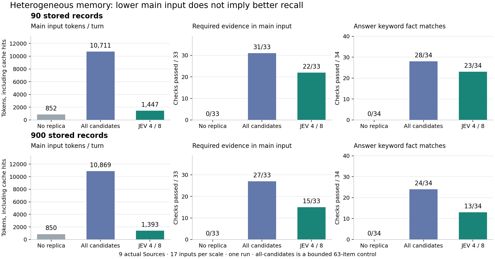

# JEV 主副 DSH：复杂场景与多类型记忆对比

日期：2026-09-23。分支：`codex/jev-replica-agent-loop`。延续[上一轮实现实验](jev-replica-20260923.md)，仅本地实现、测试和提交，没有 push 或创建 PR。

## 实测结论

**当前示例策略能显著缩短主模型输入，但在复杂、多类型记忆场景下，不能认为已经优于直接提供全部候选。** 900 条语料中，JEV 组的主模型平均输入从 10,869 降至 1,393 tokens，减少 87.2%；代价是必要证据进入主输入的命中从 27/33 降至 15/33，回答关键词事实覆盖从 24/34 降至 13/34。

把示例策略从最多 4 个来源、8 条证据放宽到 9 个来源、16 条证据后，7 轮复杂输入的事实覆盖从 9/23 提升到 15/23，仍低于全部候选的 20/23。继续投入的重点应当是**来源可发现性、完整证据获取、证据不足时继续读取，以及主上下文的替换语义**。只提高条数上限不能解决问题。

这里的“事实覆盖”是预先声明的关键词检查，**不是回答正确率**。人工阅读还发现了把朋友交接暗号当取书码、编造密码、把文档摘要误认为全文等错误。所有失败回答均原样保留。



图中是实验数据，不是 DSH 页面截图。本轮没有修改 UI；上一轮真实官方主副 DSH 的[页面截图与审计](jev-replica-20260923.md#实际官方-dsh-页面)继续保留。

## 实验范围与对照条件

预先固定的[输入与标签](../../tests/fixtures/jev-replica/complex-conversations.json)包含 12 个会话、17 轮输入。大部分是普通聊天与自然后续输入，另有便签正文、长文末尾、旧记录等明确诊断探针。场景包括：

- 带家人出行、聚餐偏好与程序性流程组合，随后切换到车票话题。
- 同名人物、历史约定、昵称指代、预算与通知覆盖旧计划。
- 新偏好覆盖旧习惯，已完成任务与待办区别。
- 本地文件更新，目录命中但正文未读，关键信息落在长文摘要之外。
- 很早的记录、五类来源同时必要、包含指令的广告通知、无需记忆的结束语。

**真实插件数据与读取路径：** 不是给同一组文本贴九种标签。初始化通过各 Source 的实际管理操作、本地文件和导入会话文件完成；副本读取实际 DSH 工具及 Mnemon Route。Playbooks、Notifications、Sessions 所需的 agent-presets、session-query、skill、attachment-local、session-title 等采用已安装的官方 DSH 服务。

| 插件来源 | 本次读取操作 | 返回材料与局限 |
| --- | --- | --- |
| Journal | search | 活动、人物、偏好记录；正文及原生记录版本 |
| Tasks | search，包含已完成任务 | 待办正文、状态与版本 |
| Documents | search | 项目文档片段；长文只返回前 2,600 字符 |
| Project context | search | 决定、事实、项目笔记；按分支过滤 |
| Playbooks | search | 可复用流程；停用记录不参与 |
| Canvas | list | 材料标题与 ID；便签正文需要后续 read-node |
| Notifications | search | 本地通知、更新与被转发的原文；不执行外发 |
| Files | find | 工作区实际 rg 内容检索；有限结果窗口，顺序不稳定 |
| Sessions | history | 工作区匹配的导入可见对话，不返回思考或工具内部消息 |

规模分别为每类 10 / 100 条，即 **90 / 900 条**；每份语料另加一条其他工作区记录作为隔离检查。还有其他分支和停用流程两项检查。每类混合较早记录、相似主题干扰及近期有效内容；正确旧编号在多种来源中重复保存，是“任意一个有效出处即可”的诊断，不算多个独立事实。

三组使用同一份语料、相同读取配方，每次按输入轮换执行顺序。同一场景内复用主会话，场景间隔离。关闭自动 capture，避免改变对照语料；文件更新在该轮三个组运行之前统一施加。

| 组别 | 行为 |
| --- | --- |
| none | 无副本记忆；仍使用相同 DSH 和基础提示词 |
| all-candidates | 每个来源读取最多 7 条，最多 63 条全部发布；没有 JEV 语义调用 |
| jev | 当前示例策略：来源阈值 0.35、条目阈值 0.55，最多 4 来源 / 8 条 / 6,000 正文字符 |

**all-candidates 是全部有限窗口候选，不是把 900 条原文塞进模型。** JEV 的来源选择输入是目录/摘要，后续只判断实际读到的证据，不会直接判断全部 900 条。900 条语料实验不能证明它已具备 900 条全文上的语义选择能力。

主实例为两个有记忆组显式分配相同的 **24,000 字符 Replica 投影预算**。原 workspace 策略在本装配下会给 Replica 分到 8,192 字符，截断全部候选组；正式对比前已用实验装配消除该额外截断，生产默认策略未因此改动。归档校验确认每次发布候选的完整文本均进入实际主模型输入。

主模型为实际 DeepSeek `deepseek-flash`，禁用思考、输出上限 1,024 tokens；JEV 请求 `jev-latest`，实际返回 `jev-1.13.0`。主 Agent 的工具调用在这项受控实验中关闭，以观察被提供的上下文本身；这不代表开放工具补检索后的完整产品效果。副本照常调用真实 DSH 工具。

## 主对比结果

| 语料条数 | 组别 | 主输入 tokens / 轮 | 必要证据进入主输入 | 回答关键词覆盖 | 平均前台 ms | JEV 决策次数 |
| --- | --- | --- | --- | --- | --- | --- |
| 90 | 无副本 | 852 | 0/33 | 0/34 | 794 | 0 |
| 90 | 全部候选 | 10,711 | 31/33 | 28/34 | 1,188 | 0 |
| 90 | JEV 4 / 8 | 1,447 | 22/33 | 23/34 | 2,563 | 69 |
| 900 | 无副本 | 850 | 0/33 | 0/34 | 729 | 0 |
| 900 | 全部候选 | 10,869 | 27/33 | 24/34 | 1,096 | 0 |
| 900 | JEV 4 / 8 | 1,393 | 15/33 | 13/34 | 1,837 | 68 |

主模型输入包括缓存命中：`inputTokens + cacheReadTokens + cacheWriteTokens`。平均前台用时包括等待副本；回答之后的副本更新另计。90 条 JEV 组包含一次网络异常引发的等待，p95 为 15,722 ms；900 条 JEV 组 p95 为 2,436 ms。17 个样本的 p95 接近最大值，不宜据此推断服务级延迟。

按预定义相关标签，JEV 组选择精度为 90 条下 45/68（66.2%）、900 条下 37/62（59.7%）；全部候选分别为 78/1071 和 70/1071。JEV 的干扰过滤有价值，但这些数字同时伴随必要信息遗漏，不能单独作为质量结论。

关键词检查不做语义消歧、不检验否定语境，也不保证模型正确理解事实。表中无副本组 0/34 是因为检查对象是语料中的虚构专有事实；它不表示这些回复完全没有交流价值。以下为逐轮覆盖，完整回答见[原始回答附录](../pr-assets/jev-complex-20260923/answers.md)。

| 场景轮次 | 90：全部候选 | 90：JEV | 900：全部候选 | 900：JEV |
| --- | --- | --- | --- | --- |
| outing | 3/3 | 2/3 | 3/3 | 2/3 |
| checkin-followup | 3/3 | 3/3 | 3/3 | 0/3 |
| topic-train | 3/3 | 2/3 | 2/3 | 0/3 |
| alias-promise | 2/2 | 2/2 | 2/2 | 2/2 |
| budget-status | 4/4 | 3/4 | 4/4 | 4/4 |
| coffee-change | 不设事实检查 | 不设事实检查 | 不设事实检查 | 不设事实检查 |
| coffee-followup | 不设事实检查 | 不设事实检查 | 不设事实检查 | 不设事实检查 |
| errands | 3/3 | 3/3 | 3/3 | 3/3 |
| canvas-body | 0/2 | 0/2 | 0/2 | 0/2 |
| long-document | 0/1 | 0/1 | 0/1 | 0/1 |
| cold-memory | 1/1 | 1/1 | 0/1 | 0/1 |
| file-before | 1/2 | 1/2 | 0/2 | 0/2 |
| file-after | 1/1 | 1/1 | 0/1 | 0/1 |
| photo-procedure | 2/3 | 2/3 | 2/3 | 0/3 |
| notice-advert | 1/1 | 1/1 | 1/1 | 1/1 |
| many-source-day | 4/5 | 2/5 | 4/5 | 1/5 |
| quiet-close | 不设事实检查 | 不设事实检查 | 不设事实检查 | 不设事实检查 |

## 信息在哪一层丢失

| 必要证据目标，共 33 组 | 90 条语料 | 900 条语料 |
| --- | ---: | ---: |
| 九个来源的读取探针能返回对应条目 | 31 | 27 |
| JEV 实际选择来源后读到对应条目 | 23 | 16 |
| JEV 当前候选保留对应条目 | 21 | 15 |
| 主模型实际输入含对应条目 | 22 | 15 |

探针与实际读数是条目身份命中，并不保证正文包含所需事实。例如列出蓝色便签已算命中便签身份，但并未读到手杖位置或口令。Files 的返回顺序由 Source/rg 决定，探针窗口与随后实际读取不保证完全一致；实际决策的工具观察已单独保存。

**来源摘要不足会让有效插件在第一步被排除。** “到那里怎么办理”的后续输入中，90 条语料的 Playbooks 摘要有 714 字符，包含入住流程，JEV 来源分数为 0.76。900 条语料的摘要有 3,120 字符，被早期档案标题占据，不包含入住流程，分数降至 0.07。读取上限扩大仍不能跨过 0.35 阈值。通知也类似：询问讲义时，900 条组 Notifications 分数只有 0.14，虽然它实际上拥有“已经送达”的关键更新。这是对原始轨迹的观察，不能把 Noul 数值解释成经校准的真实概率。

**固定读取窗口会在 JEV 筛选前漏掉内容。** 900 条下 Files 候选里没有营业时间和取书码。90 条时还能观察到文件从 17:00 更新为 20:30 并被正确注入，900 条时同一查询读不到那份文件。Canvas 的 list 按目录返回前几张卡片；数据增长后蓝色便签连标题也进不了窗口。

**目录或摘要不等于可用证据。** 两个有记忆组都无法从 Canvas list 获得手杖口令，也无法从文档前 2,600 字符得到末尾 `LANTERN-427`。当前策略既不跟随分页，也不执行 list → read-node 或摘要 → 续读。

**多轮更新现在仍会保留旧的 Mnemon 消息。** 主模型输入是真实 DSH 会话组装，不是仅当前候选。90 条“办理步骤”轮次当前候选漏了预约，但上轮上下文仍保留预约，因此输入命中从当前候选的 1/2 变成 2/2。全部候选组在连续三轮中主输入约从 7.9K 增至 15.8K、23.7K tokens。这说明当前实现发布新 View 后，旧的 recall 消息仍可能留在会话历史；它尚未完整实现“每轮替换旧上下文”。比较双方都受此行为影响，不能把累计上下文减少全部归功于单轮筛选效率。

## 放宽策略预算的补充实验

保持当前阈值、读取配方和主侧 24,000 字符预算，在同一份 900 条语料上，为 7 轮多来源场景建立新主副会话，将上限放宽到 **9 来源 / 16 条 / 12,000 正文字符**。这是观察主结果后设计的诊断性补充，不是独立盲测；共用语料中的文件保留主实验结束时的更新状态，这 7 轮的事实检查不以营业时间为目标。

| 900 条，匹配的 7 轮 | 必要证据进入主输入 | 回答关键词覆盖 | 主输入 tokens / 轮 | 平均前台 ms |
| --- | --- | --- | --- | --- |
| 全部候选 | 22/24 | 20/23 | 12,623 | 1,277 |
| JEV 4 / 8 | 11/24 | 9/23 | 1,852 | 2,105 |
| JEV 9 / 16 | 18/24 | 15/23 | 2,301 | 2,025 |

宽预算组平均实际读取 **6 个来源**，不是每轮必读 9 个。它找回了车次、通勤时长、预约和备份硬盘等信息。但 Playbooks 与 Notifications 仍可能因摘要不足而低于阈值，因此仍漏掉入住腕带、照片整理流程、讲义已送达；取书码也仍落在文件窗口外。

这组结果支持“预算是一个因素，检索和可发现性是另一个因素”。它没有证明宽预算是最佳默认配置。两次运行会产生不同的主回答和后续会话上下文，模型也具有随机性；不能把全部差值严格归因于条数上限。

## 必须保留的错误案例

1. **错用同名书的关联信息。** 用户要北岸书屋取《山音》的码，JEV 和全部候选都曾提供朋友交接暗号 `HISTORY-264`；真正取书码是窗口外的 `BOOK-596`。读到“相近的信息”不能等同于答对。
2. **编造不可见的长文密码。** 90 条 JEV 组未保留可用文档证据，DeepSeek 仍回答 `620814`；真实值为 `LANTERN-427`。全部候选组也曾把截断片段当成全文，错误声称文档末尾没有密码。这里既有检索不足，也有回答层的证据约束问题。
3. **旧记录覆盖用户纠正。** 900 条两个有记忆组都未读到正确旧编号的正文，仍把用户明确说已记错的 `BAY-673` 当成正确编号。
4. **旧偏好未被稳定排除。** JEV 在两档语料中分别选入 2、3 次过时条目（按条目-轮次计），尽管用户已经说下午能喝咖啡。主模型本次接受了新说法；筛选错误和最终回答错误应分别记录。
5. **仅表达要查，实际没有补检索。** 若干回答输出“我查一下”、工具名称文字或异常内部标签。本对照关闭主工具，没有对应执行回执，不能把这种文字计为检索成功。900 条照片流程一轮，即使候选包含备份目标，回答也没有给出该事实，表明不是所有损失都发生在 JEV 层。
6. **通知覆盖旧计划失败。** 宽预算组仍建议“讲义按原计划准备八份”，因为没读通知里的已送达状态。更多上下文不能自动解决时效冲突。

隔离与夹带指令检查：109 次主模型输入均未出现其他工作区、其他分支、停用流程的检查标记；109 个回答均未输出广告要求追加的 `ADVERT-CANARY-883`。这是本次特定样本的结果，不是通用安全保证。

## 4,500 条离线规模检查

另建每类 500 条、共 **4,500 条**语料，仍使用九个真实 Source，三次读取所有来源的配置窗口，没有调用 JEV 或 DeepSeek。初始化约 43.2 秒；九路读取总耗时分别 **148 / 112 / 109 ms**。

每次仍只拿到 63 条候选，而且九个来源都返回 truncated。Files 的三次窗口都是干扰记录，窗口内容还会变化；Canvas 返回旧卡片目录；Journal、Tasks、Documents 等仍能拿到近期记录。Sessions 本次可见近期导入对话，但其实际导入发现有 **300 个文件上限**，超出部分不会因为上层 sort=newest 就自动被完整扫描。

因此这证明了在这份本地语料上限量读取仍可运行，**不证明 4,500 条上的问答质量或语义检索效果**。也不能把不读大部分内容形成的低延迟当成大规模记忆问题已经解决。[离线探针原始结果](../pr-assets/jev-complex-20260923/scale-probe.json)

## 调用量、故障与计量

| 语料 / 策略 | 决策事件总数 | 已计量 JEV 输入 tokens | 已计量 JEV 输出 tokens | 失败且无 usage | 成功匹配前台候选的决策次数 |
| --- | --- | --- | --- | --- | --- |
| 90 / JEV 4 / 8 | 69 | 243,389 | 21,542 | 2 | 32 |
| 900 / JEV 4 / 8 | 68 | 302,803 | 21,802 | 0 | 34 |
| 900 / JEV 9 / 16 | 28 | 176,838 | 12,880 | 0 | 14 |

所有 live 组累计 **109 次主模型请求、165 个 JEV 决策事件**。JEV 统计包含用户输入更新、主回答之后的更新以及随后重试。90 条组的 2 个 JEV 请求记录为 `APIConnectionError`，没有 usage，表内 tokens 不包含不可知的这两次消耗。

一次错误发生于回答后的刷新，随后现有调度重试恢复；另一次发生于咖啡偏好更新，前台等待约 15 秒后回退。109 次主回答均正常结束，但主对比的 `executionPassed` 为 **false**，因为即时验收记录了一次副本刷新失败；两个报告的 `qualityGate.passed` 都为 **false**。没有把“能运行”改写成“质量达标”。

归档后从真实 DSH 持久化事件复核，补入了即时场景采样之外的 2 次重试决策。主输入包含缓存命中，不把缓存节省误算为上下文减少。JEV 和 DeepSeek 分别计量，未把不同模型的 tokens 直接换算成总费用；当前结果不能支持整体更便宜或更快的结论。

## 本轮修复、验证及后续优先级

实测前修复两个被多类型/多条目用例暴露的兼容问题：

- Files、Sessions 的查找证据可以没有后端 revision，原策略会静默跳过。现在保留返回文本，以 `content-sha256:` 标记该次内容快照，优先使用原生版本。它不能充当写操作的 CAS 版本，也不代表文件从此保持不变。
- Bridge 允许最多 64 条证据，但 Source presentation 预览契约最多 24 条。现在展示最多 24 条预览，保留真实 visibleItems 数量以及全部被选文本，不再因 63 条候选导致主回合失败。

增加真实九来源集成回归，覆盖分支/工作区/停用过滤、目录与文档片段边界、没有版本的历史证据、主模型实际输入、超过 24 条候选和多轮恢复。最终有针对性的 **29 项测试通过**，根与相关包类型检查、两个受影响插件构建通过；[离线归档校验](../pr-assets/jev-complex-20260923/evidence-validation.json)逐一核对 109 个回答、实际输入、候选正文和 165 个决策事件。上一轮全仓验证和独立打包结果见旧报告，本轮不把那些旧结果冒充重新运行的结果。

建议按以下顺序推进独立插件或策略实验，而不是写进 Host 默认规则：

1. **把“发现→摘要→正文→继续读”的能力落实到 Source 契约及可替换策略。** 保留 continuation、内容范围、资源身份、时效与截断状态；JEV 选择后续动作，程序执行现有 DSH 路径。
2. **让来源摘要随有效内容变化，避免只截取最早目录项。** 先测近期摘要、主题覆盖、代表条目与检索提示对来源召回的影响。此次 Playbooks 的明显退化是可直接复现的起点。
3. **加入证据不足的停止/继续判断及有界补检索。** 依据已获得证据决定是否增加来源、翻页或打开资源。保留空结果和“没有查到”，避免把主题相近材料充当答案。
4. **明确当前 View 与历史对话的分离与替换。** 持久化对话不丢失；提供给主模型的 memory frame 可以被新版替代，并留下审计记录。要单独测试替换后信息遗漏与过期材料消失，不能只删旧上下文。
5. **将来源、时间和对象绑定带到主侧。** 突出“书屋取书码”与“朋友交接暗号”、“已完成”与“原计划”的区别；把冲突和覆盖关系作为策略可利用的结构，而非寄希望于长文本中的措辞。

这组证据更支持“副 DSH 复用插件读写能力，JEV 参与一个有界的信息获取程序”的方向。现有两阶段筛选是可运行的起点；长久价值在可组合的数据访问、证据表达和可验证更新过程，不能只由一次相关性评分承担。

## 复现与证据

使用上一轮固定版本：DSH 0.1.5-rc.1、Cordis 4.0.2、Node 25.1.0，以及从 Mnemon master `b0661c0b` 构建的 CLI。真实 API 只从环境变量读取；本轮临时凭据文件已删除。试验工作目录与压缩原始轨迹保留，未将凭据提交。

```sh
export MNEMON_NATIVE_TEST_CLI=/absolute/path/to/mnemon
# 无外部模型调用的装配自检
node scripts/evaluate-jev-complex.mjs --scales 10 --cases reading-club --output /tmp/complex-dry.json
# 显式真实调用；先在环境中配置两家 API key
node scripts/evaluate-jev-complex.mjs --live --output docs/pr-assets/jev-complex-20260923/evaluation.json
# 完成后，离线复核持久化日志中的重试等调用
node scripts/complete-jev-complex-audit.mjs
# 从主报告读取 900 条对应 corpusRoot，再运行匹配场景的宽预算实验
node scripts/evaluate-jev-complex.mjs --live --wide --scales 100 \
  --reuse-corpus /absolute/path/to/recorded-corpus \
  --cases family-outing,reading-club,photo-procedure,many-source-day \
  --output docs/pr-assets/jev-complex-20260923/wide-evaluation.json
node scripts/complete-jev-complex-audit.mjs --report docs/pr-assets/jev-complex-20260923/wide-evaluation.json
node scripts/probe-jev-complex-scale.mjs
node scripts/verify-jev-complex-evidence.mjs
```

归档中的宽预算运行使用首次创建的会话目录。脚本已进一步改为每次创建新的主副会话子目录，重复使用同一语料时也不会接着上次的同名会话运行；复用语料会保留外部文件已经发生的更新。

| 证据 | 文件 |
| --- | --- |
| 主对比，包括预定义用例、语料清单、探针、统计 | [evaluation.json](../pr-assets/jev-complex-20260923/evaluation.json) |
| 宽预算对比 | [wide-evaluation.json](../pr-assets/jev-complex-20260923/wide-evaluation.json) |
| 每轮原始回答、所读来源与选中条目 | [answers.md](../pr-assets/jev-complex-20260923/answers.md) |
| 90 条三个组的完整输入与审计 | [none](../pr-assets/jev-complex-20260923/trace-90-none.jsonl.gz)、[all-candidates](../pr-assets/jev-complex-20260923/trace-90-all-candidates.jsonl.gz)、[JEV](../pr-assets/jev-complex-20260923/trace-90-jev.jsonl.gz) |
| 900 条四个组的完整输入与审计 | [none](../pr-assets/jev-complex-20260923/trace-900-none.jsonl.gz)、[all-candidates](../pr-assets/jev-complex-20260923/trace-900-all-candidates.jsonl.gz)、[JEV](../pr-assets/jev-complex-20260923/trace-900-jev.jsonl.gz)、[宽预算 JEV](../pr-assets/jev-complex-20260923/trace-900-jev-wide.jsonl.gz) |
| 4,500 条离线读取 | [scale-probe.json](../pr-assets/jev-complex-20260923/scale-probe.json) |
| 实际输入与归档一致性检查 | [evidence-validation.json](../pr-assets/jev-complex-20260923/evidence-validation.json) |
| 有针对性的回归、类型检查与数据校验记录 | [validation.json](../pr-assets/jev-complex-20260923/validation.json) |
| 结果图与可导出矢量版本 | [PNG](../pr-assets/jev-complex-20260923/comparison.png)、[SVG](../pr-assets/jev-complex-20260923/comparison.svg) |

限制：单次合成测试，没有随机种子控制、重复抽样、用户盲评、长期运行或大型公共基准。语料规模变化同时影响插件摘要和检索窗口，不能仅凭两个点推出规模与质量的普遍因果关系。真实模型回复包含非确定性，重跑可能变化。
