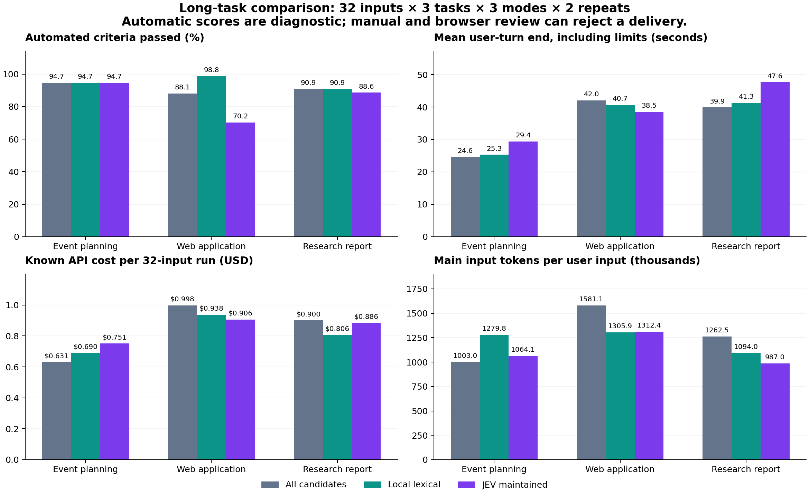
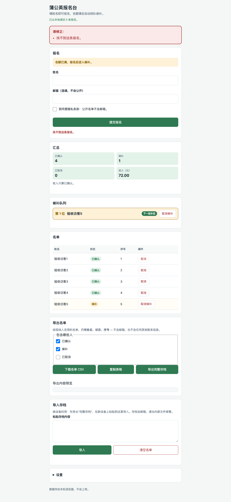
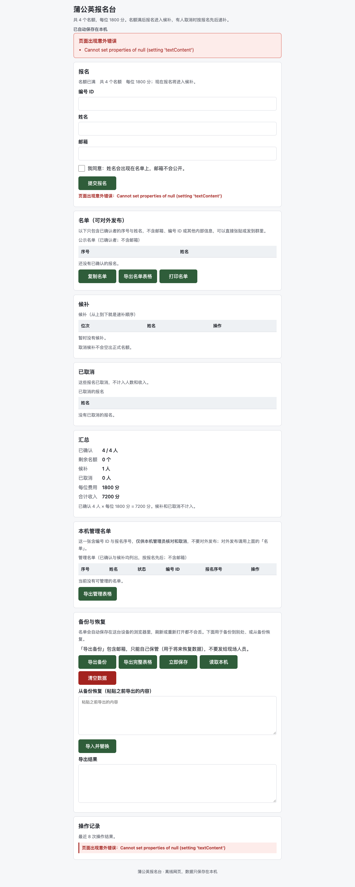
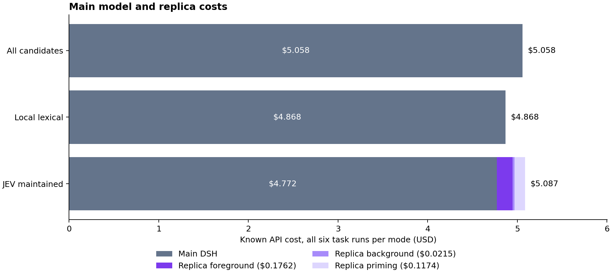
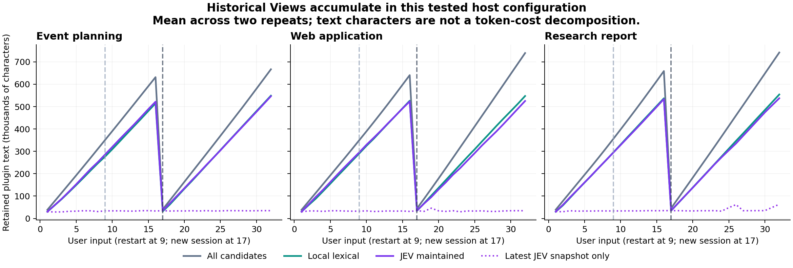
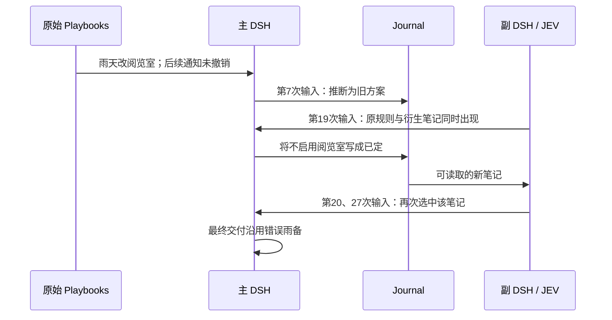

# JEV 长任务与完整交付实验（2026-09-23）

**已完成 576 次真实 API 用户输入、18 条完整任务流程，并复核最终产物。当前没有证据表明 JEV 能稳定提高完整任务的交付质量。** maintained 机制确实改善了某些新资料的可达性，但本地词面策略也能取得这部分收益；JEV 的增量优势尚未得到证明。

相对 all-candidates，JEV 组累计主模型输入减少 **12.6%**，主模型已知费用减少 **5.7%**；计入副本后，两组已知费用分别为 **$5.0867 / $5.0581**。JEV 的回合结束中位延迟是 **35.69 秒**，all-candidates 是 **32.96 秒**；正常完成输入分别为 **134/192 / 148/192**。这不是稳定的质量、成本或交互速度提升。20 次正式 API 调用没有返回用量，不能把这点微小费用差异当作精确账单排名。

最值得先修复的问题是：**最新 View 的筛选没有替换掉历史 View。** 在本次装配中，同一会话的 16 份快照会留在主模型请求中，旧事实和模型自行写回的推断继续干扰后续交付。下一轮应先验证有效上下文替换和写回来源状态，再判断 JEV 的独立收益。

模型、策略与评测数据冻结于 `76390d77`，之后只修订外层并发调度。沿用分支 `codex/jev-replica-agent-loop`；本次增加评测工具与记录，不改变 Source 插件或生产策略。没有 push 或创建 PR。

正式运行使用 `6e9db8cd`，于北京时间 10:30:54–11:39:26 完成。以下保留失败结果，不修改被测模型产物。完整数字另见[可重新生成的计量表](../pr-assets/jev-long-tasks-20260923/formal/metrics.md)。

## 实验对象

| 场景 | 完整工作 | 主要变化与验收 |
|---|---|---|
| 活动筹备 | 白鹭读书日的方案、通知草稿、执行清单和结构化资料 | 场地、时间、人数、预算、截止、印刷状态、交通的更新；饮食、隐私、雨备约束 |
| 网页项目 | 纯静态报名网页、领域逻辑和交接说明 | 报名校验、候补、取消、隐私、收费、持久化、备份、CSV；独立功能检查与浏览器操作 |
| 技术调研 | Yjs / Automerge / SQLite Session 的选型报告、结构化结论和迁移方案 | 团队、周期、离线目标、包体、部署和迁移约束更新；事实与引用、验证及回退计划 |

每类 32 次输入，每种策略独立运行两次，共 576 次用户输入。每次运行有两个连续的 16 输入会话：第 9 次输入前重启主副 DSH，保留同一会话；第 17 次输入开启新会话，保留文件和插件数据。这里的“32 轮”不表示单一对话历史连续保留 32 轮。

每个独立运行包含九类 Source，每类 50 条初始记录；调研另有七条官方资料摘要，共 457 条。来源为 Journal、Tasks、Documents、Project Context、Playbooks、Canvas、Notifications、Files、Sessions。外部事件按预定输入位置写入，各组拥有独立可写数据；模型产生的笔记和代码不在组间复制。

调研采用预先核验、人工转述的官方资料包，三组可读取同一来源和链接。它检验基于固定证据完成决策交付的能力，没有检验实时网络搜索覆盖率。

## 三组如何比较

- **all-candidates**：九个公开读取窗口全部接收，最多 63 项；不是全量 450 条资料。
- **lexical-maintained**：相同维护框架与读取预算，使用通用词面评分和本地整理，不调用 JEV。
- **jev-maintained**：当前 maintained 策略，JEV 做结构化评分，并参与语义 nap；供应商返回版本为 `jev-1.13.0`。

后两组的差异包含前台评分和后台语义整理，不能凭一次比较拆分出二者各自的因果贡献。本地组是有检索和整理能力的对照，不是“没有记忆”。

三组均使用 DeepSeek `deepseek-flash` 非思考模式；每次请求输出上限 8192 token，每次用户输入最多 12 次模型请求、120 秒。它们拥有相同的公开记忆查询与进一步读取、Journal 写入、交付文件读写、资料阅读和基础验收工具。主 DSH 可以主动找材料，副本选择不是唯一取证入口。

三个场景、每个场景中的三个独立组并发推进，单个组内的用户输入串行；每轮轮换派发顺序，第二次重复反转初始顺序。并发负载属于本次测量条件，绝对延迟不能直接与之前单输入实验比较。

最初仅并发场景、串行等待三个组，在 107 次输入且尚无最终验收分数时统一停止，随后只改变外层调度并从头运行全部正式组。旧记录、在途会话和文件保留在 `serial-prefix/`，不混入新负载条件的延迟比较。该修订没有改变模型、策略、数据或验收条件。

维护组在每个会话前执行九次不依赖查询的预热，费用和时间单列；所有中间 assistant 消息触发的后台处理也纳入统计。单次用户回合的 View 在工具步骤间保持快照一致；后台 revision 前进不会使已送入本回合的记忆凭空消失。

## 验收与计量边界

最终验收代码位于模型不能写入的目录。网页功能在独立 VM 运行，禁止模块导入；浏览器使用独立上下文、真实表单操作，并阻断外网请求。模型可用的基础核验覆盖更小的一组条件。验收条目百分比是诊断指标，不是通用智能得分；完整通过和关键失败单独报告。

延迟分别记录首次可见文本、正常完成回合的最终回答首次文本、整个用户回合结束。工具前说明文字不等于回答完成；回合结束包含被预算截断的情况，因此必须同时看正常完成率。原始 `finalAnswerFirstTextMs` 实际记录末条 assistant 消息首字，可能属于未完成回合；汇总另用 `completedAnswerFirstTextMs` 仅统计正常完成回合。费用逐个模型请求累计，包含同一输入下的所有工具步骤；不会把一次 DSH request series 误记作一次 API 请求。

交互延迟从 DSH 接收本轮输入计时；测试驱动恢复会话、准备外部事件和等待副本收尾的时间另存 `wallMs`。工具计数指进入实验工具执行器的调用，语法解析前失败的工具意图可能不在该计数内；所有已记录模型请求仍计费。没有最终文字的回合不伪造首字延迟为零，完成率和该指标的样本数单列。

本次没有启用无限期的空闲定时循环；统计包含固定预热和对话期间实际触发的整理，不能据此推算常驻服务一个月的空闲费用。

DSH 的 `inputTokens` 是未命中缓存的输入，`cacheReadTokens` 是另一桶；总输入是两者之和。根据当日 [DeepSeek 官方价格](https://api-docs.deepseek.com/quick_start/pricing/?push_animated=1&show_loading=0&theme=light&webview_progress_bar=1)，Flash 每百万 token 的非高峰输入未命中 / 缓存命中 / 输出为 $0.15 / $0.003 / $0.60，高峰为两倍；按请求 UTC 时间计价，并另算统一价格下的比较。根据 [TypeSafe 官方价格](https://typesafe.ai/blog/introducing-system-one-models-and-jev)，JEV 输入 $0.042 / 百万 token，输出免费。

价格计算是公开标价与已返回用量的估算，不是账户账单。被取消、报错或超时且没有供应商用量的请求标记为未知，不作为免费调用。机器、存储和开发试跑费用与正式实验分别说明。

校准小样及其接线问题保留在[原始资料目录](../pr-assets/jev-long-tasks-20260923/README.md)。正式实验冻结后不按质量得分修改策略，不选择性丢弃慢回合或失败回合。

## 完整任务结果

表中自动分数保持原始验收规则；“正常完成”指 DSH 回合以 `completed` 结束，不表示最终产物满足全部要求。费用为每条 32 输入任务的两次平均已知费用。

| 场景 | 策略 | 第一次自动检查 | 第二次自动检查 | 正常完成输入 | 回合结束中位秒 | 每条任务费用 |
| --- | --- | --- | --- | --- | --- | --- |
| 活动筹备 | all-candidates | 18/19 | 18/19 | 61/64 | 22.25 | $0.6306 |
| 活动筹备 | 本地 maintained | 19/19 | 17/19 | 63/64 | 23.06 | $0.6900 |
| 活动筹备 | JEV maintained | 19/19 | 17/19 | 56/64 | 29.13 | $0.7514 |
| 网页项目 | all-candidates | 39/42 | 35/42 | 43/64 | 40.07 | $0.9979 |
| 网页项目 | 本地 maintained | 42/42 | 41/42 | 29/64 | 36.45 | $0.9377 |
| 网页项目 | JEV maintained | 40/42 | 19/42 | 41/64 | 37.08 | $0.9064 |
| 技术调研 | all-candidates | 19/22 | 21/22 | 44/64 | 39.85 | $0.9005 |
| 技术调研 | 本地 maintained | 20/22 | 20/22 | 41/64 | 38.74 | $0.8065 |
| 技术调研 | JEV maintained | 19/22 | 20/22 | 37/64 | 47.30 | $0.8855 |



图中时间为平均值，表中为中位数；二者都包含预算终止。三类任务不能仅靠自动检查总和排列优劣：活动有否定句误判为通过，项目有 API 返回结构引起的连锁失败，调研有引用放在附属文件而被漏检的情况。下面的语义和浏览器复核用于解释这些差异，没有事后修改评分器以获得更好的分数。

活动筹备中，三个策略两次自动检查合计都是 36/38，但错的事情不同。all-candidates 两次都遗漏交通变更；本地组第二次错过已到货回执，仍保留“预计首批 12 份”；JEV 第一次擅自取消雨备，第二次把既有活动日期改成另一个占位日期。这说明需要验收事实沿用、更新与撤销，不能只看“找到了多少项”。

### 六个实际网页的浏览器验收

所有页面都从最终产物启动，执行真实报名、刷新、取消、导出、清空、回导和移动端检查。不同页面按标签和实际导出形式适配定位器；没有修复生成的代码。

| 项目运行 | 浏览器结果 | 产物复核后的主要问题 |
| --- | --- | --- |
| 第一次 all-candidates | 14/15 | 公开名单仍显示邮箱片段；通用 CSV 含完整邮箱；重复报名不符合幂等约定 |
| 第一次本地 maintained | 15/15 | 冻结的 42 项检查也全部通过；本次复核范围内未发现关键交付缺陷 |
| 第一次 JEV maintained | 15/15 | 带引号姓名被拒绝；备份的自动失败来自附加元数据，核心回导和浏览器操作通过 |
| 第二次 all-candidates | 15/15 | 通用 CSV 含完整邮箱；部分自动失败来自错误返回形式和严格相等比较，不能误称为校验或备份缺失 |
| 第二次本地 maintained | 4/7 已执行检查通过，后续流程受阻 | HTML 与 JS 的名单节点 ID 不一致，加载和提交时报错，名单不能呈现；通用 CSV 仍含邮箱 |
| 第二次 JEV maintained | 14/15 | 取消按钮取得空 ID，提示“找不到这条报名”，无法取消或递补；领域 API 也偏离指定返回结构 |

这里的浏览器 15/15 只是冒烟检查，不是完整产品认证。它测了独立的现场名单导出；领域验收还测通用 `toCSV`，因此页面导出安全与另一函数暴露邮箱可以同时成立。第二次本地组的 41/42 自动分数也不能掩盖页面无法呈现名单的缺陷。

第二次 JEV 自动分数 19/42 不表示 23 个独立算法错误：`register/cancel` 返回 `{ ok, state, ... }` 包装结构，而约定是直接返回状态，造成后续多项检查连锁失败。补充探针显式解包后，核心校验、备份和取消逻辑可工作。但浏览器中的取消故障是真实集成缺陷：公开名单剔除了 `id`，界面又把该行的 `id` 传给取消操作。





逐项记录、堆栈和所有桌面/移动端截图见 [browser/inspection.json](../pr-assets/jev-long-tasks-20260923/formal/browser/inspection.json)；领域接口解释见 [domain-review.json](../pr-assets/jev-long-tasks-20260923/formal/domain-review.json)。

### 六份调研交付

六份报告都通过七项预先指定的基础事实布尔检查，也都提供阶段迁移、回退和待测指标。然而，完整交付仍有结构或语义缺陷。

第一次 all-candidates 的指定 JSON 缺少选项数组，把已给定的旧格式和访问控制要求又当成未知；第一次本地组因通知 `read=false` 而不承认新的部署和加密范围。第一次 JEV 的指定比较列表漏掉 Automerge，还把模型自行作出的选择写成“人类未反对”乃至“人类决定”，输入中并没有这份确认。

第二次 all-candidates 将 `richText` 写成描述文字而非约定的布尔值，正文仍保留富文本要求，这应归为接口类型错误。第二次本地和 JEV 的正文都更新为新加坡部署，指定 JSON 却仍为笼统的“自管基础设施”，属于跨文件不一致。第二次本地报告还把资料包未覆盖的能力推断成“Automerge 无富文本 CRDT”；实验后的[官方文档核验](https://automerge.org/docs/reference/documents/rich-text/)确认其有富文本接口。该外部核验只用于事后审查，未改动实验输入或原始分数。

同时应避免低估正确交付：部分 JEV 和本地报告把官方链接或乱序验证步骤放在明确引用的附属文件，冻结检查只扫描主文档而漏检；第一次 all-candidates 的一个 URL 失败来自提取器捕获了中文右括号，不能据此宣称伪造引用。逐份说明保存在 [manual-review.json](../pr-assets/jev-long-tasks-20260923/formal/manual-review.json)。

## 主副 DSH 开销与交互体验

每种策略均包含六条任务、192 次输入。M 为百万 token；输入包含缓存命中和未命中，输出只按返回用量统计。

| 策略 | 主请求数 | 主输入 M | 其中缓存 M | 主输出 M | 主费用 | JEV 副费用 | 已知合计 |
| --- | --- | --- | --- | --- | --- | --- | --- |
| all-candidates | 976 | 246.181 | 241.230 | 1.771 | $5.0581 | $0 | $5.0581 |
| 本地 maintained | 1003 | 235.498 | 230.942 | 1.763 | $4.8684 | $0 | $4.8684 |
| JEV maintained | 977 | 215.267 | 210.997 | 1.854 | $4.7716 | $0.3151 | $5.0867 |

主输入是所有工具步骤的累计量，不是一个请求有两亿 token。三组缓存命中率约 98%；JEV 少输入的部分大多来自便宜的缓存桶，同时主输出略多，所以 12.6% 的输入节省只对应 5.7% 的主模型已知费用节省。计入 JEV 后，已知合计比 all-candidates 高约 0.6%，比本地组高约 4.5%；未返回用量的请求会影响精确差值。

JEV 共 930 次决策调用，已返回用量为 **7.501M 输入 / 0.512M 输出**。按触发阶段拆分：

| 阶段 | 调用数 | 输入 M | 输出 M | 已知费用 |
| --- | --- | --- | --- | --- |
| 主输入驱动的前台决策 | 383 | 4.194 | 0.218 | $0.1762 |
| 对话/写入触发的后台整理 | 220 | 0.512 | 0.041 | $0.0215 |
| 两个会话前的固定预热 | 327 | 2.794 | 0.253 | $0.1174 |

阶段按决策用途归类：预热有显式标记，其余 `nap` 归后台，`terms/leaves` 归前台。即使前台失败而没有发布新 View，其已发生的调用也不会被误归后台。

预热不能视为免费：JEV 六条任务的预热累计约 210.49 秒，本地约 28.99 秒，单独发生在相应会话交互计时之前；其费用已计入合计。一个预热周期或用户输入可有多个 JEV 子调用。主 DSH 的主动记忆查询为 all-candidates 247 次、本地 218 次、JEV 171 次，这反映工具使用路径变化，不能单独证明回答质量提升。



所有正式请求都落在本次计价的高峰时段。若对同一用量统一采用非高峰 DeepSeek 价格，三组费用分别是 **$2.5290 / $2.4342 / $2.7009**；这只是价格敏感性换算，并非另一次实测，JEV 单价不变。

正式实验已知费用 **$15.0131**；校准试跑与中止的串行前段另为 **$2.7571**，本次工作已记录的 API 费用共 **$17.7702**，另有未知用量部分。校准明细见 [calibration-costs.json](../pr-assets/jev-long-tasks-20260923/calibration-costs.json)。上述数字不含机器和存储成本，也不是无限期后台运行预算。

| 策略 | 正常完成 | 首次文本中位秒 | 正常回合最终回答首字中位秒 | 所有回合结束中位秒 | 结束 P95 秒 |
| --- | --- | --- | --- | --- | --- |
| all-candidates | 148/192（77.1%） | 1.68（n=192） | 27.73（n=148） | 32.96 | 74.56 |
| 本地 maintained | 133/192（69.3%） | 1.60（n=192） | 28.66（n=133） | 32.62 | 80.25 |
| JEV maintained | 134/192（69.8%） | 2.85（n=190） | 33.16（n=134） | 35.69 | 82.45 |

首次文本可能只是工具前的说明；实际回答需要等多个工具步骤。只统计正常回合的结束中位数分别是 29.88 / 31.08 / 35.09 秒。JEV 没有改善这次长任务的响应体验，也不能用更多被截断的回合换来的较短时间宣称更快。

## 执行完整性与失败

576 次输入均有记录、没有漏跑或运行器致命中断；其中 415 次正常结束，132 次以 `max-tokens` 结束，29 次以 `aborted` 结束。预算受限回合仍可能留下部分代码或文本，不能算成功交互。网页项目大量整文件重写，会碰到 8192 输出上限；三组受到相同限制，但实际碰到的频次不同。

| 策略 | 正常结束 | max-tokens | aborted | 新鲜 View | 已选快照在所有工具步骤中注入 |
| --- | --- | --- | --- | --- | --- |
| all-candidates | 148 | 34 | 10 | 192/192 | 192/192 |
| 本地 maintained | 133 | 51 | 8 | 192/192 | 192/192 |
| JEV maintained | 134 | 47 | 11 | 187/192 | 192/192 |

JEV 的五次旧 View 分别发生在第一轮调研的第 25、26、31、32 次输入（`leaves` 决策报 `BadRequestError`）和第一轮项目的第 19 次输入（`terms` 超时）。这些回合仍注入上一次可用快照，但不能算成功完成当轮上下文更新。四次 BadRequest 的序列化请求约 100–104 KB，日志没有保留供应商具体校验原因，不能据此认定确切的载荷或候选数量上限。

正式实验共有 **20 次没有返回用量的逻辑调用**：3 次主模型被调用方取消；17 次 JEV 调用中有 4 次 BadRequest、2 次超时、2 次服务端错误、9 次后台整理取消。取消事件不等于供应商故障，也不等于零费用。明细见 [api-failures.json](../pr-assets/jev-long-tasks-20260923/formal/api-failures.json)。

因此 `evaluation.json` 的 **`executionPassed` 为 `false`**。完成整批采集与系统通过验收是两件事；本次不以离线工程测试通过掩盖这些运行结果。

## 语义与机制复核

运行后的复核另外保存原始自动评分之外的解释：`manual-review.json` 是本助手对照输入记录的语义复核，不是独立盲评专家组；`domain-review.json` 是隔离 VM 中的补充探针；`browser/inspection.json` 记录真实页面操作。不会用这些事后解释回改被冻结的自动分数。

### 已观察到的失败路径

**旧 View 没有退出主模型上下文。** 本次组合通过 [Host lifecycle](../../src/host/lifecycle.ts) 的插件消息追加快照。逐请求记录显示，第 32 次输入仍保留第二个会话内的 16 份 View。例如活动第一轮 JEV 的该次首请求，插件消息累计约 54.6 万字符，最新候选正文只有约 5,800 字符；快照中还反复附带公开 Route/Action 描述。`freshCandidate` 证明新候选已送达，不证明旧候选已退出。当前 `memoryText` 包括所有保留的 Mnemon 消息，不能误称为“本轮选中的记忆大小”；正文字符统计也不能直接当 token 分摊。



这是本次最重要的集成发现：**筛选最新 View 并没有等同于替换主模型的有效记忆上下文**。旧值、衍生结论和接口描述继续随历史输入。主模型中的历史淘汰/替换需要另行实现和验证；这里描述的是本次所装配的 DSH 服务与 Host 路径，没有将其泛化到所有官方包配置。正式比较中三组都沿用该行为，未在测到不利结果后修补某一组。

**最新资料的可达性。** 活动第 26 次输入前，交通变更写入 **Files**。all-candidates 两次都没在 View 中带入这条正文，主模型主要在 Notifications 等来源查找，最终保留了已停运的 28 路。本地 maintained 和 JEV maintained 两次都将文件正文送入 View，最后改用了 36 路。这里证明了有方向的进一步读取有价值；本地策略也做到了，不能将这一收益独占归因于 JEV。逐请求证据见 [transport-update-case.json](../pr-assets/jev-long-tasks-20260923/formal/transport-update-case.json)。

**写回后再选中的错误解释。** JEV 第一轮主模型把未撤销的雨备流程解释为“南厅时期旧口径”。第 19 次输入的上下文中，原始 Playbooks 规则仍然存在，但主模型再次把取消雨备写成“已定”；副本随后在第 20、27 次输入中选回该 Journal 笔记。最终方案明确否定室内阅览室，自动评分却因含有“室内”字样给了 19/19。证据见 [memory-feedback-case.json](../pr-assets/jev-long-tasks-20260923/formal/memory-feedback-case.json)。这条轨迹不证明 JEV 导致最初误判，但表明当前循环不能阻止模型推断逐步取得事实地位。



## 下一步优先级

1. **落实 View 的替换语义。** 主模型请求中保留本轮有效快照；旧快照留在审计日志。Route/Action 描述单独做稳定的能力目录与预算，避免每轮重放。必须测请求正文，不能只验证新候选包含在其中。替换后缓存命中和首字延迟可能改变，需要重新计费实测。
2. **给写回内容保留来源与状态。** 在共享协议/副本侧区分外部事实、模型建议、已确认决定和已过期内容，并关联来源版本；`read=false` 不应被臆断为“未批准”，模型的“人类没有反对”也不等于人类确认。这可以先在 Host 与副本的元数据层实现，不要求逐个改写 Source 插件。
3. **缩小交付工具与预算造成的干扰。** 项目文件支持补丁或局部更新，验收时给必需的最终回答留出预算。当前整文件重写很容易碰到 8192 输出限制；高分文件与顺畅的交互体验是两项不同验收。
4. **再隔离 JEV 的增量价值。** 在共同的可达候选集、相同 View 生命周期下比较本地评分和 JEV；分别开关语义整理，加入近义冲突、隐含关联和自然闲聊，而不总是由输入给出检索词。继续保留完整交付与多次重复，避免只测选中率。

这些是本次实验导出的后续工作，未在正式组运行中修改实现或补跑更有利的结果。

## 复现与资料

```sh
node scripts/evaluate-jev-long-tasks.mjs --live --parallel --parallel-arms \
  --output docs/pr-assets/jev-long-tasks-20260923/formal/evaluation.json
node scripts/compact-study-traces.mjs docs/pr-assets/jev-long-tasks-20260923/formal
node scripts/summarize-jev-long-tasks.mjs docs/pr-assets/jev-long-tasks-20260923/formal
node scripts/render-study-metrics.mjs docs/pr-assets/jev-long-tasks-20260923/formal
python scripts/plot-jev-long-tasks.py docs/pr-assets/jev-long-tasks-20260923/formal
node scripts/inspect-study-browser.mjs docs/pr-assets/jev-long-tasks-20260923/formal
node --experimental-vm-modules scripts/inspect-study-domain.mjs
```

供应商凭据由环境提供，不写入目录。绘图使用 matplotlib；浏览器检查使用 Playwright 与 Chrome，可通过 `STUDY_PLAYWRIGHT_MODULE` 指定已有包路径。

冻结前验证：TypeScript 类型检查通过；新增评测、主副交互、maintained 集成与维护单元测试共 20 项通过。离线汇总进一步校验逐请求用量的加总与原始记录一致。

报告与资料的本地链接、Markdown 锚点检查通过；分析脚本的语法检查通过。原始资料包含压缩内容的凭据模式扫描未发现密钥。工程检查与模型交付验收分别报告，前者通过不代表后者通过。

18 条正式轨迹在结束后从 gzip 无损转换为 Brotli，解压内容逐字节一致，哈希保存在 [trace-archive.json](../pr-assets/jev-long-tasks-20260923/formal/trace-archive.json)。汇总核验了全部 278 个最终产物的哈希，语义和浏览器复核未改写这些产物。

这是一组有完整产物的受控小项目，输入是固定脚本，不能根据模型临时追问自适应回应。部分输入明确提示“读当前计划”“交通公告”，词面线索较强，不能代表此前讨论的任意闲聊自动联想。背景资料多数明显无关，尚未覆盖大量近义冲突、真实私有知识库和大型仓库。网页文件工具采用整文件读写；补丁编辑可能改变实际产品的输出开销。两次重复只改变背景记录布局并重新运行模型，没有固定供应商采样随机种子，不足以支持普遍统计结论。

运行环境为 Apple M4、24 GiB 内存、Node v25.1.0、DSH 0.1.5-rc.1；三个场景及各自三个策略组并发。详细环境和脚本摘要见 [environment.json](../pr-assets/jev-long-tasks-20260923/formal/environment.json)。绝对时延包含当时服务端和本机并发负载，不能当作供应商吞吐基准。
