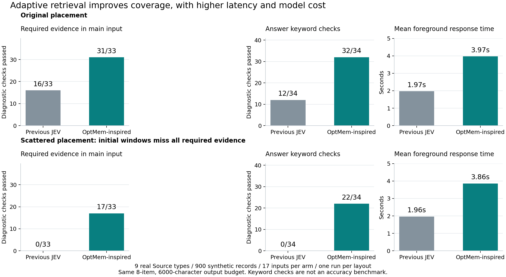
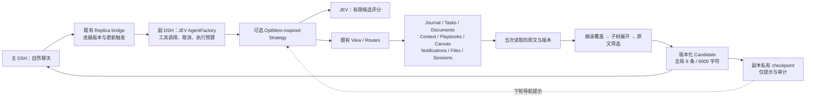
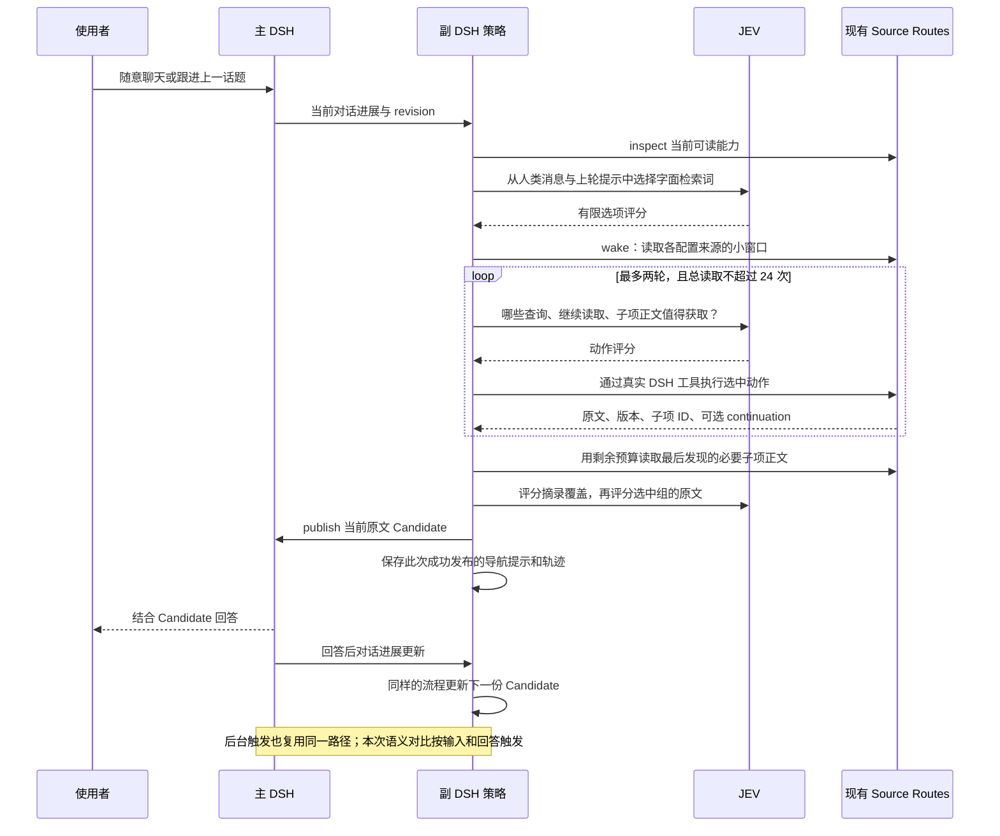
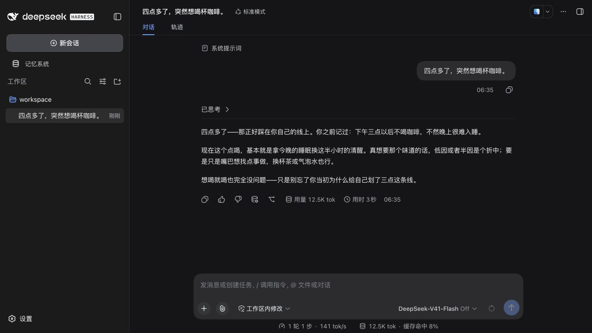
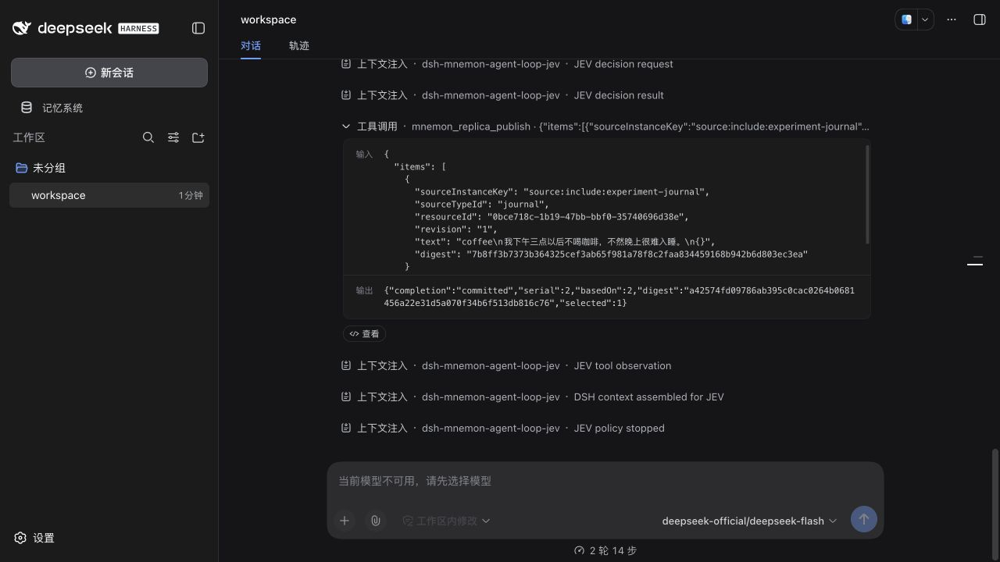

# OptMem 启发的 JEV 策略：实现与对照实验

日期：2026-09-23。分支：`codex/jev-replica-agent-loop`。在上一轮本地版本 `8dbf9b21` 上继续实现，仅本地提交，没有 push 或创建 PR。

后续按用户要求增加了 [all-candidates 全面对比与主 DSH 首段/完整响应延迟](jev-optmem-all-candidates-20260923.md)。下文保留最初与旧 JEV 的同期结果，未将两轮实验混合。

## 结论

这次实现了独立的 [dsh-mnemon-strategy-jev-optmem](../../plugins/dsh-mnemon-strategy-jev-optmem/README.md)。副本 DSH 继续承担执行主体，JEV 通过有限选项决定检索词、后续读取和最终保留内容；既有 Source 插件、共享 SDK、Host 都没有修改，也没有安装默认策略。

**实测收益来自打破“先固定读一小批，再筛选”的限制。** 同样的 8 条、6,000 正文字符输出预算下，900 条原布局语料的必要证据注入从 16/33 提升到 31/33，回答关键词检查从 12/34 提升到 32/34。把相关记录分散后，分别从 0/33、0/34 提升到 17/33、22/34，但复杂组合仍明显不足。

代价也很明确：前台平均响应从约 2 秒增至约 4 秒，JEV 输入约为旧策略的 5 倍。树式筛选在两种布局中都没有提高同池证据保留量；原布局增加了 4.1% JEV 输入，分散布局减少了 24.2%。因此，这版应作为可选实验策略保留，尚不足以作为默认策略，也不能宣称树式记忆普遍更省、更准。



图来自归档数据，是实验图表。下文另附官方 DSH 界面截图。

## 从 OptMem 借用了什么

依据 [OptMem 官方仓库](https://github.com/VictorTaelin/OptMem)及其 [memo](https://github.com/VictorTaelin/OptMem/blob/main/memo)：保留提交的原始笔记，构造有损摘要树，以有限覆盖表示唤醒代理，再通过 recall/zoom 获取细节。它不是训练方法。此前文档中“OptMem 训练”的表述已纠正。

本实现独立借用“粗粒度导航 → 按需展开 → 保留原证据”的思路，没有复制上游源码或调用它的 CLI。区别如下：

| 层次 | 本次实现 | 尚未实现 |
| --- | --- | --- |
| 原始记忆 | 各 Source 原有存储、版本、权限与写路径 | 不迁移存储、不建立第二份权威记忆库 |
| 导航表示 | 当前读到结果的二叉摘录树，保留头尾片段 | 全库、随写入更新的语义摘要树 |
| 选择控制 | JEV 返回数值判断，程序执行 read/recall/zoom | JEV 生成文字、查询或摘要 |
| 连续性 | 每个主会话的查询提示、选中片段提示、诊断轨迹 | 跨 View 恢复旧 cursor，或直接把旧正文当新证据 |
| 策略演进 | 可配置、可替换、可重放比较 | 在线学习、奖励训练、自动修改插件 |

树只覆盖**已经读到的候选池**。实验中回答后更新的池大小为原布局 56–62 条、分散布局 56–66 条，不能把这称作对 900 条全文完成了语义搜索。

## 架构和运行时序





复用现有副本 DSH 的意义在这里得到保留：工具执行、View 限制、会话轨迹、取消和发布都沿用已有路径。策略没有直接读插件数据库。主副实例也不需要把所有插件变成同一种存储。

### 不修改每个插件，靠什么接入

新增的是策略自己的声明式 adapter 配置：已有操作叫什么、查询/条数字段叫什么、如何从返回的 ID 或 provenance 映射到后续读取参数。例如 Canvas 使用 `list → read-node(id)`，Files 使用 `find → read-file(path)`，Sessions 使用 `history → conversation`。

配置示例在 [adapters.ts](../../plugins/dsh-mnemon-strategy-jev-optmem/src/adapters.ts) 和 [九类 Sources 的实验装配](../../scripts/lib/jev-complex.ts)。它依赖已有 Mnemon Source 契约，**不意味着任意普通 Cordis 插件都能无配置地作为记忆源**。没有对应公开 Route 的能力，策略也不能凭空获得。

Documents 目前仍受公开检索片段限制；这次通过针对性查询找到了长文末尾片段，没有新增通用全文接口。支持 current-View continuation 的机制已有测试，但两组最终真实 API 实验中，JEV 没有实际选择 continuation。不能据此宣称已经验证连续翻页的实用效果。

### 连续选择与预算

初始读取覆盖已配置来源，每次最多 7 条；再进行至多两轮、每轮最多 6 个按需动作，末尾使用剩余预算展开刚发现的子项。总读取上限为 24，同时服从 Route 自身调用限制。树覆盖上限 24 个节点、原文检查预算 64 条；输出仍为全局 8 条/6,000 字符，不给每个来源预留配额。

初始窗口仍然有限，区别是之后能按对话需要继续寻找和展开。文件检索要求非空查询，没有有用词时可以跳过，因此平均读到 8.94 类来源，而不是保证每轮九类都读。

JEV 没有文字生成环节。检索词来自字面分词、相邻中文词组合、引号及标识符，再由 JEV 选择。自动生成同义词、推导新查询和跨语言搜索尚未实现。人工标签不参与策略分支，但测试原文中的可见短码和标识符会进入导航提示；这是合成语料的便利条件。

checkpoint 只提供导航提示。每轮发布的正文都来自当次 Route 返回；旧 cursor 不跨 View 复用。文件更新集成测试覆盖从 17:00 变为 20:30，并确认**新 Candidate**不包含旧时间。它没有证明主模型整段聊天历史会删除旧注入内容。

## 实验设计

预先记录的[实验协议](../plans/jev-optmem-experiment.md)和[输入、标签](../../tests/fixtures/jev-replica/complex-conversations.json)均随代码保留。

- 九种真实 Source，合计 900 条合成记录，每组 12 个会话、17 个输入。包含人物/饮食/出行、程序记忆、任务状态、历史承诺、偏好更新、长文末尾、旧记录、实时文件更新和多来源组合。
- 两个布局使用相同目标事实。原布局多数目标记录靠近近期窗口，并有重复主题干扰；分散布局按 `SHA-256(source type + fixture key)` 固定排列，加入十二类不同主题干扰。
- 分散布局的九个初始窗口恰好全部错过必要证据。这是严重的窗口遗漏压力条件，解释了旧策略归零；它不是代表真实分布的平均效果，也没有独立留出集。
- 同一布局两组共享语料、轮换执行顺序；同一场景复用对话，场景之间隔离。写入 capture 关闭，文件变更在两组运行该轮前统一施加。
- 主模型都是 `deepseek-flash`，思考关闭；JEV 请求 `jev-latest`，实际返回 `jev-1.13.0`。主模型工具关闭，用于观察提供的上下文本身；副本执行真实 DSH 工具。
- 两组都允许主实例等副本最多 30 秒，Candidate 预算相同；Replica 投影显式配置到 24,000 字符，消除额外注入截断。主输入 tokens 包含 cache read/write。
- 新策略花费更多检索和 JEV 预算，因此这不是等计算量对比。另做相同候选池的树/扁平消融，隔离最后筛选步骤。

旧策略是上一轮 `jev`：先选择至多四个 Source，各读至多七条，再筛选。不是与“把全库给主模型”或最强检索系统比较。

## 最终结果

### 覆盖与响应

| 布局 | 策略 | 读取命中 / 33 | 注入命中 / 33 | 回答关键词 / 34 | 主输入 tokens/轮 | 平均前台 | p95 前台 |
| --- | --- | ---: | ---: | ---: | ---: | ---: | ---: |
| 原布局 | 旧 JEV | 17 | 16 | 12 | 1,418 | 1.97 秒 | 2.73 秒 |
| 原布局 | 新策略 | 32 | 31 | 32 | 1,761 | 3.97 秒 | 5.17 秒 |
| 分散布局 | 旧 JEV | 0 | 0 | 0 | 957 | 1.96 秒 | 3.08 秒 |
| 分散布局 | 新策略 | 18 | 17 | 22 | 1,449 | 3.86 秒 | 5.54 秒 |

必要证据组是按来源标识检查，标题命中不保证正文完整；回答关键词提供另一个诊断，但不等于正确率或盲评。各布局只跑了一次最终比较，17 个输入的 p95 接近最大值，不适合推断服务级延迟。

每组 17 个 Candidate 都完整进入实际主模型输入。两组最终实验都没有执行失败、JEV API 错误、测试工作区/分支泄漏或广告 canary 出现在回答中；这仅是所列探针的结果。**两组均未通过完整质量门槛**，因为仍有遗漏，且原布局新策略两次选入了过期偏好。

### 检索与模型开销

| 布局 | 策略 | 前台 Route 读取/轮 | JEV 次数 | JEV 输入 tokens | JEV 输出 tokens |
| --- | --- | ---: | ---: | ---: | ---: |
| 原布局 | 旧 JEV | 3.59 | 68 | 304,002 | 21,672 |
| 原布局 | 新策略 | 17.88 | 178 | 1,540,822 | 100,734 |
| 分散布局 | 旧 JEV | 3.71 | 68 | 298,713 | 21,802 |
| 分散布局 | 新策略 | 18.06 | 182 | 1,536,320 | 92,225 |

JEV 总量包含输入触发与回答后更新，前台耗时不含回答后更新。原布局前台 JEV 输入为旧组 148,521、新组 864,484；分散布局为 149,086、815,526。回答后刷新并非免费，报告已计入。

两个布局的新策略合计分别执行 492、548 次 Route 读取（包括回答后更新）。其中分别有 Canvas 正文读取 4/5 次、文件正文读取 7/14 次、历史对话正文读取 8/10 次，证明确实使用了后续子项读取，而非只给原窗口重排。

### 树式筛选消融

从各输入**回答后更新**的 checkpoint 取出完全相同的已观察候选池和对话，分别调用 tree/flat；交替执行顺序，每种 17 次，输出预算相同。该实验不重做检索，也不调用主模型，不能据此推断回答质量。

| 候选池来源 | 模式 | 保留必要证据 / 33 | 直接评分原文条目数 | JEV 输入 | JEV 次数 |
| --- | --- | ---: | ---: | ---: | ---: |
| 原布局 | tree | 30 | 506 | 242,862 | 34 |
| 原布局 | flat | 30 | 967 | 233,286 | 34 |
| 分散布局 | tree | 16 | 149 | 159,797 | 32 |
| 分散布局 | flat | 16 | 996 | 210,934 | 34 |

原布局树覆盖里的无关主题相似，先读摘录再读原文增加了输入。分散布局更容易排除整组内容，才体现 token 节省。两组保留量相同，不表示条目完全相同或有统计等效性。应保留 `flat` 选项，继续验证什么情况下需要树；不能只凭“少读了几条原文”声称更高效。

## 成功、失败与边界

1. **Canvas 正文读取有效。** 在原布局中，新策略找到备用手杖位于“车尾箱右侧”及口令 `CANVAS-531`。开发版 v1 曾只找到标题，最终一轮发现子项后没机会读正文；v2 在同一个 24 次预算内增加末尾展开阶段，修复了这个机制问题。
2. **长文末尾和较早内容能够突破窗口。** 定向搜索找到了 `LANTERN-427` 和 `ANCIENT-673`。这依赖检索词与公开 Route 的行为，不能证明语义模糊输入也能稳定找到深处事实。
3. **全局 8 条仍可能漏掉组合中的关键事实。** 原布局 `many-source-day` 读取命中 7/7，但只选中 6/7；回答有预约、忌口、取书码和双份备份，漏掉“月影硬盘”。这是覆盖集合选择仍不足的证据。
4. **更深检索不等于全库覆盖。** 原布局 `file-before` 找到取书码，未找到 17:00；分散布局 `many-source-day` 仅注入 1/7 必要组，回答关键词仅 1/5。分散布局 `errands` 读到一组必要证据又被筛掉，最终 0/3 关键词。
5. **过期内容抑制仍不可靠。** 原布局的新策略在 `coffee-change`、`coffee-followup` 都选入旧咖啡习惯；主回答遵守了用户最新偏好，没有观察到沿用旧限制。选择层错误和回答层结果应分开记录。
6. **新 Candidate 不会自动清除旧聊天注入。** 原布局新组累计出现 17 个、分散布局 13 个“仅存在于旧注入”的标识命中。这是历史上下文累积问题，当前策略没有改变主 DSH 的历史事件语义。
7. **主模型仍会产生无依据的表达。** 分散布局 `errands` 把未执行的检索写成文本示意；`many-source-day` 在缺少任务证据时说“已订好”。工具在受控对比中被关闭，因此这些不是实际执行。它们说明仅靠记忆筛选不能保证主回答可靠。

所有原始回答都在 JSON 和压缩轨迹中。开发版 v1 的结果单独保存在 [original.json](../pr-assets/jev-optmem-20260923/original.json)，没有混入最终表格；旧策略在该次运行中出现一次 `APIConnectionError`，后续重试完成。

## 工程验证与实际界面

| 检查 | 结果 |
| --- | --- |
| 针对性策略、AgentFactory、Replica、集成和仓库边界回归 | 13 个测试文件、114 项通过 |
| 新策略独立 verify、仓库 TypeScript | 通过 |
| 独立包安装验证 | 42 个独立插件仓库、43 个 tarball；安装、无 workspace 链接、独立构建/类型检查/测试通过 |
| 实际九类 Sources 集成 | Canvas 正文、取消/并发路径、重启导航提示、文件更新后的新 Candidate 通过 |
| 4,500 条规模机制探针 | 真实双进程和 Route；24 次读取、57 条已观察结果、8 条发布，完成 |
| 归档完整性 | 指标与原始轨迹一致、完整注入、预算、同池 SHA-256、官方装配通过 |
| 文档与差异检查 | 本地链接校验、`git diff --check` 通过 |

4,500 条探针使用脚本评分，只证明执行和预算机制工作，不提供语义质量或真实 API 延迟结论。完整测试及验证日志保存在[证据目录](../pr-assets/jev-optmem-20260923/README.md)。

官方 Web 测试另用 13 条小型数据、Journal/Tasks/Documents 三个 Source，独立主副 DSH home。主界面仅输入“四点多了，突然想喝杯咖啡。”，副本发布了已有咖啡偏好，主模型自然引用。该检查验证官方装配，不能代替九类数据的定量实验。





副本界面底部的“当前模型不可用”对应官方聊天模型选择器；副本执行的是替换后的 JEV AgentFactory，没有配置生成式聊天模型。不是此次运行失败：[持久会话审计](../pr-assets/jev-optmem-20260923/official-session-audit.json)确认两轮执行完成、7 次 typed JEV decision、真实 inspect/route/publish、Candidate 跟上最新进展，没有伪造 LLM request/header 或 assistant 文本。

本地环境：Node 25.1.0、DSH 0.1.5-rc.1、Cordis 4.0.2、dsh-mnemon 0.5.13，官方 profile 指向本机 mnemon 0.2.7。最终语义实验运行在策略提交 `59c73dde`，其源文件 SHA-256 随每份结果保存。

### API 用量记录

包含开发版、两个最终布局和两个同池消融，共 102 次主模型调用：149,120 输入、5,334 输出 tokens；JEV 共 863 次尝试、6,157,770 已报告输入、402,849 输出 tokens，含一次失败尝试。失败请求可能没有完整计费用量，不据此估算精确账单。

独立官方 UI 检查另有 1 次主回答（总输入含缓存 12,409，输出 96）和 7 次 JEV 决策（输入 13,646、输出 1,266）。没有把该小样本混入定量表格。密钥只通过进程环境注入，不保存在代码、报告或截图中。

## 复跑与后续方向

在环境中提供 `DEEPSEEK_API_KEY`、`TYPESAFE_API_KEY`，不把值写入命令或版本库。真实 API 会计费：

```bash
pnpm --filter dsh-mnemon-strategy-jev-optmem verify
pnpm exec tsc --noEmit
node scripts/evaluate-jev-optmem.mjs --live --scales 100 --layout original --output /tmp/optmem-original/evaluation.json
node scripts/evaluate-jev-optmem.mjs --live --scales 100 --layout scattered --output /tmp/optmem-scattered/evaluation.json
node --experimental-transform-types --disable-warning=ExperimentalWarning scripts/ablate-jev-optmem.ts --report /tmp/optmem-original/evaluation.json --output /tmp/optmem-ablation-original.json
node scripts/probe-jev-optmem-scale.mjs /tmp/optmem-scale.json
node scripts/serve-jev-replica.mjs --root /tmp/optmem-web-demo --mnemon /opt/homebrew/bin/mnemon --main-port 5490 --replica-port 5491 --optmem
```

不调用 API 的归档核验和绘图：

```bash
node scripts/summarize-jev-optmem.mjs
python3 scripts/plot-jev-optmem.py
```

绘图需要 matplotlib。官方 Web 的 `--optmem` 只在隔离测试 profile 中安装新策略；用户自己的 profile 不受影响。详见[策略说明](../../plugins/dsh-mnemon-strategy-jev-optmem/README.md)。

接下来最有价值的工作，是在策略层改进**缺失证据驱动的检索与组合覆盖**：已满足的事实减少重复动作，未满足的约束继续找，避免八个高分条目遗漏一个必要步骤。还需要真实留出对话、更多排列和等调用预算对照，区分改进来自更多搜索还是更好的控制。对主上下文，应该单独研究候选替换和过期注入退场；它属于主副协议，不应下沉到每个 Source。

若要进一步实现 OptMem 式长期树，先做可选的旁路导航索引，明确随写入更新、失效和权限语义，再用同池与等预算实验验证价值。当前实验尚不支持为了摘要树而修改所有数据插件。
