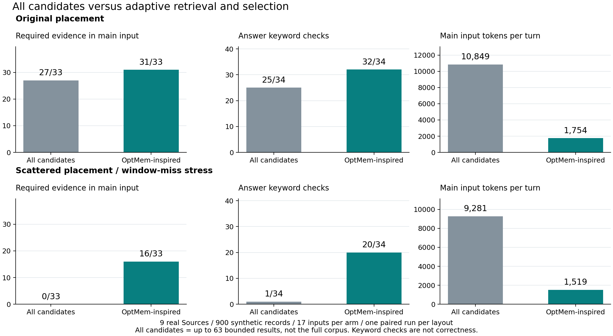
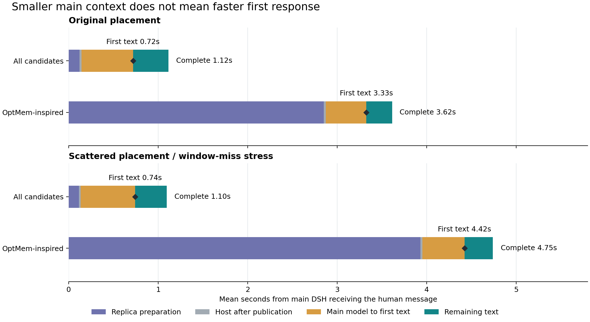

# OptMem-inspired 与 all-candidates：质量、开销和主 DSH 响应延迟

日期：2026-09-23。延续[实现与初轮报告](jev-optmem-20260923.md)，按用户要求新增两组同期真实 API 对照，并从主 DSH 的持久流式事件补齐首段文字和完成时间。策略代码保持不变；没有修改任何现有 Source 插件，没有 push 或创建 PR。

## 实际结论

**新策略能找回固定窗口漏掉的证据、显著缩小主模型上下文，但目前会明显增加用户等待，不能称为全面优于 all-candidates。**

| 900 条语料 | 指标 | all-candidates | OptMem-inspired |
| --- | --- | ---: | ---: |
| 原布局 | 必要证据进入主输入 | 27/33 | 31/33 |
| 原布局 | 回答关键词检查 | 25/34 | 32/34 |
| 原布局 | 主模型平均输入 tokens | 10,849 | 1,754 |
| 原布局 | 平均首段文字延迟 | 0.72 秒 | 3.33 秒 |
| 原布局 | 平均完整响应延迟 | 1.12 秒 | 3.62 秒 |
| 分散布局 | 必要证据进入主输入 | 0/33 | 16/33 |
| 分散布局 | 回答关键词检查 | 1/34 | 20/34 |
| 分散布局 | 主模型平均输入 tokens | 9,281 | 1,519 |
| 分散布局 | 平均首段文字延迟 | 0.74 秒 | 4.42 秒 |
| 分散布局 | 平均完整响应延迟 | 1.10 秒 | 4.75 秒 |

“关键词检查”不是回答正确率。分散布局 all-candidates 唯一的一次命中来自模型追问里的“按日期分文件夹”，不是实际找到了程序记忆。保留这个计数，是为了展示检查器本身的局限。



这两组新对照共 68 次主回答。每个布局 17 个输入、两种模式，使用九种实际 Source。这里的 all-candidates 是九个有限窗口返回的全部内容，最多 63 条，**不是全库 900 条，也不是带递归正文读取的检索器**。

## 对照条件及可比范围

| 维度 | all-candidates | OptMem-inspired |
| --- | --- | --- |
| 数据与对话 | 同布局共享新建语料；同样的 17 个输入和文件更新 | 相同 |
| 主模型 | DeepSeek `deepseek-flash`，关闭思考，输出上限 1,024 tokens | 相同 |
| 主模型工具 | 关闭，单独观察提供上下文的作用 | 相同 |
| 初始读取 | 九个 Source 各至多七条 | 配置来源的小窗口；Files 按对话词检索 |
| 后续读取 | 不继续查询、翻页或展开正文 | 至多两轮探索及末尾正文读取，总上限 24 次 |
| JEV | 不调用 | `jev-latest`，实际 `jev-1.13.0` |
| 最终 Candidate | 全保留，实测每轮 63 条 | 全局最多八条、6,000 正文字符 |
| 主侧 Replica 投影 | 24,000 字符 | 相同；不是新策略的 6,000 正文预算 |
| 新鲜度 | 主实例等待当前输入对应的 Candidate，最多 30 秒 | 相同 |
| 回答后更新 | 执行并单独记录 | 执行并单独记录 |

执行顺序按输入轮换，写入 capture 关闭，语料变更在两组处理该输入之前施加。每个场景保持多轮会话，场景间隔离。两组每个 Candidate 的全部正文均核实进入真实主请求，未发生“先被主侧截断再比较”的问题。

原布局多数目标内容靠近近期窗口；分散布局按固定 hash 排列，并加入十二类主题干扰。后者初始九个窗口均未命中必要证据，是严重的窗口遗漏压力条件。它不能代表随机真实用户数据，更不能据此推断 all-candidates 在一般情况下没有价值。

新策略的检索预算更大，输出更小；这是整体策略比较，不是等计算量、相同候选池的筛选实验。树本身的价值应看上一轮的[同池 tree/flat 消融](jev-optmem-20260923.md#树式筛选消融)：保留证据量相同，只有分散布局节省了 JEV 输入。

## 用户在主 DSH 中等待了多久

计时从主 DSH 持久化原始人类消息的 inbox 插入事件开始，使用同一进程的毫秒时间戳：

- **首段文字：** 第一个非空白的 `text-delta`，不把 reasoning、开始标记或工具事件算作可读回答。
- **最后文字：** 最后一个非空白文字片段到达。
- **完整响应：** 对应 `turn/end`，保证这一轮已结束。
- **副本准备：** 到本轮新 Candidate 实际发布，包含进展传递、排队、轮询、JEV、读取和发布。
- **主模型首字阶段：** 从 `request/header` 到第一段文字。它发生在副本已经准备完成之后。

通过官方 `expandAssistantStream` 解码持久化紧凑流，匹配每个输入、会话和轮次。首尾文本与最终回答一致；时间顺序、Candidate 新鲜度和汇总都重新检查。不是用模型 tokens/s 反推，也不是只量 HTTP 请求。

**这些是主 DSH 收到输入后的服务端延迟，不包含浏览器传输和渲染，也不包含调用 followup 之前的会话创建。** 它比只报告模型耗时更接近用户的实际等待，但不是浏览器画面逐帧测速。最初 harness 的 `elapsedMs` 还包含完成后的本地收尾，通常比这里多十余毫秒，因此同期日志中的 1.13/3.63 秒与表中的 1.12/3.62 秒略有差异。

### 分布

| 布局 | 模式 | 首段平均 | 首段中位数 | 首段 p95 | 完整平均 | 完整中位数 | 完整 p95 |
| --- | --- | ---: | ---: | ---: | ---: | ---: | ---: |
| 原布局 | all-candidates | 0.719 | 0.682 | 0.979 | 1.121 | 1.149 | 1.521 |
| 原布局 | OptMem-inspired | 3.326 | 3.010 | 4.726 | 3.617 | 3.366 | 4.978 |
| 分散布局 | all-candidates | 0.744 | 0.672 | 1.234 | 1.103 | 1.065 | 1.449 |
| 分散布局 | OptMem-inspired | 4.423 | 4.339 | 8.719 | 4.746 | 4.500 | 9.049 |

单位为秒。每组只有 17 个输入，按 nearest-rank 计算的 p95 在这里就是最大值，不是稳定的生产尾延迟估计。完整响应还受回答长度影响，因此单列首段延迟。

### 时间花在什么地方



| 布局 | 模式 | 副本准备 | 发布后至主请求 | 主模型到首段文字 | 余下文字生成 |
| --- | --- | ---: | ---: | ---: | ---: |
| 原布局 | all-candidates | 0.121 | 0.022 | 0.576 | 0.397 |
| 原布局 | OptMem-inspired | 2.849 | 0.025 | 0.453 | 0.287 |
| 分散布局 | all-candidates | 0.114 | 0.022 | 0.608 | 0.354 |
| 分散布局 | OptMem-inspired | 3.931 | 0.021 | 0.471 | 0.315 |

均为平均秒数；最后文字至 turn/end 另有几毫秒。主模型获得短上下文后确实更快，但约 0.12–0.14 秒的首字阶段收益，抵不过副本新增的数秒准备时间。

最慢的是分散布局 `photo-procedure`：副本准备 8.368 秒，主 DSH 首段文字 8.719 秒，完成 9.049 秒。该轮六次串行 JEV 决策约为 0.419、1.187、2.798、2.074、0.405、1.185 秒，没有 API 错误或重试记录。串行决策延迟本身就足以造成明显等待。

回答之后的新 Candidate 更新没有算进用户响应时间，但仍消耗资源：all-candidates 平均额外约 0.21 秒，新策略原布局 1.89 秒、分散布局 3.35 秒。实验会等待这次更新完成再发送下一条，因此没有测连续输入抢占和高并发下的体验。

## 质量、检索与过期内容

| 布局 | 模式 | 读到必要组 | 选中/注入必要组 | 总选择条目 | 标签相关条目 | 过期选择 | 仅在旧注入中的标识 |
| --- | --- | ---: | ---: | ---: | ---: | ---: | ---: |
| 原布局 | all-candidates | 27/33 | 27/33 | 1,071 | 70 | 5 | 0 |
| 原布局 | OptMem-inspired | 32/33 | 31/33 | 76 | 56 | 2 | 16 |
| 分散布局 | all-candidates | 0/33 | 0/33 | 1,071 | 0 | 0 | 0 |
| 分散布局 | OptMem-inspired | 16/33 | 16/33 | 32 | 22 | 0 | 10 |

相关条目按预先声明标签计数，不是盲评。all-candidates 保留全部窗口，天然包括无关和过期材料；新策略更集中，但仍会漏掉必要组合。旧注入计数为零也不表示清除了历史，只表示历史标识仍在当前全量 Candidate 中，没有成为“仅旧注入”标识。

两组均未通过“所有必要组、所有关键词、零过期选择”的完整质量门槛。没有发现预设的跨工作区、跨分支、停用流程泄漏或广告 canary 出现在回答中；只覆盖这些合成探针，不构成一般安全保证。

### 实际回答差异

| 场景 | all-candidates | OptMem-inspired | 能支持的判断 |
| --- | --- | --- | --- |
| 原布局：车票 | 有车次和出发建议，无座位 | 找到 `08 车 12A` | 后续读取补上窗口外细节 |
| 原布局：Canvas | 找不到手杖和口令 | “车尾箱右侧”、`CANVAS-531` | 标题之后读正文有效 |
| 原布局：长文尾部 | 错称“末尾并没有”密码 | 找到 `LANTERN-427` | 有限片段不能当全文；定向查询有价值 |
| 原布局：旧记录 | 仍提供错误旧编号 `BAY-673` | 找到 `ANCIENT-673` | 固定近期窗口会遗漏更早的权威记录 |
| 原布局：实时文件 | 初始与更新后的营业时间都未知 | 初始时间仍遗漏，更新后找到 `20:30` | 新策略读取能力更强，但尚不稳定 |
| 原布局：多来源一天安排 | 有“月影硬盘”，误把 `HISTORY-264` 当取书暗号 | 取书码 `BOOK-596` 正确，但漏“月影硬盘” | 两者都为 4/5 关键词，错误内容不同，不能说等质 |
| 原布局：偏好改变 | 仍注入两类旧咖啡记录 | 仍选入旧咖啡记录 | 两组回答都跟随新偏好；选择错误与回答结果分开看 |
| 分散布局：流程记忆 | 没找到，追问时碰巧命中“日期” | 有步骤，仍不知道“月影硬盘” | 关键词计数可能出现假阳性 |
| 分散布局：多来源一天安排 | 没有必要证据 | 只有取书码，却把取书当作“预约”并补出一般备份步骤 | 深检索仍不足，主模型也可能填补空白 |

完整的 17 个输入、每轮关键词命中和首段延迟见[逐输入对照](../pr-assets/jev-optmem-20260923/all-cases.md)。原始回答与请求保存在压缩 JSONL；不只保存成功样本。

分散布局新策略此前与旧 JEV 对比为 17/33、22/34，本次为 16/33、20/34。源代码未改，模型调用及文件返回顺序并不保证完全一致。这种波动本身说明仍需重复实验与独立留出集，不能挑高分一轮代替本次结果。

## token、调用和总工作量

| 布局 | 模式 | 前台 Route/轮 | 主输入总量 | 主输出总量 | JEV 次数 | JEV 输入总量 | JEV 输出总量 |
| --- | --- | ---: | ---: | ---: | ---: | ---: | ---: |
| 原布局 | all-candidates | 9.00 | 184,426 | 1,185 | 0 | 0 | 0 |
| 原布局 | OptMem-inspired | 17.35 | 29,825 | 926 | 176 | 1,535,307 | 99,767 |
| 分散布局 | all-candidates | 9.00 | 157,773 | 1,034 | 0 | 0 | 0 |
| 分散布局 | OptMem-inspired | 18.41 | 25,819 | 886 | 180 | 1,532,005 | 91,914 |

JEV 包含输入前台和回答后更新。主输入包含缓存命中，新策略分别减少 83.8% 和 83.6%。但把主模型和 JEV 的已报告输入数量相加，新策略总输入处理量约为 all-candidates 的 8.5 倍、9.9 倍；不同模型 tokenizer 与计价不同，这不是账单倍率。没有价格与计费核验，不给出金额节省结论。

本次增量实测：主模型 68 次、397,843 输入/4,031 输出 tokens；JEV 356 次、3,067,312 输入/191,681 输出 tokens。没有记录到 API 失败。

整个 OptMem 任务截至本报告的已归档实验及消融合计：主模型 170 次、546,963 输入/9,365 输出；JEV 1,219 次尝试、9,225,082 已报告输入/594,530 输出，包含早期开发版的一次失败。另有已单独说明的官方 UI 小样本，不混入这些对照。

## 对架构的含义

all-candidates 适合检索窗口已经覆盖需求、上下文规模可控、希望尽快开始回复的场景。这次原布局 25/34 的关键词覆盖和约 0.72 秒首段延迟表明，它应继续作为强基线保留。

OptMem-inspired 的价值是副本主动寻找和展开信息，再交给主 DSH 更小的证据集合。它解决了部分“根本没有读到”的问题，代价来自串行 JEV 控制。这次不能得出“有 JEV 就应把所有选择都放到每轮前台”的结论。

下一步优先级应是：

1. **减少前台串行决策。** 研究把查询和动作打分合并、复用可校验的导航结果，并给前台补读独立时间预算。收益要靠首段延迟与质量联合验证，不能仅看 JEV 分数。
2. **让后台组合承担更多预备工作。** 需要明确什么情况下可以用上一份 View 开始回答，什么变化必须等新证据。当前实验坚持最新 Candidate，尚未测试这个取舍，不能直接宣称后台已消除等待。
3. **改进组合覆盖与过期退场。** 多来源需要的是一组互补事实，逐条高分可能漏掉关键步骤；主 DSH 的旧注入退场也应在主副协议层解决。
4. **补更强基线。** 后续可在同样的自适应检索池上比较“全部原文给主模型”与“JEV 压缩”，再做等调用预算、更多排列、真实留出对话。当前 all-candidates 不具备同样的深度读取，不能把全部收益归功于筛选器。

本轮没有为了表格结果再调整策略或每个 Source。保留可选策略、完整证据和公开读取边界，更利于下一轮验证。

## 验证和复跑

原有 114 项回归和 43 个 packed artifacts 的验证见[实现报告](jev-optmem-20260923.md#工程验证与实际界面)。本轮新增时序单元测试通过，覆盖多轮匹配、空白流片段、紧凑时间差还原、过期 Candidate 拒绝；仓库 TypeScript、归档指标/时间重算、文档链接、差异空白检查通过。主副 UI 的实际截图与会话审计仍保留于实现报告。

在环境中提供已授权 API 凭证后，可复跑付费对比：

```bash
node scripts/evaluate-jev-optmem.mjs --live --scales 100 --layout original --modes all-candidates,jev-optmem --output /tmp/optmem-all-original/evaluation.json
node scripts/evaluate-jev-optmem.mjs --live --scales 100 --layout scattered --modes all-candidates,jev-optmem --output /tmp/optmem-all-scattered/evaluation.json
node scripts/inspect-jev-latency.mjs /tmp/optmem-all-original/evaluation.json
node scripts/inspect-jev-latency.mjs /tmp/optmem-all-scattered/evaluation.json
```

时序采集需要同一次运行留下的本地主 DSH session。已经归档的证据可以脱离临时目录重算，不调用 API：

```bash
pnpm exec vitest run tests/jev-latency.spec.ts
node scripts/summarize-jev-optmem.mjs
python3 scripts/plot-jev-optmem-all.py
```

绘图需要 matplotlib。数据入口：[原布局](../pr-assets/jev-optmem-20260923/all-original/evaluation.json)、[分散布局](../pr-assets/jev-optmem-20260923/all-scattered/evaluation.json)、[原布局时序](../pr-assets/jev-optmem-20260923/all-original/latency.json)、[分散布局时序](../pr-assets/jev-optmem-20260923/all-scattered/latency.json)、[重算结果](../pr-assets/jev-optmem-20260923/analysis.json)。密钥不进入仓库。
