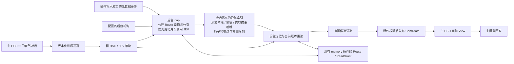
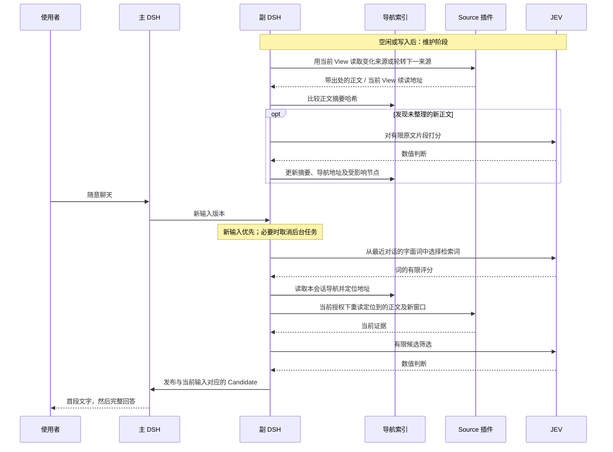
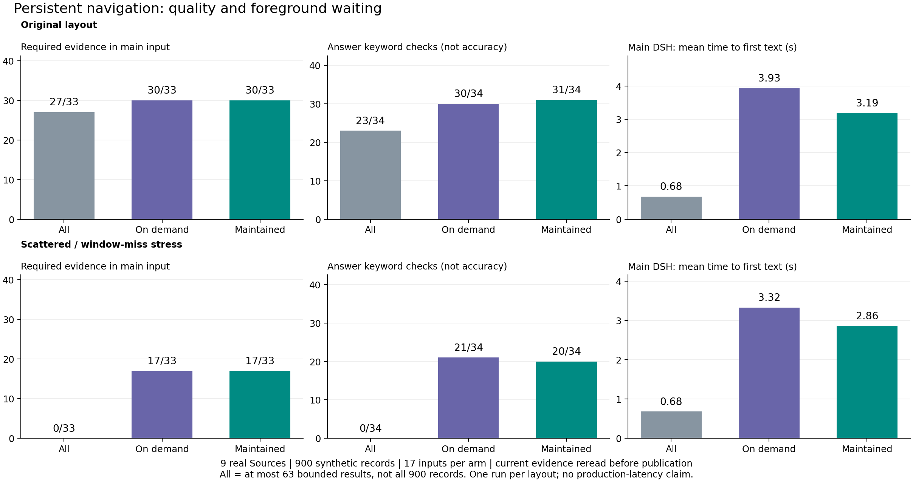
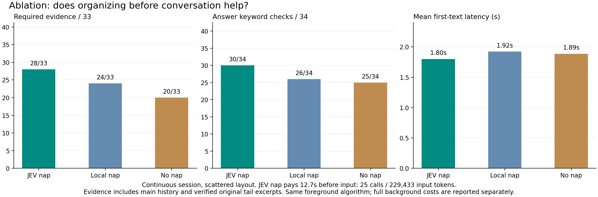
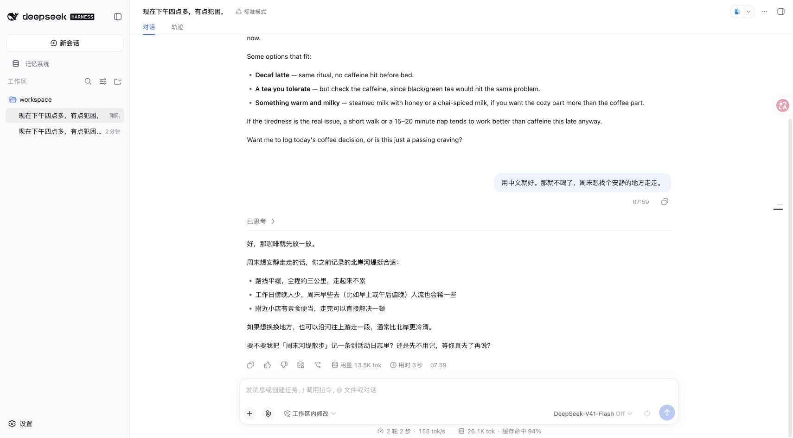

# JEV 持续整理导航：实现与验证

2026-09-23。任务起点 `42d7aecb`；工作分支 `codex/jev-replica-agent-loop`。实现与实验均在独立 checkout 中完成，没有改动原工作目录，没有 push 或创建 PR。

已实现可选的“后台增量整理 + 前台当前证据重读”策略，保留原 Source 插件与写路径。实验支持把重复整理移出对话等待路径：原始布局后续输入的平均首段时间从 4.04 秒降至 2.06 秒，必要证据仍为 10/10。持续消融中 JEV 整理比只预读又有额外收益，但约付出 2.98 倍的 JEV 输入 token；严格质量门槛仍未通过。

我的判断是：值得保留为可选策略继续实验，尚不足以替换默认策略。以下将等待、覆盖、后台成本和已知失败分开报告。

## 这次借鉴了 OptMem 的什么

OptMem 在追加 note 后产生待压缩的区间，由宿主模型完成 nap；读取时再用已经维护的层级摘要组织 wake/zoom。它把整理从每次问答的重复工作中分离出来，但源码并不是一个自行生成摘要的后台模型。[官方实现](https://github.com/VictorTaelin/OptMem/blob/main/memo)

这里沿用这个时机划分，独立实现一个可选策略。JEV 为有限原文片段打分，程序选择原文作为导航摘要；正文内容没有被模型改写。后台索引是检索材料，不是新的事实库，也不是可以绕过插件权限的缓存。

因此，这里的“实时整理”具体指：成功写入后尽快刷新、回复结束后轮转维护，以及按配置的间隔检查外部变化。它不是零延迟的跨进程同步，也不会替用户合并、删除或改写插件中的原始记忆。





## 插件与写入边界

现有 Source 插件没有改动。新代码集中在已有可选策略插件、主副实例桥接调度，以及实验工具。适配配置声明公开的 browse、reread、child 和完整枚举能力；新增社区插件只需提供可用的读取契约和相应策略配置，不需要把其数据库导入策略内部。

真实数据写入继续经过插件已有的 Action/管理接口。副实例能观察到的本地成功写入会优先唤醒对应 Source 的维护。另一个 DSH 进程或外部编辑器的写入不会神奇地产生跨进程事件：由配置的周期扫描或下一次前台读取发现。索引本身的更新是另一种写入，不会删除、合并或改写原始记忆。

本策略也不接管“这句对话是否应该写成长期记忆”的判断；原有主、副实例的插件写路径仍负责它。这里新增的是成功写入后的增量维护，以及输入到来时如何消费这些材料。

每次前台仍有有限的新窗口读取，用来发现尚未整理的新内容；最终筛选遵守全局预算，没有每插件必须入选的配额。这里没有实现插件运行时的自动安装、卸载或权限扩大。

## 正确性约束

- 索引按主会话通道隔离；不能借用另一个会话的缓存。重启后可以恢复同一会话。
- 持久化的是 Source 实例、公开操作与参数；不持久化授权、当前 View Route ID 或跨轮续读游标。
- 缓存正文只用于本地导航。筛选器与当前 Candidate 使用重新读取的证据。文件即使没有变化的版本号，也会重新读取正文。
- 对明确支持完整枚举的适配器，完成扫描后移除已消失的导航项。对有限窗口搜索不做这种推断。读取失败的旧定位地址失效，不使用旧正文兜底。
- 检查点有限额、文件锁、原子替换与世代比较。Candidate 的发布仍由桥接层验证输入版本、租约和摘要。
- 前台新输入可以抢占本会话或其他会话占用的后台执行容量。未变化的正文不重复调用 JEV 做语义整理。

旧证据如果已经进入主 DSH 的历史对话，本实现不会从历史中删除它；“新 Candidate 不含过期正文”与“主请求里没有任何过去的文本”是两回事。

## 实验边界

九种实际 Source：journal、tasks、documents、project-context、playbooks、canvas、notifications、files、sessions。每种 100 条，共 900 条合成数据，覆盖偏好、实体、待办、程序、通知、文件、长文和历史会话。相同的 17 个输入分别在 12 个场景会话中运行；连续消融把这些输入串成一个会话。测试标签只供外部评估，正文里仍有可见的 fixture 标记，因此不能视为真实用户盲测。

数据包含不应对当前工作区、分支或启用状态可见的记录，900 不等于当前 View 可以读取的记录数。输入既有闲聊、话题切换和结束语，也有明确的取物码、回忆和程序步骤请求；这不是无限长自由对话的充分替代。

主模型为 DeepSeek `deepseek-flash`，JEV 实际返回版本为 `jev-1.13.0`。主 DSH 的工具关闭，以分离上下文供给效果；写入 capture 关闭；文件更新在各臂处理对应输入之前完成。all-candidates 是九个公开读取窗口的所有候选，最多 63 条，**不是全库 900 条**。它没有递归展开正文。

延迟以官方 DSH 持久化事件为依据，从原始人类输入进入 inbox，到首个非空白文本增量、以及 turn/end。包含副本排队、读取、JEV 筛选与发布等待；不包含浏览器传输绘制。每组 17 个输入的 nearest-rank p95 就是最大值，不能用来声称生产尾延迟。

后台和预整理时间不计入某次已预热输入的前台延迟，但所有 API 调用、token 和预整理墙钟时间单列，并计入总开销。三臂轮换执行，没有同时发起对照请求。

正常配置的首次输入沿用已有多步探索器，再把真实读取结果保存为导航；已有导航的前台使用一次 JEV 检索词选择和至多一次正文筛选。连续会话消融则统一使用 `coldStart: bounded`，以保证三臂前台算法相同。开启整理的两臂各做九轮与问题无关的预整理，关闭整理的臂没有这笔前置工作。Local nap 仍会扫描、预读和保存索引，只关闭后台 JEV 原文片段打分；No nap 仍保留前台已经实际读到的地址，不能理解为完全没有缓存。

## 最终 v5 对照结果

冻结实现为 `2bcdf824`。三组实验共 153 次主 DSH 回复；所有回复完成，当前输入发布、文本实际注入、租约/版本与持久化时间戳核验通过。没有检测到测试中的跨范围泄漏或广告指令标记输出。**严格质量门槛没有通过**：仍有必要证据遗漏、关键词未命中以及旧偏好被选入。

以下“必要证据”按 33 组预声明记录计数，“答案关键词”按 34 项计数。收到某条记录不等于收到其所有细节；关键词命中也不等于整段回答正确。表中已包含下述经过来源与原文字串核验的长文尾部补正。

| 布局 | 策略 | 当前入选 → 主输入命中 /33 | 答案关键词 /34 | 首段均值 / P95（秒） | 完成均值 / P95（秒） | 平均主输入 token |
|---|---|---:|---:|---:|---:|---:|
| 原始 | 窗口全收 | 27 → 27 | 23 | 0.68 / 1.03 | 1.12 / 2.02 | 10,856 |
| 原始 | 原按需策略 | 30 → 30 | 30 | 3.93 / 6.25 | 4.31 / 7.22 | 1,762 |
| 原始 | JEV 持续整理 | 30 → 30 | 31 | 3.19 / 6.09 | 3.62 / 7.03 | 1,725 |
| 分散 | 窗口全收 | 0 → 0 | 0 | 0.68 / 1.10 | 1.07 / 1.65 | 9,263 |
| 分散 | 原按需策略 | 17 → 17 | 21 | 3.32 / 4.10 | 3.62 / 4.51 | 1,444 |
| 分散 | JEV 持续整理 | 17 → 17 | 20 | 2.86 / 4.10 | 3.12 / 4.40 | 1,290 |



原始布局的必要证据覆盖持平，平均首段等待下降 18.8%；分散布局覆盖也持平，平均首段等待下降 14.0%，但答案关键词反而少命中一项。因此这里能支持“减少重复探索的等待”，不能支持“所有场景质量全面提高”。窗口全收最快，但在刻意把目标放出默认窗口的分散布局里完全漏检；这不代表全库全文注入或其他检索基线也会如此。

收益主要来自已经有导航的后续输入。每组只有 5 个后续输入，以下是平均首段时间；12 个首次输入仍走原多步探索器。

| 布局 | 原策略首次输入 | 新策略首次输入 | 原策略后续输入 | 新策略后续输入 | 后续必要证据（原 → 新） |
|---|---:|---:|---:|---:|---:|
| 原始 | 3.88 秒 | 3.66 秒 | 4.04 秒 | 2.06 秒 | 10/10 → 10/10 |
| 分散 | 3.34 秒 | 3.28 秒 | 3.30 秒 | 1.86 秒 | 5/10 → 6/10 |

## 后台整理是否贡献了独立收益

这组将 17 个输入串成一个会话，统一使用同一前台算法与预算。JEV nap 和 Local nap 在首次输入前均轮转九个来源；No nap 没有这笔预读。Local nap 使用第一段原文和中性重要性，仍保存相同结构的导航索引。

各臂保留自己的实际回答，后续 JEV 看到的对话因此会有差异。它比较的是持续运行的整套策略，并没有固定所有模型输入来单独证明某一个摘要分数的因果作用。

| 方式 | 当前入选 → 主输入命中 /33 | 答案关键词 /34 | 首段均值 / P95（秒） | 完成均值 / P95（秒） | 平均主输入 token |
|---|---:|---:|---:|---:|---:|
| JEV 持续整理 | 23 → 28 | 30 | 1.80 / 2.48 | 2.14 / 2.68 | 8,890 |
| 只做本地预读 | 20 → 24 | 26 | 1.92 / 2.20 | 2.34 / 2.87 | 8,041 |
| 关闭后台整理 | 19 → 20 | 25 | 1.89 / 2.19 | 2.26 / 2.79 | 8,355 |



这轮结果支持两个较小的结论：预读本身有帮助；在此基础上，JEV 的整理/保留选择又多送达了 4 组必要证据、多命中 4 项答案关键词。不过三臂每轮前台都是两次 JEV 决策，1.80–1.92 秒的首段均值差距很小，不能把它解释成 JEV nap 稳定降低前台延迟的证明。较确定的等待缩减来自前述与原多步策略的比较。

主输入命中包含已经进入主 DSH 历史的材料。JEV nap 当前 Candidate 命中 23/33，主请求中为 28/33；后者有 5 组来自此前注入，不能宣称每次新 Candidate 都独立覆盖了 28 组。连续会话的主输入也累积到了平均 8,890 token，这版没有解决主历史持续增长。

## 成本与覆盖的代价

2026-09-23 补充：[主、副 DSH 的分类 token 与费用复核](jev-token-costs-20260923.md) 按实际缓存命中与官方峰谷价格计算费用，包含预热、前台和回复后整理，并提供离线复算脚本。

JEV 输入/输出 token 分列，不能按与 DeepSeek 相同的单价相加估算费用。下表总调用包含该臂的回复后整理；连续消融还包含预整理。原按需策略在原实现中也会处理助手更新，因此同样按实际全部调用计量。

| 实验 | 策略 | 前台 / 总 JEV 调用 | 总 JEV 输入 token | 总 JEV 输出 token | 主模型总输入 / 输出 token |
|---|---|---:|---:|---:|---:|
| 原始 | 窗口全收 | 0 / 0 | 0 | 0 | 184,555 / 1,189 |
| 原始 | 原按需策略 | 98 / 177 | 1,583,063 | 105,257 | 29,950 / 1,105 |
| 原始 | JEV 持续整理 | 81 / 147 | 1,344,449 | 101,328 | 29,330 / 1,236 |
| 分散 | 窗口全收 | 0 / 0 | 0 | 0 | 157,470 / 904 |
| 分散 | 原按需策略 | 95 / 181 | 1,582,828 | 97,184 | 24,542 / 758 |
| 分散 | JEV 持续整理 | 78 / 144 | 1,300,094 | 97,552 | 21,930 / 670 |
| 连续消融 | JEV 持续整理 | 34 / 87 | 663,110 | 58,774 | 151,125 / 1,106 |
| 连续消融 | 只做本地预读 | 34 / 34 | 222,765 | 21,900 | 136,691 / 1,210 |
| 连续消融 | 关闭后台整理 | 34 / 34 | 223,342 | 21,846 | 142,031 / 1,058 |

正常配置下，新策略比原按需策略少用约 15–18% 的 JEV 输入 token，输出 token 的减少很小，分散布局甚至略增。**持续消融中，JEV nap 的总输入为 663,110 token，约为 Local nap 的 2.98 倍**；主模型平均输入也没有变得更小。这是用后台工作换取覆盖与回答收益，不是免费优化。

| 预整理 | 墙钟时间 | JEV 调用 / 输入 / 输出 token | 最终保留叶子 |
|---|---:|---:|---:|
| JEV 持续整理 | 12.70 秒 | 25 / 229,433 / 19,366 | 512 |
| 只做本地预读 | 2.10 秒 | 0 / 0 / 0 | 512 |
| 关闭后台整理 | 0 | 0 / 0 / 0 | 无预整理 |

九轮扫描共观察 676 个唯一资源，容量仅保留 512 个；JEV 版在这九轮整理了 398 个变化叶子，部分随后被容量淘汰，不能理解为保留的 512 个叶子都已完成整理。索引按全局重要性/最近观察时间淘汰，**没有人为每插件留出配额**。预整理后保留分布如下；这也显示 JEV 版会产生来源偏斜，不能视为均衡覆盖。

| Source | JEV nap 保留 | Local nap 保留 |
|---|---:|---:|
| journal | 100 | 100 |
| tasks | 93 | 100 |
| documents | 0 | 16 |
| project-context | 99 | 35 |
| playbooks | 93 | 99 |
| canvas | 16 | 16 |
| notifications | 99 | 100 |
| files | 11 | 24 |
| sessions | 1 | 22 |

关闭整理的臂继续从前台真实读取积累索引；开启整理的臂也会继续轮转和更新。因此这些数量是首次输入前的截面，不代表后续所有轮次的库存。

## 没通过的项目与计分复核

- 原始布局下，新策略仍漏掉取书场景的一条必要文件，以及多来源行程中的两组必要材料；分散布局下，多来源行程只有 1/7 组送达。读取预算和全局选择仍会丢失互补证据。
- 连续消融中的 JEV nap 仍缺少部分开场出行、人数/送达状态和待办材料。全量失败项及原回答见 `summary.json` 的 `failures`，没有只选成功案例。
- 标记为已过时的记录入选次数：原始布局窗口全收 5、原按需 2、新策略 1；分散布局新策略 1；连续消融三臂各 2。这表明当前人类陈述覆盖旧记忆的约束仍不够稳定。“被选入旧内容”不等于模型一定据此答错，但它未通过约定的过滤门槛。
- 连续实验两条长文回答的正文开头测试标记被尾部裁剪移除了。独立汇总用 Source 类型、公开 resource ID 和与原始正文完全匹配的长字串验证后，各补回一组：JEV nap 27→28、No nap 19→20；Local nap 不变。原始 `evaluation.json` 不改写，补正明细保存在 `evidenceAudit.corrections`。目录标题或只有 ID 的结果不会因此被补算成正文。

所有最终实验均为单轮，不能根据这 17 个输入推导显著性、生产 P95 或广泛能力领先。下一步适合扩大真实会话、别称/冲突和超出索引容量的测试，同时独立复核答案；不适合据此把新策略自动变成所有人的默认值。

## 机械验证与网页验证

101 项测试通过，覆盖 12 个测试文件；其中包括九类真实 Source 的主副 DSH 集成、新写入立即刷新、无版本号变化的外部文件修改、删除、撤销可读能力、会话隔离、重启恢复、当前 View 分页、同会话及跨会话后台抢占。根项目与受影响插件的类型检查、受影响插件的构建通过。完整独立打包验证通过：42 个插件仓库、43 个包，包含脱离 workspace 的安装、类型检查、测试、构建和官方 DSH 激活。

网页验证使用两个独立的官方 DSH Web profile，副本确实替换 AgentFactory 并走 `mnemon_view_inspect → mnemon_view_route → mnemon_replica_publish`。两轮自然聊天从咖啡偏好切换到周末散步，实际注入了新的偏好与路线材料，持久化会话核验全部通过。

初次网页测试因实验数据播种时漏掉官方 profile 的 `include:` Source 实例前缀，没有查到 Journal/Tasks；修正播种后重测，保留了初次失败记录。这不是修改 Source 才能解决的问题。网页回答还增加了原记忆未支持的周末人流和上游更安静的推断，因此截图只证明接线与真实交互，不能视为事实质量全部通过。



## 尚未解决的部分

当前实现复用语义整理结果和树节点，但激活仍遍历有限的本地叶子；JSON 检查点也按整文件原子保存。不能声称已实现 OptMem 的定长磁盘寻址或对数级读写成本。索引只覆盖实际读到的内容，公共 Route 的分页和预算决定覆盖上限。Documents、Files、Canvas、Sessions 的有限搜索不能被当作无条件全量枚举。

JEV 整理目前通过原文摘要、重要性分数和容量淘汰影响索引；激活主要使用叶子原文的词面匹配，重要性只提供有限的排序权重。并没有把摘要树当作唯一搜索入口。这也限制了仅靠改变摘要分数可能带来的增益。每轮最多整理 64 个变化叶子、192 个片段；若达到容量或公开分页上限，后台不会声称全库已经整理完毕。

摘要是抽取式的，不能表达原文中未显式出现的新概括。词面定位仍会受别称、换话题、冗余记录和跨来源关联影响。部分插件虽然都遵守 Cordis，却仍需要策略声明自己的读法；“不修改插件”不等于所有插件无需适配就能完整检索。

完整原始轨迹、主 DSH 时间戳证据及逐场景失败项均保存在 `docs/pr-assets/jev-maintained-20260923/`；复算脚本为 `scripts/summarize-jev-maintained.mjs`，图表脚本为 `scripts/plot-jev-maintained.py`。


## 开发轮次与复现

保留 v3、v4 和 v5 全部八组实验，共 374 次主模型回复。v3 强行使用短前台流程时冷启动覆盖下降；v4 修复了 Host 重绑后的 continuation Route ID，但暖启动仅用本地词面定位仍漏检；v5 因而保留冷启动多步探索、暖启动一次语义检索词选择和一次正文筛选。

v4 连续实验有一次真实 API 超时，约 30.95 秒后主 DSH 完成回答，但没有新 Candidate；旧评估器错误地把前轮仍存在的 Candidate 算作当轮成功。`initial-audit.json` 保留反例，v5 要求当前输入实际发布，并将决策错误计入执行失败。同期取消原因改为明确的 JSON 字段，并验证超时后下一轮恢复；不声称已证明旧序列化异常的唯一成因。最终 153 次没有此类执行失败，这不构成未来无超时的保证。

运行代码分布：

- [维护策略](../../plugins/dsh-mnemon-strategy-jev-optmem/src/maintained.ts)：冷启动兼容、后台扫描、有限片段打分、当前授权下重读与筛选。
- [导航存储](../../plugins/dsh-mnemon-strategy-jev-optmem/src/navigation.ts)：有限索引、内容寻址节点、文件锁/原子写入/世代比较。
- [主副调度](../../plugins/dsh-mnemon-replica/src/index.ts)：成功写入唤醒、空闲轮转与前台抢占。
- [配置说明](../../plugins/dsh-mnemon-strategy-jev-optmem/README.md)：`maintained: true` 显式启用；`semanticNap: false` 切换纯本地预读；桥接层的 `backgroundMs` 决定是否周期维护。没有新增默认安装。

真实 API 复现需事先在环境中设置两项 API 凭据；输出写入新目录，避免覆盖本次证据：

```sh
node --experimental-transform-types --disable-warning=ExperimentalWarning scripts/evaluate-jev-optmem.mjs --live --scales 100 --layout original --modes all-candidates,jev-optmem,jev-optmem-maintained --output /tmp/maintained-reproduce-original/evaluation.json
node --experimental-transform-types --disable-warning=ExperimentalWarning scripts/evaluate-jev-optmem.mjs --live --scales 100 --layout scattered --modes all-candidates,jev-optmem,jev-optmem-maintained --output /tmp/maintained-reproduce-scattered/evaluation.json
node --experimental-transform-types --disable-warning=ExperimentalWarning scripts/evaluate-jev-optmem.mjs --live --scales 100 --layout scattered --continuous --prime-cycles 9 --modes jev-optmem-maintained,jev-optmem-maintained-local-nap,jev-optmem-maintained-no-nap --output /tmp/maintained-reproduce-continuous/evaluation.json
```

无需调用 API 的复算：

```sh
node scripts/summarize-jev-maintained.mjs
python3 scripts/plot-jev-maintained.py
```

更多文件用途、保留的失败轮次及本地会话依赖见 [证据目录说明](../pr-assets/jev-maintained-20260923/README.md)。测试日志、当前源码哈希与文件清单随证据提交。仅有本地 commit；没有 push、PR 或正式发布。
