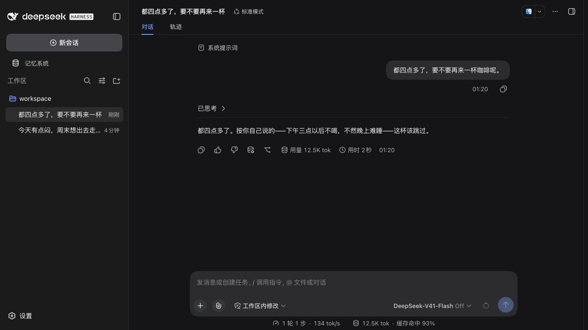
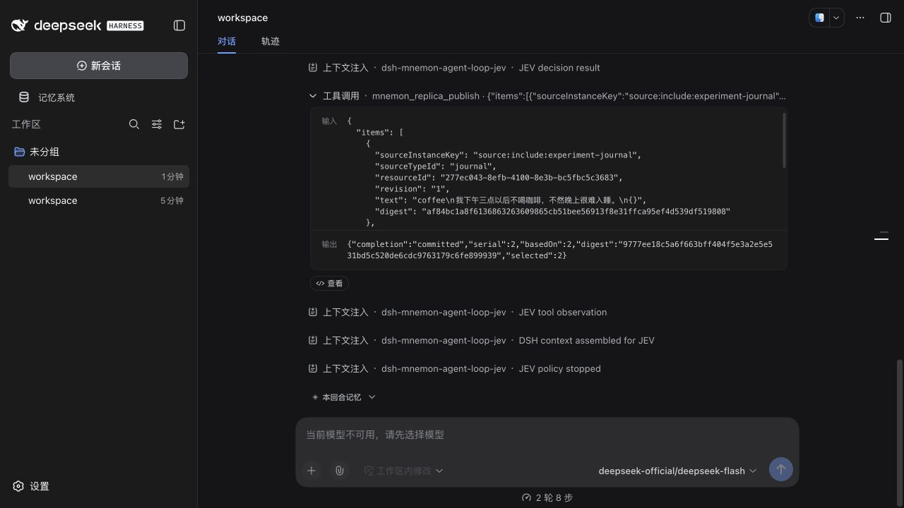

# JEV 主副 DSH 实现与实测报告

日期：2026-09-23。交付性质：本地可运行的架构实验，未 push、未创建 PR。

后续补充：[九类插件、90 / 900 条记忆、17 轮输入与 4,500 条离线探针](jev-complex-memory-20260923.md)。复杂场景暴露了明显的来源遗漏、读取窗口和旧上下文保留问题，不能将本报告的小样本收益外推到大规模使用。

## 结论

已经把“普通主 DSH 对话 → 独立副 DSH → JEV 编程式判断 → 已有插件读写 → 主实例固定 View”跑通。副本替换了官方 `agent-loop` 的 AgentFactory，实际执行 DSH 的工具管线；没有用文本 LLM 假扮 JEV，也没有另造一套插件存储。

7 条预先定义的普通中文输入、13 条合成记忆、3 个对照组中，JEV 组的主模型平均输入为 **845.1 tokens**，全量记忆组为 **1377.3 tokens**，减少 **38.6%**；记忆正文平均减少 **83.0%**。代价是前台每轮平均增加 **866 ms**，以及额外的 JEV 请求。5 个必要记忆目标全部取到，但用户已改变咖啡习惯时，旧习惯仍进入候选，**质量门槛未通过**。

这证明了可组合运行机制和局部筛选价值，尚不能证明整体费用更低、长期记忆更准确，或优于 Jev-Mem。最值得继续投资的是插件证据契约、可重放的决策记录和可替换策略；冲突处理仍需要独立实验。

## 分支与实现范围

| 项目 | 版本或位置 |
| --- | --- |
| 新分支 | `codex/jev-replica-agent-loop` |
| 起点 | [draft PR #229](https://github.com/omdsh-dev/dsh-mnemon/pull/229)，`codex/composable-workspace-context`，`21df9c228ed4453ff28136ce231f084724ef7a82` |
| 合入的 main | `84d469ffa838a36fa579295d94029fcac8ac058e`，v0.5.13 |
| 合并提交 | `9673d36a` |
| 首个实现提交 | `50d2e29c` |
| 官方 Profile / 并发修复提交 | `338a3475` |
| 持续后台公平调度提交 | `ca3d6f28` |
| 工作区 | `<repo>` |
| Mnemon CLI | 从 master `b0661c0bcdb8e7c08e9239b6942118e18dd288ad` 构建，测试二进制 `/tmp/mnemon-jev-native-master` |
| 实际宿主 | Node 25.1.0；DSH 0.1.5-rc.1；Cordis 4.0.2 |
| 真实模型 | DeepSeek `deepseek-flash`；JEV 请求 `jev-latest`，返回版本 `jev-1.13.0`；TypeSafe SDK 0.6.0 |

原主工作区及其已有未跟踪研究文档保留。完整架构图、时序图、启动方式见[设计文档](../plans/jev-replica-agent-loop.md)。

新增三个可独立安装的软件包：

| 软件包 | 实际职责 |
| --- | --- |
| `dsh-mnemon-agent-loop-jev` | 实现公开 AgentFactory；管理会话、队列、上下文钩子、有限决策、工具执行、预算、取消和恢复。必须显式指定策略，不内置记忆选择策略。 |
| `dsh-mnemon-replica` | 主副角色、独立传输目录、输入版本、任务租约、写入意图与回执、候选发布；主实例把候选转换成自己的 Source 快照与 ReadGrant。 |
| `dsh-mnemon-strategy-jev-context` | 可选示例策略。先选 Source，再选证据；读取方式、阈值、长度预算和原文追加均由它显式配置。 |

增加 `mnemon_view_inspect`，使程序读取本轮可用的 Route/ActionOffer 目录，不返回 ReadGrant 或扩大权限。现有插件按 Driver、Transport、Source、Strategy、Provider、Kit 梳理为[41 个独立包目录](../../plugins/README.md)，保留 npm workspace 路径，避免批量重命名破坏导出。

示例 Profile 显式启用 workspace 策略。根 Starter 的已有兼容行为仍保留；新 Driver 和新策略没有作为默认运行能力自动激活。副本按配置安装插件，**本轮没有实现每轮安装、卸载或热替换任意插件**。普通 Cordis 插件可接入 DSH；参与此示例策略的插件还需要提供 Mnemon Source/Route/ActionOffer 契约，或由作者编写相应的 JEV 策略。

## 验证结果

| 验证层 | 结果 | 覆盖内容 |
| --- | --- | --- |
| `pnpm run verify` | 通过 | 文档、确定性构建、全部插件构建、根和包级类型检查、测试、Headless、包内容、公用导出、publint、attw |
| 根测试 | 1449 通过，7 跳过 | 112 个通过的测试文件；包含新驱动集成和 token 计量回归 |
| 41 个插件的包内测试 | 551 通过，2 跳过 | 新 Driver 9、Bridge 7、示例策略 6 项均通过 |
| 独立打包消费 | 通过 | 41 个包复制到工作区外，以 42 个实际 tarball 安装，独立类型检查、测试、构建，以及真实 DSH 安装/升级 |
| 双进程确定性验收 | 5/5 | 独立 PID/DSH_HOME、普通输入、实际插件读取、主上下文、空闲和重启 |
| 最终真实 API 读取验收 | 5/5 | 实际 JEV 与 DeepSeek，同样经过双进程及持久化路径 |
| 最终真实 API 写入验收 | 5/5 | 原文追加、主插件可读、两次进展不重复追加、回执跨重启保留 |
| 官方 DSH CLI/Web Profile | 9/9 审计条件 | 两次 `dsh plugin add` 安装；真实页面聊天、持久化工具轨迹、上下文和候选版本互相印证 |
| 多会话压力用例 | 两种模式均为 8/8 | 仅输入触发和持续后台刷新均覆盖所有会话，观测到的最大 JEV 请求并发为 2 |
| 新输入覆盖旧任务 | 通过 | 旧请求收到取消，最终只发布 revision 2，candidate serial 为 1 |
| 示例数据初始化 | 通过 | 新目录写入 13 条；再次执行拒绝覆盖已有插件数据 |

7 项根测试跳过包含原有 Flash 质量/压力等 opt-in 用例及一个生命周期用例；插件层跳过 Windows 平台用例和未配置的 OpenViking 外部集成。本轮没有将这些写成已验证。日志中的 DSH UI source map 缺失提示来自已发布宿主包，不影响最终测试退出状态。

自动化进一步覆盖：启动中失败的回滚、持久化恢复不重放旧输入、工具执行被拒绝、决策预算与超时、运行中取消/卸载、错误决策格式、过时候选拒绝、篡改摘要拒绝、只允许一个工作者取得同会话租约、未知写入结果不自动重试、已固定 View 不随新候选改变，以及配置的后台间隔、版本滞后与有效期。

## 真实 API 对比方法与效果

输入事先记录在[固定用例](../../tests/fixtures/jev-replica/conversations.json)。内容是“周末想出去走走”“四点多要不要喝咖啡”“今晚不想做饭”等日常对话，不要求用户特意发出检索指令。每条输入使用独立会话，三个组都使用相同的 13 条 Journal、Tasks、Documents 内容，关闭 capture，以免前一条输入污染后一条。

- `none`：不接 Replica Source。
- `all`：通过同一副本、同一真实插件读取和 Bridge，把 13 条内容全部纳入；使用固定返回 1 的测试决策器，没有 JEV HTTP 开销。
- `jev`：调用真实 JEV，两阶段筛选，使用示例策略的默认阈值与条数预算。

所有组的主对话都调用真实 DeepSeek。此受控服务装配只保留实验需要的提示词，并限制主 Agent 不调用工具，以便测量上下文选择效果；它与完整官方 Web Profile 的提示词/工具清单不同。没有随机化、重复抽样、盲评或长期真实用户测试。

| 指标 | 无副本记忆 | 全量记忆 | JEV 筛选 |
| --- | ---: | ---: | ---: |
| 主模型平均输入 tokens | 658.3 | 1377.3 | 845.1 |
| 平均前台用时 ms | 945.8 | 932.4 | 1798.8 |
| 平均记忆正文字符 | 0 | 532.0 | 90.3 |
| 选入条目总数 | 0 | 91 | 16 |
| 按预定义标签判定相关的条目 | 0 | 17 | 15 |
| 必要记忆命中 | 0/5 | 5/5 | 5/5 |
| 已过时条目仍被选入 | 0 | 1 | 1 |

JEV 选择精度为 15/16，即 93.75%；全量组为 17/91，即 18.68%。这是本组人工预定义标签下的选择指标，不能等同于最终回答准确率。

JEV 组共 27 个 HTTP 决策请求，累计输入 **31,209 tokens**、输出 **2,956 tokens**，单次决策平均 **361.7 ms**。主消息和主回答都触发更新，所以统计包含后台处理回答后的请求；某次更新没有读取候选，因此不是固定 28 次。主模型输入合计从 9,641 降到 5,916，但另有上述 JEV 消耗；没有据此推算总价或宣称整体 token 成本更低。

计量使用 DSH 的真实 usage，输入总量为 `inputTokens + cacheReadTokens + cacheWriteTokens`。DSH 的 `inputTokens` 单字段只含未缓存部分。对比原始会话已离线核对并保留原始 usage；本组 21 次请求没有缓存命中，修正计量方式后数字不变。新增回归测试防止以后把缓存收益误报为上下文缩减。

完整输入、回答、候选、来源版本、有限决策请求与返回见[原始评测 JSON](../pr-assets/jev-replica-20260923/evaluation.json)。其中 `passed` 只表示运行完成；`qualityGate.passed` 明确为 `false`。

### 保留的失败与局限

1. **旧习惯冲突未解决。** 用户说“我现在下午也喝咖啡了，最近睡得挺好”，JEV 仍选入“下午三点以后不喝咖啡”。DeepSeek 能部分承认变化，但存储与候选中的旧命题没有被修订。本轮 capture 是追加原文，不是事实合并、撤销或冲突消解。
2. **Source 摘要不足影响路由。** Documents 的目录摘要不足以表达内部散步路线，JEV 漏掉了 walk/dinner 的可选相关文档。只给模型插件名称和记录数量不够，插件应提供可持续更新的内容摘要或快速预览。
3. **筛选正确不等于回答有依据。** dinner 回答称“这附近清淡的素食选择其实不少”，但选入证据只有饮食偏好，没有实际附近商店信息。这是回答层仍存在的无依据推断。
4. **低延迟尚有取舍。** 本实验为等待新版本配置了最多 15 秒；实际平均约多 0.87 秒。允许旧 View 或不等待可减少前台阻塞，但会改变新鲜度条件，尚未做另一组质量对比。

## 实际官方 DSH 页面

主副实例分别安装到独立 `DSH_HOME`。副本 Profile 禁用原 `agent-loop`，以及 LLM retry/provider、token-meter、goal-round、agent-presets 等相关 Entry，启用新 Factory；两者均使用 native 工具模式。启动器不修改用户既有 DSH 配置。

主实例中的普通输入是“都四点多了，要不要再来一杯咖啡呢。”，实际回答引用了副本选出的下午咖啡习惯。公开持久化 API 读到的主上下文含 `Replica memory — input revision 1/1`，主 Agent 本次没有调用记忆工具；副本两轮共 4 次真实 JEV 决策，完成实际 inspect/route/publish。回答形成 revision 2 后，副本又提交了 serial 2 的候选。





这些是运行中的官方 DSH 页面截图。主 Web Profile 这一轮输入为 **12,450 tokens**，其中 11,520 命中缓存、930 未缓存，输出 24 tokens；页面约 12.5K 与该数值一致。它不能与受控评测的 845 tokens 直接比较：完整官方提示词和工具定义占了大量上下文。

副本 UI 目前仍沿用官方 LLM 会话界面，会显示模型不可用、禁用输入框，部分无 LLM request/header 的步骤被标成“压缩”。这是展示兼容限制；真实会话记录没有伪造 LLM header 或 assistant stream。副本页面现在用于观察轨迹，尚未实现专门的 JEV 决策可视化。

配置与会话证据见[官方 Profile 审计](../pr-assets/jev-replica-20260923/official-profile.json)。可用 `scripts/inspect-jev-profile.mjs` 重新从其公开持久化 API 读取证据。

## 写入与集成中修复的问题

实际写入用例：“以后我周末出门都尽量安排在下午，早上想留给睡觉。”JEV 选择 capture 后，策略通过现有 Journal Action 追加**完整原文**，主 DSH 安装的 Journal 能从共享数据目录读到它。用户和回答两次进展共留下一个 settled 操作回执，重启后回执仍在。[最终写入证据](../pr-assets/jev-replica-20260923/live-write-final.json)

去重范围是同一通道内的消息身份、Source 与 Action；不承诺所有外部写入方之间全局 exactly-once。已保留但未结算的意图不会自动重试，避免把未知结果误当成失败而重复写入。

实测推动了以下修复：

| 发现 | 修复与证明 |
| --- | --- |
| 替换 agent-loop 后，官方提示词找不到 model/provider | 新 Factory 注册这两个变量，并标明实际 JEV 模型；增加回归测试，官方 Profile 可完整运行 |
| 相同数据目录却读不到 Journal | RecordStore 还按完整 `sourceInstanceKey` 分区；官方 include 下的 Entry 前缀需要一致。启动器与数据初始化器统一该身份 |
| 多会话完成后锁结算失败 | proper-lockfile 内部按目标路径管理锁；改用会话文件作为目标，不再共用目录目标。8 会话并发用例通过 |
| 很短的后台间隔可能反复占用前两个执行名额 | 扫描窗口内部也轮换起点；`backgroundMs=1` 的压力配置下，8 个会话均能得到候选 |
| 首次 smoke 把回答更新误认为已空闲 | 主测试驱动在判断空闲前等待异步 progress flush；保留[初次失败记录](../pr-assets/jev-replica-20260923/live-smoke-initial.json)，最终用例通过 |
| 当前 npm 混装不兼容的 DSH prerelease | 独立消费测试使用明确的 DSH 0.1.5-rc.1/Cordis 4.0.2 注册表快照；不修改上游 manifest，不关闭 peer 检查 |
| 合并 main 后根包超过旧体积预算 | 实测 1,691,331 bytes；保留文件/导出检查，预算明确调为 1,720,000 bytes；新 Source/Driver 仍在独立包中 |

独立打包证明的是上述**固定宿主版本组合**可用。未约束版本的最新 npm 安装曾出现 peer 冲突，不能宣称任意最新 DSH 版本均兼容。构建与打包也必须串行；一次验证脚本调度重叠曾打到构建中的不完整声明文件，最终打包验证在完整构建后单独执行。

## 复现与证据

所有命令从本分支工作区运行。真实 API 测试读取环境变量 `TYPESAFE_API_KEY`、`DEEPSEEK_API_KEY`，没有把密钥放进配置或报告。交付时已停止实验 Web 进程并删除临时凭据文件；实验数据和证据保留。以下 shell 变量仅指定本地测试二进制。

```sh
export MNEMON_NATIVE_TEST_CLI=/absolute/path/to/mnemon
pnpm install --frozen-lockfile
pnpm run verify
# 等待上述完整构建结束后再运行，不能与构建并发。
node scripts/verify-plugin-artifacts.mjs --skip-build

node scripts/verify-jev-processes.mjs --output /tmp/jev-deterministic.json
node scripts/verify-jev-processes.mjs --live --output /tmp/jev-live.json
node scripts/verify-jev-write.mjs --live --output /tmp/jev-write.json
node scripts/evaluate-jev-replica.mjs --live --output /tmp/jev-evaluation.json
```

官方 Web Profile 的安装和启动见[设计文档的启动章节](../plans/jev-replica-agent-loop.md#启动与替换)。示例初始化器仅允许新实验目录；再次启动用 `--reuse` 保留自定义配置。模型返回有随机性，重跑结果可能变化；本报告数字对应已经归档的一次实验。

| 证据 | 文件 |
| --- | --- |
| 机器可读验收汇总 | [acceptance.json](../pr-assets/jev-replica-20260923/acceptance.json) |
| 完整回归 | [verify.log](../pr-assets/jev-replica-20260923/verify.log) |
| 独立软件包验收 | [artifacts.log](../pr-assets/jev-replica-20260923/artifacts.log) |
| 双进程确定性验收 | [deterministic-processes.json](../pr-assets/jev-replica-20260923/deterministic-processes.json) |
| 最终真实读取验收 | [live-smoke-final.json](../pr-assets/jev-replica-20260923/live-smoke-final.json) |
| 最终真实写入验收 | [live-write-final.json](../pr-assets/jev-replica-20260923/live-write-final.json) |
| 普通对话三组对比 | [evaluation.json](../pr-assets/jev-replica-20260923/evaluation.json) |
| 官方 Profile 审计与截图 | [official-profile.json](../pr-assets/jev-replica-20260923/official-profile.json)、上方两幅截图 |

## 下一步边界

这个版本适合继续做有记录、可比较的策略实验。优先考虑“内容摘要 + 快速证据读取”的 Source 契约，并用保留的 correction 反例验证新增的冲突策略，而不是先扩大接入插件数量。

目前未实现 Jev-Mem 的图遍历/图结构学习、OptMem 的分层摘要与展开协议、多租户远程传输、跨不同机器的数据同步或一般性的插件自动装卸。历史会话和写入回执会增长，单通道文件有 2 MB 上限，需要后续归档策略；取消要求模型请求和工具配合 AbortSignal；尚未验证非协作工具、DSH PTC 模式、长期多副本运行及大规模语料。主实例固定 View 的版本约束只证明读到了哪个快照，不保证任意第三方后端在这一刻没有再次变化。
